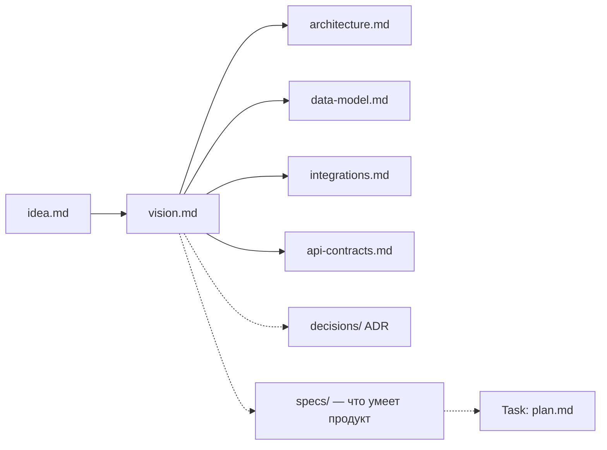

# AI-Driven Methodology

> **Философия:** агент занимается механикой исполнения. Человек занимается намерением и качеством.

Методология описывает, как вести AI-driven / Spec-driven разработку: от идеи до работающего кода — предсказуемо, трассируемо и повторяемо.

## Документация продукта

Прежде чем планировать и делать — нужно зафиксировать, **что** и **зачем** строится. Документация продукта состоит из двух частей: концепт (системный взгляд) и спецификации (функциональные требования к конкретным возможностям).



---

## Слой 1: Концепт

Концепт — набор документов, которые описывают **что** строится и **зачем**. Заполняется один раз в начале проекта и обновляется при изменениях.

### Матрица обязательности концепт-документов

| Документ | Шаблон | Обязательность | Условие |
|----------|--------|:--------------:|---------|
| `idea.md` | [idea-template.md](templates/concept/idea-template.md) | **Обязательно** | Всегда |
| `vision.md` | [vision-template.md](templates/concept/vision-template.md) | **Обязательно** | Всегда |
| `architecture.md` | [architecture-template.md](templates/concept/architecture-template.md) | **Обязательно** | При наличии ≥2 компонентов |
| `data-model.md` | [data-model-template.md](templates/concept/data-model-template.md) | **Обязательно** | При наличии базы данных |
| `integrations.md` | [integrations-template.md](templates/concept/integrations-template.md) | **Обязательно** | При наличии внешних сервисов |
| `api-contracts.md` | [api-contracts-template.md](templates/concept/api-contracts-template.md) | Опционально | При наличии API |
| ADR в `adrs/` | [adr-template.md](templates/adrs/adr-template.md) | По необходимости | При значимом архитектурном решении |

### Порядок заполнения

1. `idea.md` — суть продукта, для кого, какую задачу решает
2. `vision.md` — технический взгляд: компоненты, роли, сценарии, стек, принципы
3. `architecture.md` — диаграммы потоков, ответственность компонентов
4. `data-model.md` — логическая и физическая схема БД
5. `integrations.md` — внешние API, направления, риски
6. `api-contracts.md` — контракты REST/GraphQL, коды, пагинация, ошибки

---

## Спецификации продукта

Спецификации — это **функциональные требования**, которые образуют цельную картину того, что умеет продукт. Если концепт отвечает на вопрос «что мы строим», то спеки отвечают на «что именно умеет делать каждая часть продукта».

Каждая спецификация описывает одну фичу по принципу: **требования → дизайн → задачи**.

```
docs/specs/
├── README.md                  # карта всех фич продукта
├── payment-links/
│   ├── requirements.md        # user stories + acceptance criteria
│   ├── design.md              # архитектура, схемы, принятые решения
│   └── tasks.md               # чекбоксы шагов реализации
└── ai-assistant/
    ├── requirements.md
    ├── design.md
    └── tasks.md
```

### Принцип построения спека

**`requirements.md`** — что строим и зачем. Каждое требование — user story в формате «As a… I want… So that…» с acceptance criteria в формате GIVEN/WHEN/THEN.

```
### US-1: Генерация платёжной ссылки
As a потенциальный студент
I want нажать кнопку оплаты на лендинге
So that я перехожу прямо к оплате нужного курса

Acceptance Criteria:
GIVEN курс с ценой существует в конфиге
WHEN пользователь нажимает «Купить»
THEN открывается страница оплаты с предзаполненной суммой
```

**`design.md`** — как строим. Архитектура, sequence diagrams, выбор технических решений, принятые компромиссы.

**`tasks.md`** — конкретные шаги реализации в правильном порядке. Каждый пункт — минимально атомарный шаг с понятным результатом.

### Когда нужен спек, когда нет

| Ситуация | Решение |
|----------|---------|
| Простая правка: текст, стили, конфиг, rename | Сразу Task, без спека |
| Новая фича с ≥2 сценариями или нетривиальной логикой | Спек → Task |
| Внешняя интеграция, новый сервис | Спек + ADR → Task |

Граница простая: если у фичи есть хотя бы два разных пользовательских сценария или внешняя зависимость — нужен спек.

Шаблон: [spec-template.md](templates/specs/spec-template.md)

---

## Слой 2: Дорожная карта

`roadmap.md` — один файл в корне `docs/`. Показывает **крупные этапы** (версии, milestone'ы) без деталей реализации. Каждый этап содержит список спринтов, которые его закрывают.

**Обязателен** с первого спринта. Без roadmap нельзя начинать декомпозицию.

Шаблон: [roadmap-template.md](templates/roadmap/roadmap-template.md)

---

## Слой 3: Sprint

Sprint — ценностный блок. Один sprint поставляет законченную функциональность, понятную пользователю. Состоит из нескольких связанных Task'ов.

**Структура:**
```
docs/sprints/sprint-NN-<name>/
├── README.md       # цель, DoD спринта, список задач
└── tasks/
    ├── 01-<task-name>/
    │   ├── plan.md
    │   ├── summary.md
    │   └── demo.md   # только для cloud-задач
    └── 02-<task-name>/
```

Шаблон: [sprint-template.md](templates/sprints/sprint-template.md)

---

## Слой 4: Task

Task — атомарная единица работы с чётким DoD. Каждая задача проходит 4 фазы:

```
Plan → Implement → Self-check → Confirm & Record
```

**Документы задачи:**
- `plan.md` — цель, состав работ, DoD, артефакты, scope. Создаётся **до** начала работы.
- `summary.md` — что сделано, отклонения, решения, итог DoD. Создаётся **после** согласования.
- `demo.md` — только для cloud-агентов: ссылка на видео, скриншоты, команды запуска.

Шаблоны: [plan-template.md](templates/tasks/plan-template.md), [summary-template.md](templates/tasks/summary-template.md), [demo-template.md](templates/tasks/demo-template.md)

---

## Структура docs/ в проекте на методологии

```
docs/
├── README.md                      # навигатор по всей документации продукта
│
├── concept/                       # системный взгляд: что и зачем строим
│   ├── idea.md                    # суть продукта, проблема, целевая аудитория
│   ├── vision.md                  # технический взгляд: компоненты, стек, принципы
│   ├── architecture.md            # диаграммы, ответственность компонентов
│   ├── data-model.md              # схема данных, сущности, связи
│   ├── integrations.md            # внешние сервисы, направления, риски
│   └── api-contracts.md           # REST/GraphQL контракты, коды, пагинация
│
├── product/                       # продуктовый взгляд: пользователи и сценарии
│   ├── personas.md                # описания целевых пользователей
│   ├── user-flows.md              # сценарии использования, job stories
│   └── journey-map.md             # карта пути пользователя
│
├── decisions/                     # архитектурные решения (ADR)
│   ├── 001-<slug>.md
│   └── ...
│
├── roadmap.md                     # дорожная карта: этапы / версии / список спринтов
│
├── sprints/
│   ├── sprint-01-<name>/
│   │   ├── README.md              # цель, DoD, список задач, итог спринта
│   │   └── tasks/
│   │       ├── 01-<task>/
│   │       │   ├── plan.md        # до: цель, состав работ, DoD, scope
│   │       │   ├── summary.md     # после: что сделано, решения, итог DoD
│   │       │   └── demo.md        # только для cloud-задач: видео, скриншоты
│   │       └── 02-<task>/
│   └── sprint-02-<name>/
│
└── specs/                         # функциональные требования: что умеет продукт
    ├── README.md                  # карта всех фич: название, статус, ссылка
    └── <feature-slug>/            # одна папка = одна фича
        ├── requirements.md        # user stories + acceptance criteria (GIVEN/WHEN/THEN)
        ├── design.md              # архитектура фичи, схемы, принятые решения
        └── tasks.md               # чекбоксы шагов реализации
```

---

## Правила агента

Правила в `.methodology/rules/` описывают, как агент должен себя вести. Устанавливаются в `.cursor/rules/methodology/`.

| Файл | Назначение | alwaysApply |
|------|-----------|:-----------:|
| `00-methodology.mdc` | Entry point: ссылки на остальные правила | ✅ |
| `10-conventions.mdc` | Структура проекта, документов, секреты, соглашения | ✅ |
| `20-workflow.mdc` | 4-фазный workflow, правило двух согласований | ✅ |
| `30-cloud-agents.mdc` | PR-flow, видео-демо, Linear, scope-лимит (только cloud) | ✅ |
| `40-skills-router.mdc` | Таблица: тип работы → skill для применения | ✅ |

---

## Поток работы: от идеи до кода

**Подготовка.** Если концепт-документов нет — начни с онбординга ([from-scratch.md](onboarding/from-scratch.md) или [existing-code.md](onboarding/existing-code.md)). Если нет roadmap — составь его. Если нет открытого спринта — создай `sprint-NN/README.md` и декомпозируй задачи.

**Цикл задачи** повторяется для каждого Task в спринте:

1. **Планирование** → создать `plan.md` с целью, составом работ, DoD, scope.
   - ⛔ СТОП — показать план, ждать явного «ок».
2. **Реализация** → работать строго в scope. Для каждого файла: edit → sanitize → verify.
3. **Самопроверка** → пройти по всем критериям DoD, выполнить команды проверки, показать результат.
   - ⛔ СТОП — ждать явного «ок».
4. **Фиксация** → создать `summary.md`, обновить `sprint README.md`.

Когда все задачи спринта закрыты — обновить `roadmap.md` и открыть следующий спринт.

### Режимы планирования

**Copilot (IDE-режим).** Планирование можно вести прямо в Cursor Plan Mode (read-only): агент исследует кодовую базу и формулирует план в чате, после чего план сохраняется в `plan.md`. Согласование — в IDE-чате.

**Cloud-агент.** Агент создаёт `plan.md` и открывает Draft PR с единственным коммитом — планом. Пишет комментарий «план готов, жду ревью» и останавливается. После апрува — реализация в ту же ветку. После самопроверки — фиксирует результат в комментарии PR, записывает `demo.md` и переводит PR в Ready for review.
