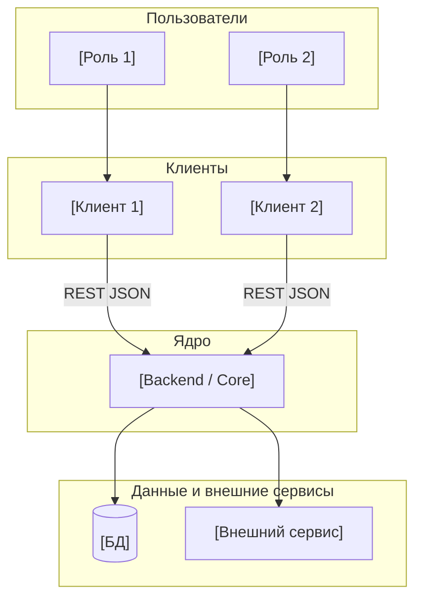
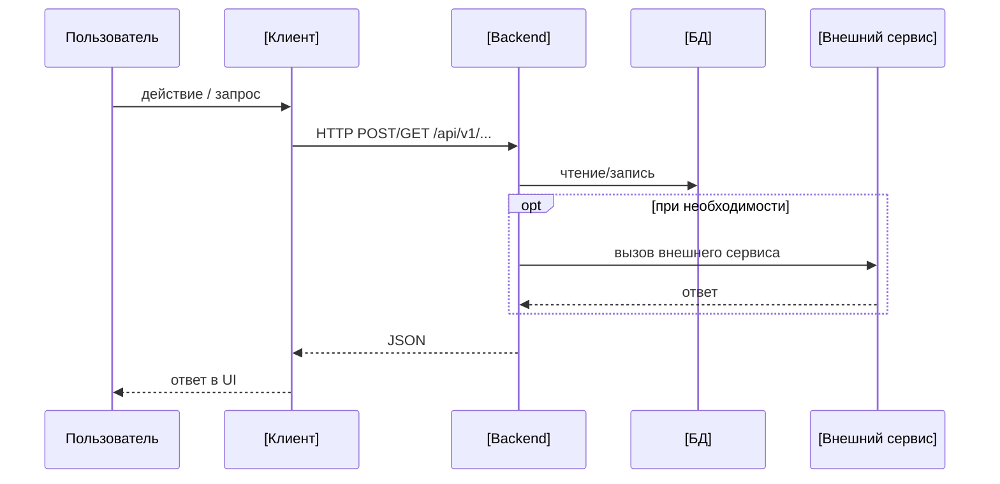
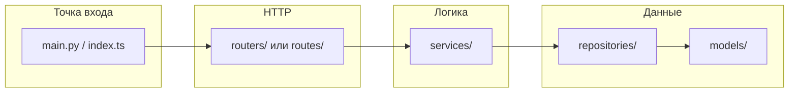

# Архитектура системы

> Высокоуровневое описание компонентов, потоков данных и ссылок на детали.
> Продуктовое видение и роли — в [vision.md](vision.md). Домен — в [data-model.md](data-model.md).

---

## Контекст системы

[1–2 предложения: кто пользователи, через что работают, где живёт бизнес-логика.]

---

## Контейнеры и ответственность

| Компонент | Назначение | Технологии | Документация |
|-----------|-----------|-----------|-------------|
| **[Компонент 1]** | [Что делает] | [Стек] | [README или ADR] |
| **[Компонент 2]** | [Что делает] | [Стек] | [README или ADR] |

---

## Взаимодействие клиентов с ядром

Контракты путей и схем — в [api-contracts.md](api-contracts.md).

---

## [Компонент 1] — внутренняя структура

[Краткое описание: что в роутерах, что в сервисах, что в репозиториях.]

---

## [Компонент 2] — внутренняя структура

[Аналогичный раздел для второго компонента, если нужен.]

---

## Деплой — локально

[Описание: как поднять весь стек локально. Ссылка на docker-compose или README.]

---

## Деплой — production

[Описание: где живёт production, как деплоится (CI/CD), ссылка на deploy-документ.]

---

## Связанные документы

- [vision.md](vision.md) — сценарии и принципы
- [data-model.md](data-model.md) — сущности БД
- [api-contracts.md](api-contracts.md) — REST-контракты
- [integrations.md](integrations.md) — внешние сервисы
- [decisions/](../decisions/) — архитектурные решения (ADR)
