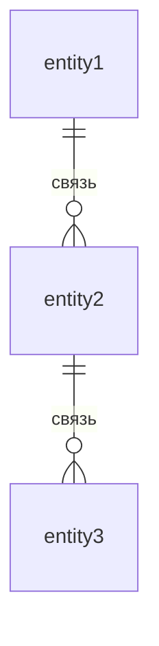
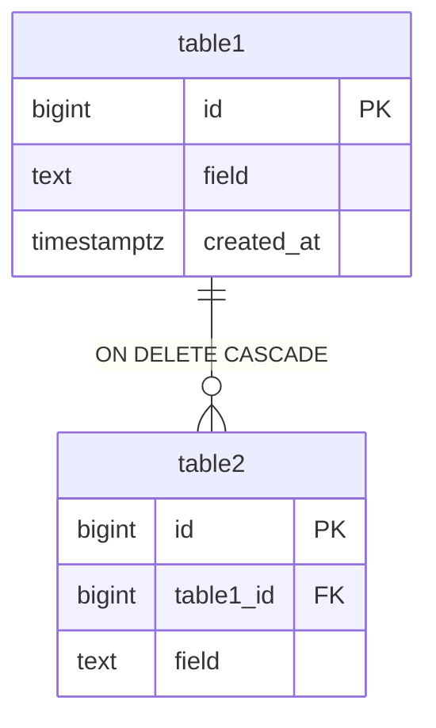

# Модель данных

> **Шаблон:** опиши логическую и физическую модель. Начни с логической (без деталей реализации), затем переходи к физической.

---

## Логическая модель

### [Сущность 1] — [краткое описание]

[Что это за сущность в доменном смысле.]

| Поле | Тип | Описание |
|------|-----|----------|
| id | bigint | Первичный ключ |
| [field] | [type] | [описание] |
| created_at | timestamptz | Дата создания |

### [Сущность 2] — [краткое описание]

| Поле | Тип | Описание |
|------|-----|----------|
| id | bigint | Первичный ключ |
| [entity1_id] | bigint → [сущность1] | Ссылка на [сущность1] |
| [field] | [type] | [описание] |

---

## Логическая ER-диаграмма

---

## Физическая модель

### Соглашения

| Правило | Значение |
|---------|---------|
| PK | `BIGINT GENERATED ALWAYS AS IDENTITY` — суррогатный, стабильный |
| Естественный ключ | Через `UNIQUE`-ограничение — защищает от дублей |
| Временны́е метки | `TIMESTAMPTZ NOT NULL DEFAULT now()` |
| Строки | `TEXT` — без ограничения длины через тип |
| Статусы/роли | `TEXT NOT NULL CHECK (col IN (...))` |
| FK-индексы | Создаются вручную (PostgreSQL не создаёт автоматически) |

---

### [table_name_1]

**Колонки**

| Колонка | PostgreSQL-тип | Модификаторы |
|---------|---------------|--------------|
| id | bigint | GENERATED ALWAYS AS IDENTITY PRIMARY KEY |
| [column] | text | NOT NULL |
| created_at | timestamptz | NOT NULL DEFAULT now() |

**Индексы**

| Определение | Тип | Зачем | Сценарии |
|-------------|-----|-------|---------|
| PK (id) | B-tree (авто) | Идентификация записи | все |
| UNIQUE ([column]) | B-tree | [зачем] | [сценарии] |

**Замечания**

- [Важные замечания по семантике или поведению колонок]

---

### [table_name_2]

**Колонки**

| Колонка | PostgreSQL-тип | Модификаторы |
|---------|---------------|--------------|
| id | bigint | GENERATED ALWAYS AS IDENTITY PRIMARY KEY |
| [entity1_id] | bigint | NOT NULL REFERENCES [table1](id) ON DELETE [CASCADE/RESTRICT] |
| [column] | text | NOT NULL |

**ON DELETE**

| FK | Действие | Причина |
|----|---------|---------|
| [entity1_id] → [table1] | CASCADE / RESTRICT | [объяснение] |

---

## Физическая ER-диаграмма

---

## Покрытие сценариев

| Сценарий | Ключевые таблицы | Ключевой запрос |
|----------|-----------------|----------------|
| [С-1: Название] | [таблицы] | [тип запроса] |
| [С-2: Название] | [таблицы] | [тип запроса] |

---

## Выбор СУБД

[Почему выбрана именно эта СУБД. 2–3 предложения.]

### Дальнейшее развитие

| Потребность | Решение |
|------------|---------|
| [Когда понадобится] | [Что добавить] |
