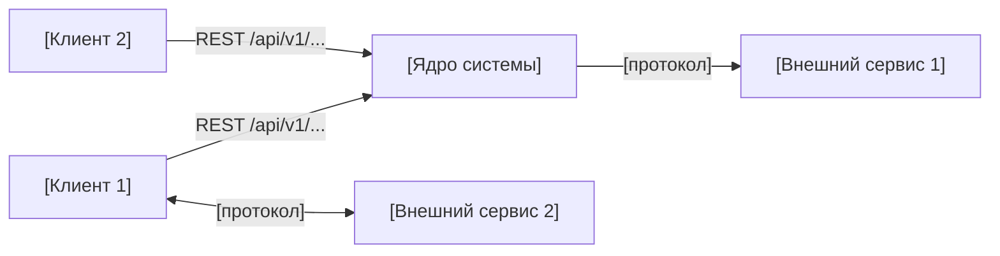

# Внешние интеграции

> Внешние системы и внутренние API, с которыми взаимодействует система.

---

## 1. [Внутренний API / Backend REST API]

[Если есть внутренний API, который используют клиенты — опиши его первым.]

| Параметр | Значение |
|----------|---------|
| Назначение | [Что делает] |
| Направление | In (клиент → backend) |
| Протокол | HTTP REST, JSON |
| Базовый URL (локально) | `http://localhost:[port]` |
| Документация | `/docs` (Swagger UI) |

Полные контракты — в [`api-contracts.md`](api-contracts.md).

| Эндпоинт | Сценарий |
|----------|---------|
| `POST /api/v1/[path]` | [Что делает] |
| `GET /health` | Проверка работоспособности |

---

## 2. Внешние системы

### [Внешний сервис 1]

[Ссылка на документацию]

| Параметр | Значение |
|----------|---------|
| Назначение | [Для чего используется] |
| Направление | [In / Out / Bidirectional] |
| Протокол | [HTTPS REST / WebSocket / GRPC / ...] |
| Критичность | [MVP / Важно / Опционально] |

[1–2 предложения: как именно используется, через что подключается (библиотека, прямые HTTP-запросы и т.д.).]

---

### [Внешний сервис 2]

| Параметр | Значение |
|----------|---------|
| Назначение | [Для чего] |
| Направление | [Out (система → сервис)] |
| Протокол | [HTTPS REST] |
| Критичность | [MVP] |

[Описание: агрегатор / gateway / прямое API, что меняется при смене провайдера.]

---

## 3. Диаграмма интеграций

---

## 4. Зависимости и риски

| Интеграция | Риск | Митигация |
|-----------|------|----------|
| **[Сервис 1]** | [Недоступность / Изменение API / Стоимость] | [Как обрабатываем / fallback] |
| **[Сервис 2]** | [Риск] | [Митигация] |

[Вывод: какие интеграции критичны для работы MVP.]
