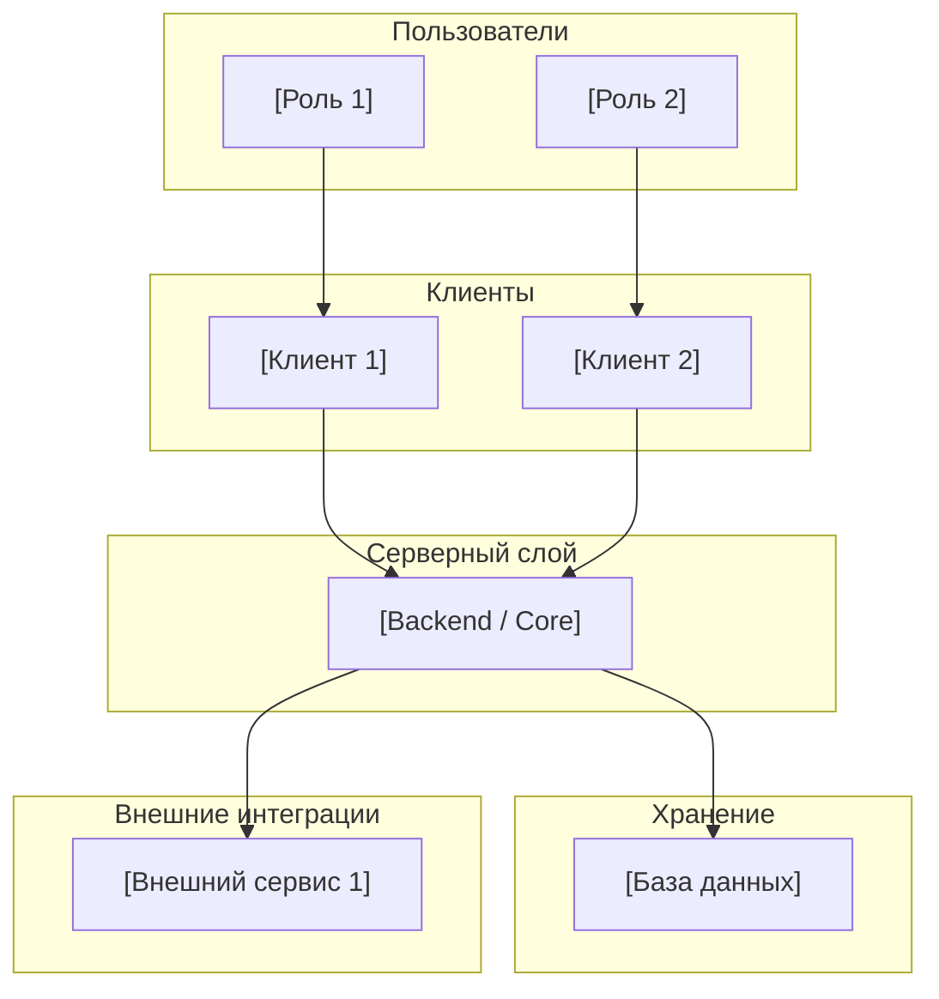

# Техническое видение проекта

> **Шаблон:** заполни все разделы. Удали инструкции в `[]` после заполнения.

---

## 1. Система в целом

[2–3 предложения: что это за система, как она называется, в чём её ядро. Обозначь главный компонент (backend-сервис? бот? монолит?) и его роль.]

---

## 2. Роли

| Роль | Описание |
|------|----------|
| **[Роль 1]** | [Что делает в системе] |
| **[Роль 2]** | [Что делает в системе] |

---

## 3. Пользовательские сценарии

> Детализация с требованиями к данным — в [`docs/concept/user-scenarios.md`](user-scenarios.md) (при необходимости).

### [Роль 1]
- **С-1: [Название]** — [что пользователь делает / видит]
- **С-2: [Название]** — [что пользователь делает / видит]

### [Роль 2]
- **П-1: [Название]** — [что пользователь делает / видит]

---

## 4. Архитектура (high-level)

> Диаграммы контейнеров и последовательностей — в [`architecture.md`](architecture.md).



---

## 5. Компоненты системы

### [Компонент 1]
- [Что делает]
- [Чего НЕ делает]
- **Статус:** [MVP / В разработке / Планируется]

### [Компонент 2]
- [Что делает]
- **Статус:** [MVP / В разработке / Планируется]

---

## 6. Структура проекта

```
project/
├── [component-1]/     # [описание]
├── [component-2]/     # [описание]
└── docs/
    ├── concept/
    ├── decisions/
    ├── roadmap.md
    └── sprints/
```

---

## 7. Доменные сущности

> Детализация — в [`data-model.md`](data-model.md).

| Сущность | Смысл |
|----------|-------|
| **[Сущность 1]** | [Что это в доменном смысле] |
| **[Сущность 2]** | [Что это в доменном смысле] |

---

## 8. Внешние связи

> Детализация — в [`integrations.md`](integrations.md).

| Интеграция | Назначение |
|------------|-----------|
| **[Сервис 1]** | [Для чего используется] |
| **[Сервис 2]** | [Для чего используется] |

---

## 9. Принципы разработки

- **KISS** — простые решения, никакой избыточной сложности
- **YAGNI** — реализуем только то, что нужно сейчас
- **DRY** — повторяющаяся логика выносится в отдельные модули
- [Дополнительный принцип, специфичный для проекта]

---

## 10. Технологии

| Область | Решение |
|---------|---------|
| [Область 1] | [Технология + версия] |
| [Область 2] | [Технология + версия] |

---

## 11. Архитектурные и прочие принятые решения

> Полный список ADR — в [`docs/adrs/`](../adrs/).

| № | Решение | Статус |
|---|---------|--------|
| [ADR-0001](../decisions/0001-<slug>.md) | [Что решено] | Принято |

