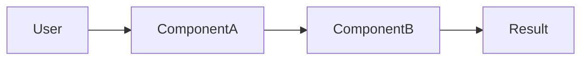

# [Feature Name] — Specification

> **Продукт / Область:** [backend / frontend / bot / ...]
> **Статус:** 📋 Speccing | 🔍 Design | ✅ Ready | 🚧 In Progress | ✅ Done
> **Sprint:** [ссылка на sprint README.md]

Спек состоит из трёх частей:
- **requirements.md** — что делаем и зачем (user stories + acceptance criteria).
- **design.md** — как делаем (архитектура, схемы, API, данные).
- **tasks.md** — в каком порядке делаем (конкретные шаги).

Этот шаблон содержит все три раздела; при необходимости раздели на три файла.

---

# requirements.md

## Контекст

[Зачем это нужно. Какую проблему решает. 2–3 предложения.]

## Целевая аудитория

- [Кто пользуется]
- [С какими знаниями / ограничениями]

## User Stories

### US-1: [Название]

**As a** [роль]
**I want** [что хочу сделать]
**So that** [какую ценность получу]

**Acceptance Criteria:**

```
GIVEN [начальное условие]
WHEN  [действие]
THEN  [ожидаемый результат]
AND   [дополнительное условие]
```

```
GIVEN [другой сценарий]
WHEN  [действие]
THEN  [результат]
```

### US-2: [Название]

[По той же структуре]

## Ограничения

- [Технические ограничения]
- [Временные ограничения]

## Out of scope

Явно исключаем из этой фичи:
- [Что не делаем]
- [Что оставляем на потом]

## Open questions

Вопросы до начала design:
- [ ] [Вопрос 1]
- [ ] [Вопрос 2]

---

# design.md

## Архитектурное решение

[Как это работает на высоком уровне. Диаграмма.]



## Компоненты и изменения

| Компонент | Изменение | Файл |
|-----------|-----------|------|
| [компонент] | [что меняем] | `путь/к/файлу` |

## API (если нужен)

```
POST /api/v1/<endpoint>
Request:  { field: type }
Response: { field: type }
Errors:   422 (валидация), 503 (внешний сервис)
```

## Модель данных (если нужна)

```sql
CREATE TABLE <name> (
  id BIGINT GENERATED ALWAYS AS IDENTITY PRIMARY KEY,
  field_name TEXT NOT NULL,
  created_at TIMESTAMPTZ NOT NULL DEFAULT now()
);
```

## Принятые решения

| Вопрос | Решение | Причина |
|--------|---------|---------|
| [из open questions] | [ответ] | [почему] |

## Риски

- [Технический риск и митигация]
