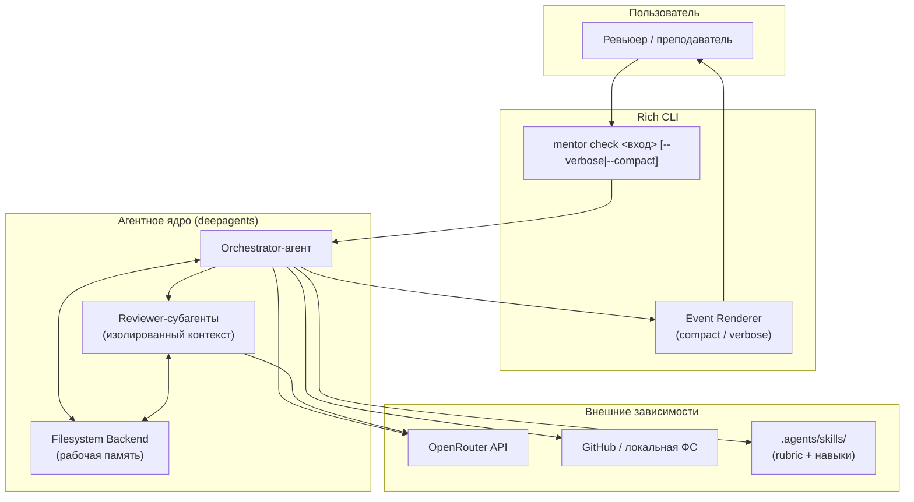
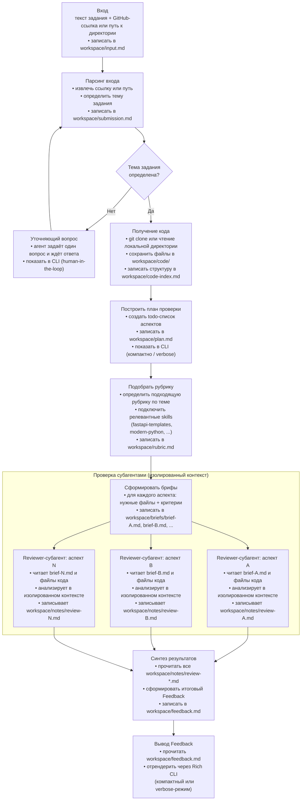
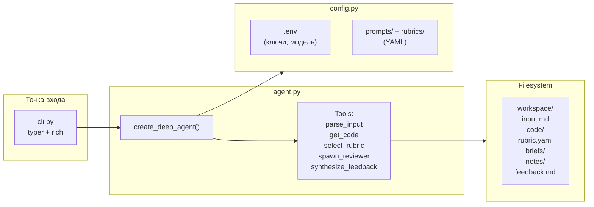
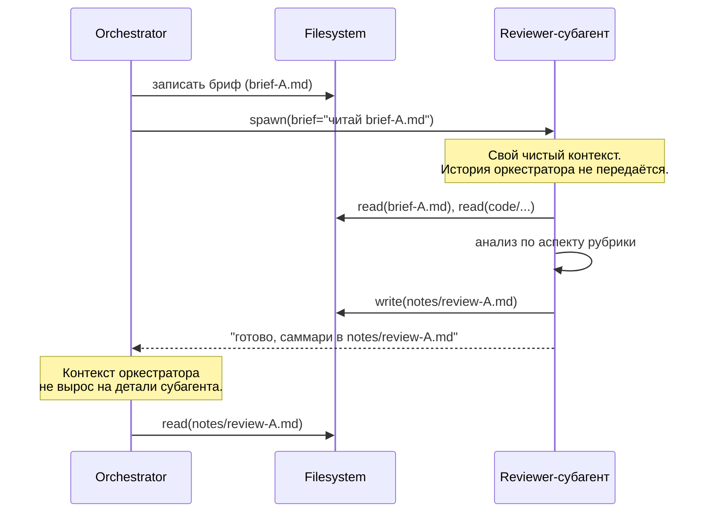

# Архитектура — AI Homework Mentor

> Продуктовое видение и роли — `[vision.md](vision.md)`. Суть продукта — `[idea.md](idea.md)`.

---

## Контекст системы

Пользователь запускает консольную команду `mentor check` с входом (GitHub-ссылка или локальный путь) и описанием задания. Вся бизнес-логика живёт в одном процессе: Rich CLI → Orchestrator-агент (`deepagents`) → Reviewer-субагенты. Никаких сетевых сервисов, баз данных и фоновых процессов в v1.




---

## Компоненты и ответственность


| Компонент              | Назначение                                                                                                                                                        | Технологии                     |
| ---------------------- | ----------------------------------------------------------------------------------------------------------------------------------------------------------------- | ------------------------------ |
| **Rich CLI**           | Точка входа; принимает аргументы, стримит события deepagents, рендерит compact/verbose вывод                                                                      | `typer`, `rich`                |
| **Orchestrator-агент** | Главный агент: парсинг входа, построение плана, управление файловой памятью, делегирование субагентам, синтез фидбэка                                             | `deepagents.create_deep_agent` |
| **Reviewer-субагент**  | Изолированный агент для одного аспекта рубрики; видит только свой бриф + нужные файлы                                                                             | `deepagents` (subagent API)    |
| **Filesystem Backend** | Рабочая память агента на локальном диске: вход, код, рубрика, брифы, review-ноты, финальный фидбэк                                                                | deepagents filesystem (local)  |
| **YAML-конфиг**        | Промпты (system, briefs, synthesis), параметры (модель, лимиты, пороги), рубрики под темы                                                                         | `pyyaml`, `pydantic-settings`  |
| **Rubric + Skills**    | YAML-описания критериев проверки под тему задания; навыки (`fastapi-templates`, `modern-python` и др.) из `.agents/skills/` — переиспользуемые процедуры проверки | YAML, `.agents/skills/`        |
| **OpenRouter**         | Единый LLM-провайдер; ключ и модель — через `.env`; используется и оркестратором, и субагентами                                                                   | OpenAI-совместимый API         |


---

## Поток проверки: вход → фидбэк




---

## Orchestrator-агент — внутренняя структура




Агент не содержит бизнес-логики в коде — только tools. Вся логика определяется промптом (из YAML) и инструментами.

---

## Файловая система как рабочая память

Агент не держит данные в оперативном контексте — он выносит их в файлы и работает со ссылками. Это снижает рост окна и делает состояние проверки персистентным и наблюдаемым.

```
workspace/
├── input.md            # исходный вход пользователя
├── submission.md       # извлечённые: ссылка/путь, тема задания
├── code-index.md       # структура кода студента (дерево файлов + краткое описание)
├── code/               # код студента (клон репо или копия локальной директории)
├── plan.md             # todo-список аспектов проверки с текущими статусами
├── rubric.md           # выбранная рубрика + подключённые skills
├── briefs/
│   ├── brief-A.md      # бриф для субагента по аспекту A
│   ├── brief-B.md
│   └── ...
├── notes/
│   ├── review-A.md     # ReviewNote от субагента A
│   ├── review-B.md
│   └── ...
└── feedback.md         # итоговый синтезированный Feedback
```

**Принцип:** в окне агента — только ссылки на файлы и короткие саммари. Сырые данные (код, полные review-ноты) живут в файлах. Это предотвращает неконтролируемый рост контекста при большом объёме кода студента.

---

## Изоляция контекста субагентов

Ключевой архитектурный паттерн: **каждый Reviewer-субагент запускается в изолированном контексте**.




Оркестратор не получает сырой вывод субагента — только саммари через файл. Это и есть context engineering: детали остаются в файловой системе, окно родителя растёт минимально. **Делает видимым** механизм изоляции в расширенном режиме вывода

---

## Context Engineering — что держим в окне, что выносим в файлы

Продукт намеренно делает механики управления контекстом наблюдаемыми. Ниже — четыре механизма, которые deepagents применяет автоматически, и которые видны в `--verbose`-режиме.

| Механизм | Когда срабатывает | Что происходит |
|----------|-------------------|----------------|
| **Вынос в файлы** | Агент получил объёмные данные: код студента, полный вывод инструмента, сырые review-ноты | Данные записываются в `workspace/`; в окне остаётся только путь к файлу и краткое саммари |
| **Узкий бриф** | Перед запуском Reviewer-субагента | Оркестратор передаёт субагенту только бриф (файлы аспекта + критерии), а не всю свою историю; контекст субагента начинается чистым |
| **Суммаризация истории** | Окно оркестратора приближается к порогу `summarization_threshold` | deepagents сжимает старые сообщения в краткое резюме; длинная история заменяется компактным summary |
| **Компактизация** | Окно превышает `context_limit` или агент завершает крупный этап | Весь контекст сворачивается в минимальный набор: текущий plan.md + ключевые ссылки на файлы |

### Verbose-режим: панели событий context engineering

В расширенном режиме (`--verbose`) каждое событие context engineering рендерится отдельной Rich-панелью:

```
╭─ Context Engineering: Вынос в файлы ────────────────────────────────╮
│ Файл:    workspace/code/main.py (и ещё 12 файлов)                   │
│ До:      4 200 токенов в окне                                        │
│ После:   320 токенов (ссылка + саммари структуры)                    │
│ Экономия: 3 880 токенов                                              │
╰──────────────────────────────────────────────────────────────────────╯

╭─ Context Engineering: Узкий бриф → Reviewer-субагент: аспект A ─────╮
│ Передано:  workspace/briefs/brief-A.md (180 токенов)                 │
│ Скрыто:    история оркестратора (11 400 токенов)                     │
│ Контекст субагента начат чисто                                       │
╰──────────────────────────────────────────────────────────────────────╯

╭─ Context Engineering: Суммаризация истории ─────────────────────────╮
│ Триггер:   окно достигло 80% от context_limit                        │
│ До:        18 600 токенов                                            │
│ После:     3 100 токенов (summary сохранён в окне)                   │
│ Экономия:  15 500 токенов                                            │
╰──────────────────────────────────────────────────────────────────────╯
```

### Что показывается в verbose-режиме в целом

| Событие | Что показывается |
|---------|-----------------|
| **Планирование** | Построение todo-списка; обновление статусов по шагам |
| **Workspace** | Какие файлы созданы / прочитаны на каждом шаге |
| **Рост контекста** | Размер окна (токены) до и после каждого шага |
| **Context engineering** | Панель с механизмом, размером до/после, сэкономленными токенами |
| **Субагент** | Запуск: что в брифе; завершение: что вернул; размер изолированного контекста |
| **Skills** | Какие навыки подключились к рубрике |
| **Параметры** | Активная модель, лимиты контекста, пороги суммаризации |

Compact-режим показывает только шаги плана (todo) и итоговый фидбэк.

---

## Рубрики и навыки (Rubric + Skills)

Рубрика — YAML-файл в `mentor/rubrics/`, привязанный к теме задания. Описывает аспекты проверки и ссылается на применимые навыки.

```yaml
# rubrics/fastapi-service.yaml
topic: "FastAPI-сервис"
aspects:
  - id: api-design
    name: "Дизайн API"
    skill: fastapi-templates        # публичный навык из .agents/skills/
    prompt: prompts/api-design.yaml

  - id: code-quality
    name: "Качество Python-кода"
    skill: modern-python            # публичный навык из .agents/skills/
    prompt: prompts/code-quality.yaml

  - id: architecture
    name: "Архитектура и структура"
    skill: null                     # собственный промпт без готового навыка
    prompt: prompts/architecture.yaml
```

Рубрика описывает **что проверяем**, навык (skill) — **чем проверяем**. Если публичного навыка нет — используется собственный промпт.

---

## YAML-конфигурация — структура

```
mentor/
└── config/
    ├── config.yaml                # параметры агента: model, context_limit,
    │                              # summarization_threshold, output_mode
    ├── prompts/
    │   ├── orchestrator-system.yaml   # system prompt главного агента
    │   ├── reviewer-system.yaml       # system prompt субагента-ревьюера
    │   ├── brief-template.yaml        # шаблон брифа для субагента
    │   └── synthesis.yaml             # промпт синтеза итогового фидбэка
    └── rubrics/
        ├── fastapi-service.yaml       # рубрика: REST API на FastAPI
        ├── python-cli.yaml            # рубрика: CLI-утилита на Python
        └── default.yaml               # универсальная рубрика (fallback)
```

Секреты (`OPENROUTER_API_KEY`, переменные среды) — через `.env`, не в `config/`.

---

## Получение кода студента


| Вход           | Механика                                                                          |
| -------------- | --------------------------------------------------------------------------------- |
| GitHub-ссылка  | `git clone --depth=1 <url>` во временную директорию workspace; код не исполняется |
| Локальный путь | `pathlib` — читаем файловую структуру и содержимое напрямую                       |


В обоих случаях код попадает в `workspace/code/` и доступен агенту через filesystem-backend.

---

## Логирование

- Только stdout; уровень через `LOG_LEVEL` в `.env` (default: `INFO`)
- В dev: human-readable; в production-режиме: JSON
- Логируется: старт с версией и конфигом, каждый шаг плана, запуск/завершение субагентов, токены контекста, ошибки с трейсом
- Не логируется: содержимое студенческого кода (только пути), ключи API

---

## Структура проекта

```
ai-homework-mentor/
├── concept/                        # проектная документация
│   ├── idea.md
│   ├── vision.md
│   └── architecture.md
├── roadmap.md
├── sprints/                        # спринты и задачи
│
├── mentor/                         # Python-пакет — исходный код утилиты
│   ├── __init__.py
│   ├── cli.py                      # точка входа: typer-команды, Rich-рендеринг
│   ├── agent.py                    # create_deep_agent, orchestrator-логика
│   ├── reviewer.py                 # spawning и управление reviewer-субагентами
│   ├── config.py                   # загрузка config.yaml + .env (pydantic-settings)
│   └── config/                     # вся конфигурация
│       ├── config.yaml             # параметры: model, context_limit, output_mode, ...
│       ├── prompts/
│       │   ├── orchestrator-system.yaml
│       │   ├── reviewer-system.yaml
│       │   ├── brief-template.yaml
│       │   └── synthesis.yaml
│       └── rubrics/
│           ├── fastapi-service.yaml
│           ├── python-cli.yaml
│           └── default.yaml        # fallback-рубрика
│
├── tests/
│   ├── test_cli.py
│   ├── test_agent.py
│   └── test_reviewer.py
│
├── pyproject.toml                  # зависимости, точка входа mentor CLI
├── Makefile                        # dev, lint, typecheck, test, ci
├── .env.example                    # OPENROUTER_API_KEY, MODEL, LOG_LEVEL
└── README.md
```

---

## Деплой — локально

```bash
cd ai-homework-mentor/
cp .env.example .env        # заполнить OPENROUTER_API_KEY, MODEL
make dev                    # uv sync + установить пакет
mentor check . --verbose    # dogfooding
```

---

## Связанные документы

- `[vision.md](vision.md)` — роли, сценарии, технологии, принципы
- `[idea.md](idea.md)` — суть продукта и MVP
- `[roadmap.md](../roadmap.md)` — слои продукта

