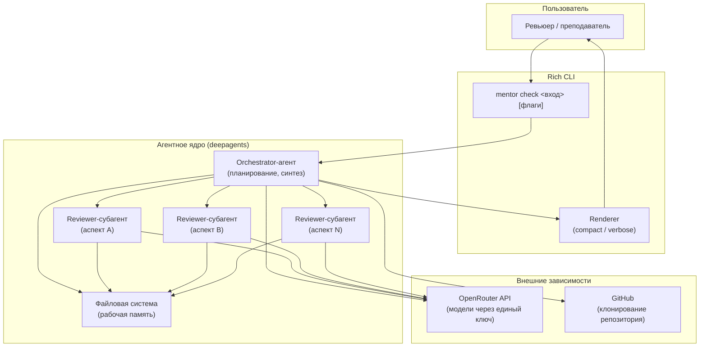

# Техническое видение — AI Homework Mentor

> Суть продукта — `[idea.md](idea.md)`. Архитектурный замысел — `[architecture.md](architecture.md)`.

---

## 1. Система в целом

AI Homework Mentor — консольная утилита с агентным ядром на `deepagents`. Единственный процесс: получает задание (текст + ссылка или путь к директории), строит план проверки, читает код, запускает reviewer-субагентов по аспектам рубрики, синтезирует результат и выводит его через Rich CLI. Никаких отдельных сервисов, баз данных и веб-интерфейса в v1.

---

## 2. Роли


| Роль                       | Описание                                                                                                                               |
| -------------------------- | -------------------------------------------------------------------------------------------------------------------------------------- |
| **Пользователь / ревьюер** | Запускает `mentor check` с входом (ссылка или путь), выбирает режим вывода, читает итоговый фидбэк                                     |
| **Orchestrator-агент**     | Главный агент: разбирает вход, строит план, управляет рабочей памятью в файловой системе, делегирует субагентам, синтезирует результат |
| **Reviewer-субагент**      | Изолированный субагент, получает узкий бриф (файлы + аспект рубрики), возвращает только саммари проверки                               |
| **Rich CLI**               | Интерфейс: принимает команду, стримит события агента, рендерит компактный или расширенный (образовательный) вывод                      |


---


## 3. Пользовательские сценарии


### Преподаватель / ревьюер

- **С-1: Проверка по GitHub-ссылке** — передаёт ссылку на публичный репозиторий и описание задания; агент клонирует, проверяет, возвращает фидбэк
- **С-2: Проверка локальной директории** — передаёт путь к папке с кодом студента; агент читает файлы напрямую
- **С-3: Уточнение темы** — если тема задания не определена однозначно, агент задаёт один уточняющий вопрос и продолжает
- **С-4: Расширенный режим** — флаг `--verbose` включает образовательный вывод: видны план, субагенты, рост контекста, суммаризации


### Команда курса (dogfooding)

- **D-1: Самопроверка** — `mentor check . --verbose` из директории проекта; агент проверяет свой собственный код по той же механике

---


## 4. Архитектура (high-level)




---


## 5. Компоненты системы


### Rich CLI (`mentor`)

- Принимает команду и флаги (`--verbose`, `--compact`)
- Стримит события из deepagents и рендерит их в зависимости от режима
- В `--verbose` показывает: план (todo), файлы рабочей памяти, события субагентов, рост контекста, токены, срабатывания суммаризатора, активную конфигурацию
- **Статус:** MVP


### Orchestrator-агент

- Разбирает вход: извлекает ссылку / путь, определяет тему задания
- При нехватке данных — задаёт один уточняющий вопрос (human-in-the-loop через deepagents interrupts)
- Строит план проверки (todo) и ведёт его как наблюдаемое состояние
- Получает код: клонирует репо (`git clone`) или читает директорию
- Выбирает рубрику под тему и формирует брифы для субагентов
- Собирает саммари от субагентов, синтезирует итоговый фидбэк
- **Статус:** MVP


### Reviewer-субагент

- Получает узкий бриф: нужные файлы + конкретный аспект рубрики
- Работает в изолированном контексте — не видит историю родителя
- Возвращает только саммари: findings + рекомендации по своему аспекту
- **Статус:** MVP


### Файловая система (рабочая память)

- Локальный диск через встроенный filesystem-бэкенд deepagents
- Хранит: вход, код студента, рубрику, брифы субагентов, review-ноты, финальный фидбэк
- В окне агента — только ссылки и саммари; детали - в файлах
- **Статус:** MVP


### **Рубрики + Skills**

- Рубрика описывает «что проверяем» под конкретную тему задания
- Навыки (skills) дают «чем проверяем»: публичные навыки `fastapi-templates`, `modern-python` и другие из `.agents/skills/`
- **Статус:** MVP


### YAML-конфигурация

- Все промпты (system prompts, шаблоны брифов, рубрики) в конфиг-файлах, не в коде
- Параметры: модель, режим вывода по умолчанию, лимиты контекста, пороги суммаризации
- **Статус:** MVP

---


## 6. Структура проекта

```
ai-homework-mentor/
├── concept/
│   ├── idea.md
│   ├── vision.md
│   ├── architecture.md
├── roadmap.md
├── sprints/
├── mentor/                   # Python-пакет (исходный код утилиты)
│   ├── cli.py                # точка входа, Rich CLI
│   ├── agent.py              # create_deep_agent, orchestrator
│   ├── reviewer.py           # субагенты-ревьюеры
│   ├── config.py             # загрузка конфига и .env
│   └── config/               # вся конфигурация в одном месте
│       ├── config.yaml       # параметры агента (модель, лимиты, режим)
│       ├── prompts/          # YAML-промпты
│       └── rubrics/          # YAML-рубрики под темы
├── pyproject.toml
├── .env.example
└── Makefile
```

---


## **7. Образовательная цель и расширенный режим вывода**

Продукт намеренно проектируется как **демонстрационный стенд** механизмов DeepAgents. В расширенном режиме (`--verbose`) пользователь наблюдает:

- **Планирование** — текущий план (todo), как он строится и обновляется по шагам
- **Workspace** — какие файлы созданы, прочитаны, какие rubric и skills подключились
- **Субагенты** — какие запущены, что им передано (узкий бриф) и что вернули (саммари)
- **Контекст** — как растёт размер окна по шагам; какие механизмы context engineering срабатывают (суммаризация, вынос в файлы, компактизация); до/после по токенам
- **Параметры** — активная модель, режим, лимиты контекста

Цель — чтобы обучающийся буквально видел: вот план, вот контекст вынесен в файлы, вот окно выросло и сработал суммаризатор, вот субагент отработал в изоляции и контекст родителя остался чистым.

---


## **8. Dogfooding как критерий зрелости**

Продукт достигает зрелости, когда его можно навести на **его собственную директорию** (`mentor check /path/to/ai-homework-mentor/`) и получить осмысленный feedback по тем же механикам, по которым проверяются студенческие работы. Dogfooding — финальный E2E-тест первой версии и постоянный индикатор здоровья продукта.

---


## 9. Доменные сущности


| Сущность        | Смысл                                                                                |
| --------------- | ------------------------------------------------------------------------------------ |
| **Submission**  | Домашняя работа студента: вход (ссылка или путь) + описание задания                  |
| **Rubric**      | Набор аспектов и критериев проверки, привязанных к теме задания                      |
| **Skill**       | Переиспользуемая процедура проверки (свой или публичный навык)                       |
| **ReviewBrief** | Узкое задание для субагента: конкретные файлы + аспект рубрики                       |
| **ReviewNote**  | Результат субагента: findings и рекомендации по одному аспекту                       |
| **Feedback**    | Итоговый структурированный вывод: что хорошо, что исправить, приоритизированный план |
| **Plan (todo)** | Наблюдаемое состояние процесса проверки, ведётся оркестратором                       |


---


## 10. Внешние связи


| Интеграция             | Назначение                                                              |
| ---------------------- | ----------------------------------------------------------------------- |
| **OpenRouter API**     | Единая точка доступа к LLM; ключ и выбор модели — через `.env` и конфиг |
| **GitHub (git clone)** | Получение кода студента по публичной ссылке                             |
| `.agents/skills/`      | Локальные и публичные навыки для проверки кода                          |


---


## 11. Принципы разработки

- **KISS** — консольная утилита, без лишних слоёв: нет отдельного API-сервиса, нет БД, нет веб-UI
- **YAGNI** — в v1 только то, что нужно для E2E-сценария; всё остальное — в следующих слоях roadmap
- **Fail fast** — конфиг и `.env` валидируются на старте; отсутствие ключей = ошибка до запуска агента
- **Наблюдаемость как первый класс** — все механики deepagents видимы через `--verbose`; это не дебаг, а образовательная цель продукта
- **Dogfooding как критерий зрелости** — продукт считается готовым к релизу, когда успешно проверяет сам себя

---


## 12. Технологии


| Область             | Решение                                               |
| ------------------- | ----------------------------------------------------- |
| Язык                | Python 3.12+                                          |
| Package manager     | `uv`                                                  |
| Агентный фреймворк  | `deepagents` (поверх LangChain + LangGraph)           |
| LLM-провайдер       | OpenRouter (OpenAI-совместимый API)                   |
| CLI / вывод         | `rich`, `typer`                                       |
| Конфигурация        | YAML-файлы (промпты, параметры, rubric)               |
| Линтер / форматтер  | `ruff`                                                |
| Типы                | `mypy` (strict)                                       |
| Тесты               | `pytest`                                              |
| Получение кода      | `git clone` (репо) / `pathlib` (локальная директория) |
| Хранение артефактов | Файловая система (workspace-директория)               |


---


## 13. Принятые архитектурные решения


| №       | Решение                                                                          | Статус  |
| ------- | -------------------------------------------------------------------------------- | ------- |
| ADR-001 | `deepagents` как агентный фреймворк (вместо raw LangGraph)                       | Принято |
| ADR-002 | OpenRouter как единый LLM-провайдер                                              | Принято |
| ADR-003 | Консольная утилита без отдельного API-сервиса (v1)                               | Принято |
| ADR-004 | Промпты и параметры в YAML-конфигах, не в коде                                   | Принято |
| ADR-005 | Файловая система deepagents как рабочая память агента вместо in-memory состояния | Принято |


