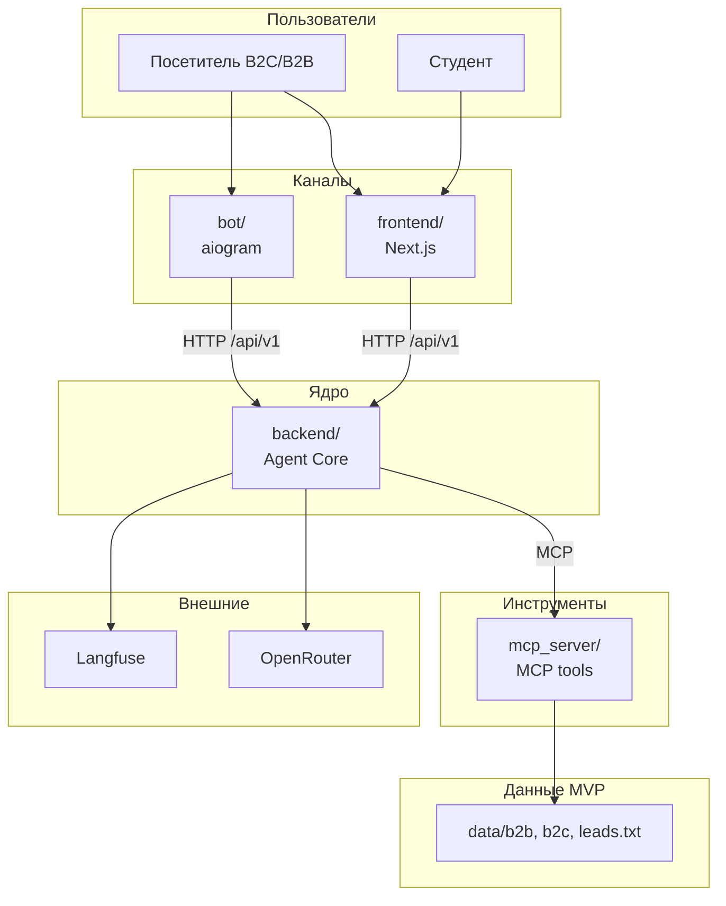
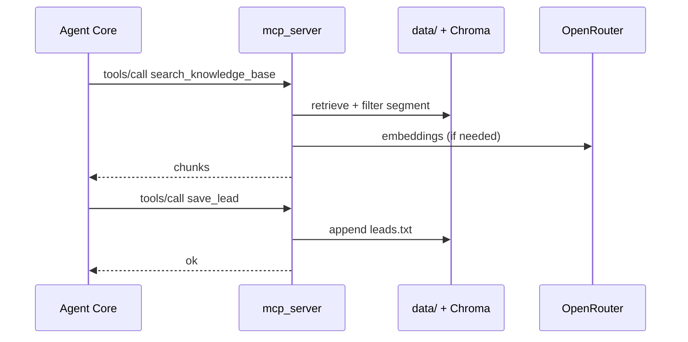
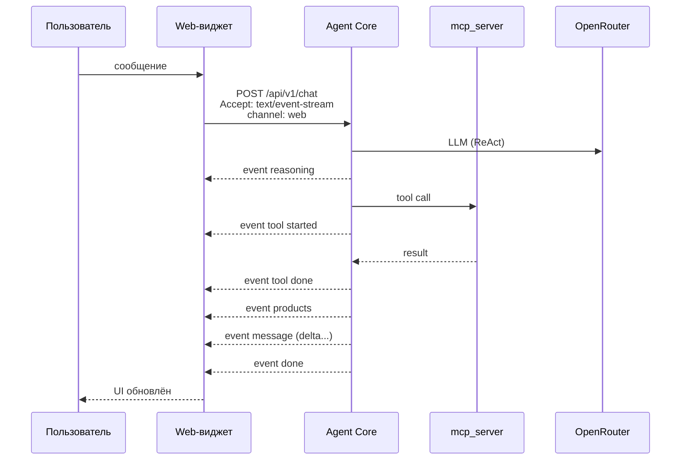
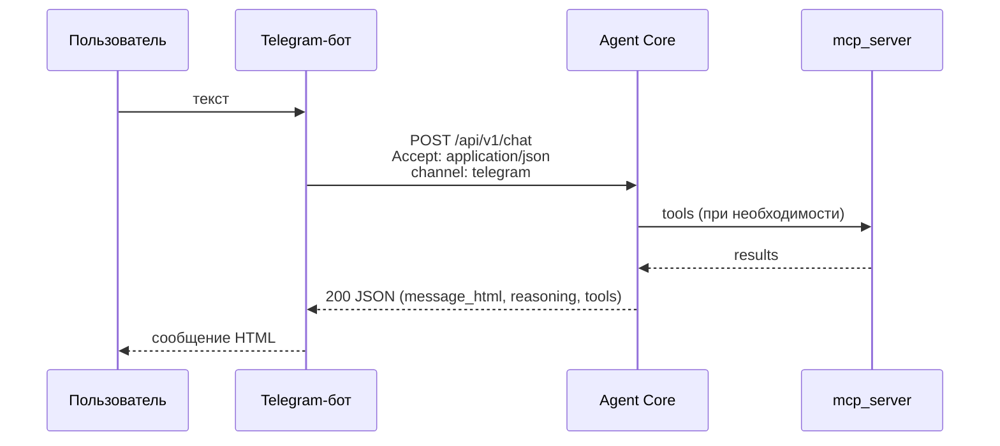
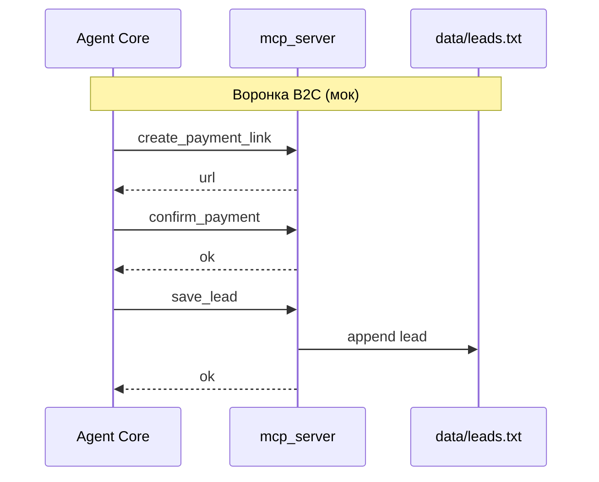
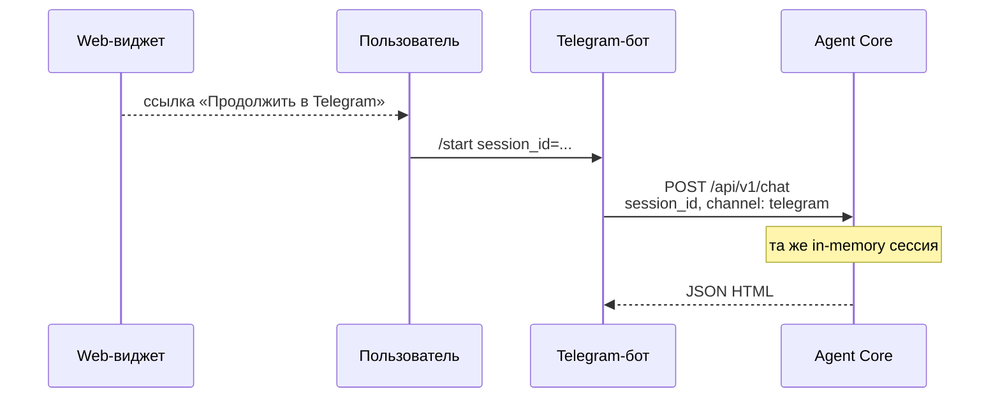
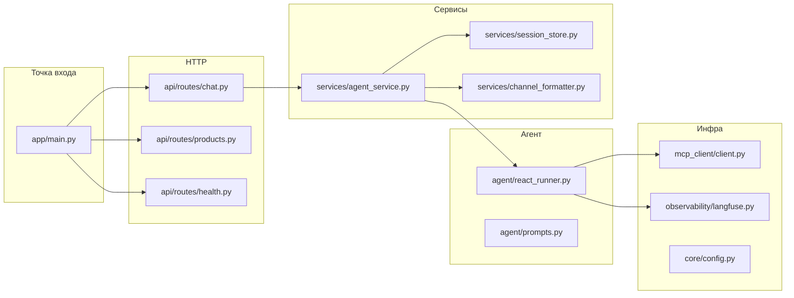
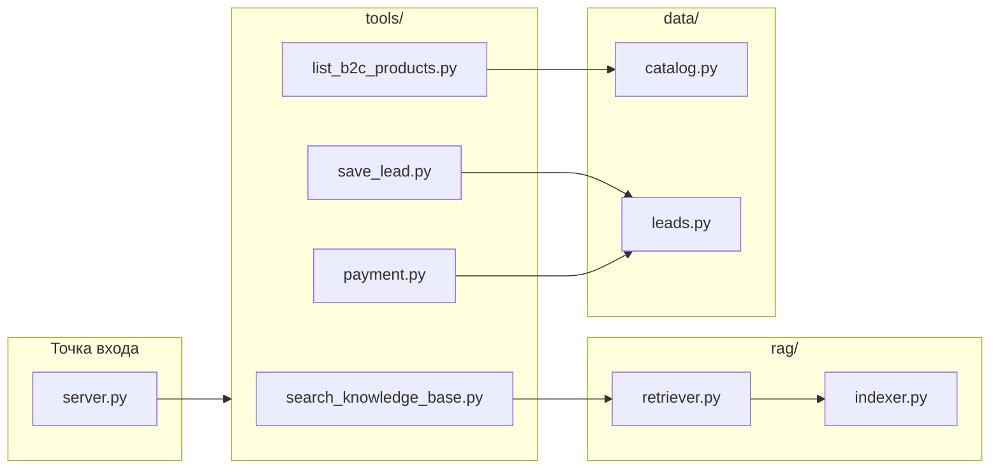
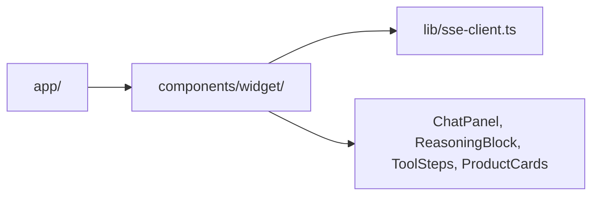

# Архитектура системы: LLMStart Agent

> Продуктовое видение и роли — в [vision.md](vision.md).  
> REST-контракты — в [api-contracts.md](api-contracts.md).  
> Интеграции — в [integrations.md](integrations.md).  
> Домен без БД на MVP — сущности описаны в [vision.md §7](vision.md#7-доменные-сущности).

---

## Контекст системы

Пользователи (B2C, B2B, студенты) общаются с агентом через **веб-виджет** (Next.js, SSE) или **Telegram-бот** (aiogram). Оба канала вызывают **Agent Core** (FastAPI): ReAct-агент, in-memory сессии, форматирование под `channel`. Побочные эффекты и RAG — только через **MCP-сервер инструментов** (`mcp_server/`). LLM — **OpenRouter**; трассировка — **Langfuse** (Docker).



---

## Контейнеры и ответственность

| Компонент | Назначение | Технологии | Документация |
|-----------|------------|------------|--------------|
| **backend/** | Agent Core: `/chat`, `/products`, `/health`; сессии, ReAct, MCP-клиент, channel-адаптация, Langfuse | Python 3.12, FastAPI, LangChain | ADR-0001, ADR-0002, ADR-0006…0008 |
| **mcp_server/** | Tools: RAG, каталог, лиды, мок-оплата; доступ к `data/` | Python 3.12, MCP SDK | ADR-0002 |
| **frontend/** | Виджет: SSE UI, reasoning/tools/products; `GET /products` для витрины; CTA Telegram | Next.js, shadcn | — |
| **bot/** | Long polling → Core API, `channel=telegram` | aiogram | ADR-0001 |
| **data/** | B2B/B2C knowledge, `leads.txt`, каталог (файлы) | PDF, MD, JSON | — |
| **devops/** | docker-compose, Langfuse, env, Makefile | Docker Compose | — |

---

## MCP: Core ↔ mcp_server

| Аспект | Решение (MVP) |
|--------|----------------|
| **Транспорт** | **stdio**: Core при старте поднимает `mcp_server` как subprocess; один хост разработки, минимум сетевой возни. |
| **Альтернатива (post-MVP)** | HTTP MCP в отдельном контейнере — при масштабировании или внешних MCP-клиентах. |
| **Контракт tools** | `search_knowledge_base`, `list_b2c_products`, `save_lead`, `create_payment_link`, `confirm_payment` |
| **RAG** | Индексация и поиск в **mcp_server**; эмбеддинги через OpenRouter; **Chroma** persist в `data/.chroma/` (переиндексация при изменении файлов в `data/b2b`, `data/b2c`). |
| **Каталог B2C** | `data/b2c/catalog.json` — 6 продуктов; `list_b2c_products` читает файл. |
| **CRM / оплата** | Append в `data/leads.txt`; мок-URL и confirm в памяти MCP или простом JSON-state в `data/` |

Core **не** читает `data/` напрямую — только через MCP.



---

## Взаимодействие клиентов с ядром

### Единая операция чата

Один эндпоинт **`POST /api/v1/chat`** — представление через заголовок **`Accept`**:

| Accept | Ответ |
|--------|--------|
| `application/json` | Полный ответ после завершения (Telegram, простые клиенты) |
| `text/event-stream` | SSE-поток событий (виджет) |

- **HTTP 200** на успех (не 201): сессия in-memory, не REST-ресурс в БД.
- **Сегмент B2B/B2C:** не передаётся в API — определяет агент (в т.ч. через tools/RAG).
- **Публичный API MVP:** `POST /api/v1/chat`, `GET /api/v1/products`, `GET /health` — см. [api-contracts.md](api-contracts.md).

> ADR-0006: один `/chat`, JSON vs SSE через `Accept`.

### Форматирование под канал

Параметр **`channel`**: `web` | `telegram` в теле запроса. Core возвращает:

- **web** + SSE: структурированные события (`reasoning`, `tool`, `products`, …).
- **telegram** + JSON: `message_html`, `reasoning`, `tools[]` (`done` \| `error`), опционально `products`, `payment_link` — см. [api-contracts.md](api-contracts.md).

> ADR-0007: форматирование в Core, клиенты тонкие.

### SSE: типы событий

| event | data | Назначение |
|-------|------|------------|
| `reasoning` | `{ "text" }` | Рассуждение агента (блок «Рассуждение») |
| `tool` | `{ "name", "status", "title" }` | `started` ⟳ / `done` ✓ / `error` |
| `products` | `{ "items": [{ code, title, price, currency }] }` | Карточки подобранных продуктов |
| `message` | `{ "delta" }` | Чанк финального текста |
| `payment_link` | `{ "url" }` | Мок-ссылка («Купить») |
| `done` | `{ "session_id", "message" }` | Завершение; полный финальный текст |
| `error` | `{ "detail" }` | Ошибка генерации |









Контракты путей и схем запросов — в [api-contracts.md](api-contracts.md).

---

## Сессии

| Параметр | MVP |
|----------|-----|
| Хранение | `dict[session_id → Session]` в процессе Core |
| Создание | Новый `session_id` (UUID), если не передан |
| TTL | **24 ч** с последней активности (in-memory sweep) |
| Handoff | `session_id` в deep link бота (`t.me/bot?start=s_<uuid>`) |
| Потеря | Рестарт Core — сессии сбрасываются (ADR-0005) |

---

## Agent Core (`backend/`) — внутренняя структура



| Слой | Ответственность |
|------|-----------------|
| `api/routes/chat.py` | `POST /chat`: Accept → JSON или SSE |
| `api/routes/products.py` | `GET /products`: каталог из `data/b2c/catalog.json` (тот же источник, что MCP `list_b2c_products`) |
| `api/routes/health.py` | `GET /health` |
| `services/agent_service.py` | Оркестрация turn: загрузка истории, вызов ReAct, маппинг в SSE-события |
| `services/session_store.py` | In-memory сессии + TTL |
| `services/channel_formatter.py` | web vs telegram (HTML) |
| `agent/` | LangChain ReAct graph, привязка MCP tools |
| `mcp_client/` | MCP session, list/call tools |

---

## MCP-сервер (`mcp_server/`) — внутренняя структура



---

## Web-виджет (`frontend/`)



- Режимы: **split-screen** и **floating pop-up** (один набор компонентов, разный layout).
- Парсит SSE по таблице событий; каталог витрины — `GET /api/v1/products`; MCP не вызывает.

---

## Telegram-бот (`bot/`)

```
bot/
├── main.py           # polling, startup
├── config.py
├── api/core_client.py  # HTTP → /api/v1/chat
└── handlers/
    ├── start.py      # /start с session_id
    └── message.py
```

Только HTTP-клиент Core; без локальной логики агента.

---

## Деплой — локально

`devops/docker-compose.yml` (целевой состав MVP):

| Сервис | Порт (host) | Назначение |
|--------|-------------|------------|
| `backend` | 8000 | Agent Core |
| `mcp_server` | — | stdio subprocess от backend (не отдельный published port в MVP) |
| `frontend` | 3000 | Next.js dev / preview |
| `bot` | — | outbound к backend |
| `langfuse` | 3001 (UI) | Observability |
| `langfuse-db` | — | Postgres для Langfuse (internal) |

Запуск: `make dev` из корня → compose + локально `uv`/`pnpm` по README в `devops/`.

Volumes: монтирование `./data` в `mcp_server` (и при stdio — тот же путь с хоста).

---

## Деплой — production

**Вне scope MVP.** Целевая схема (roadmap): VPS или облако, Docker Compose, reverse proxy (TLS), секреты в env; виджет — static/SSR на CDN, Core — один или несколько реплик с sticky sessions **или** переход на Redis для сессий.

---

## Безопасность (MVP)

| Тема | Решение |
|------|---------|
| Auth API | **Нет** публичной auth на `/chat` (демо-стенд); опционально `X-Internal-Key` между bot ↔ Core в compose |
| CORS | MVP: `http://localhost:3000`; `llmstart.ru` — post-MVP |
| Rate limit | Post-MVP |
| Секреты | `.env`, не в образах |

---

## Связанные документы

- [vision.md](vision.md) — сценарии и принципы
- [api-contracts.md](api-contracts.md) — REST/SSE контракты
- [integrations.md](integrations.md) — OpenRouter, Langfuse, Telegram
- [docs/decisions/](../decisions/) — ADR (в т.ч. кандидаты: `/chat` + Accept, channel в Core, HTTP 200)

### ADR по API (согласовано с api-contracts)

| № | Тема | Статус |
|---|------|--------|
| ADR-0006 | Один `POST /api/v1/chat`, JSON vs SSE через `Accept` | Принято |
| ADR-0007 | Форматирование ответа в Core по `channel` | Принято |
| ADR-0008 | HTTP 200 на `/chat` (in-memory, не 201) | Принято |
