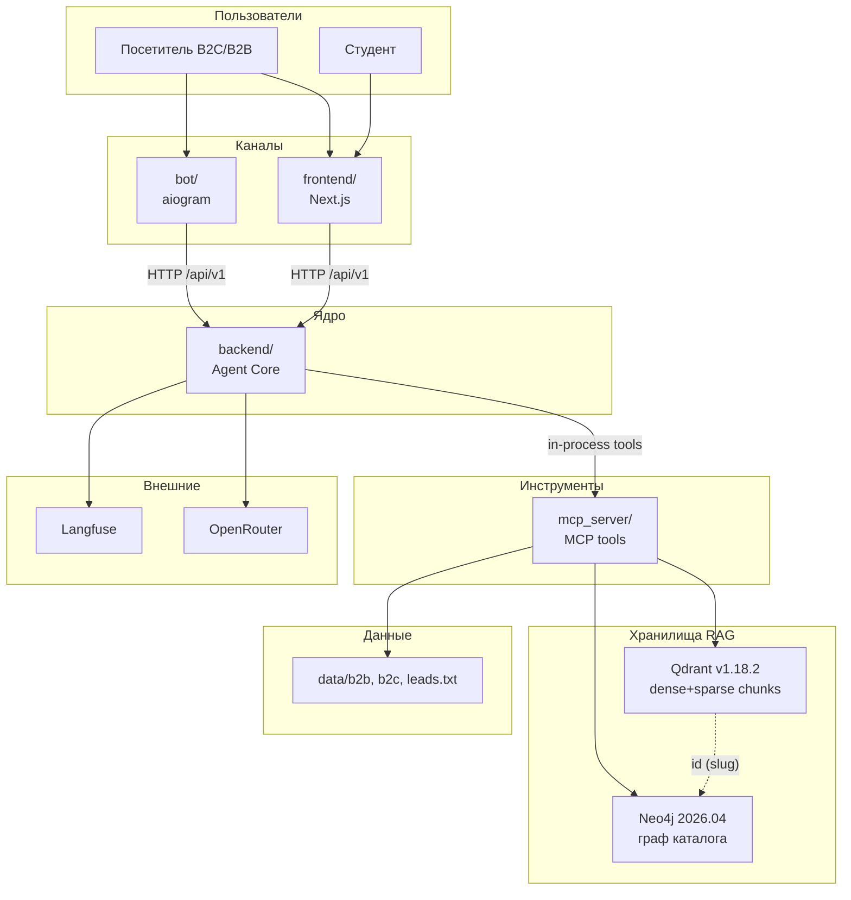
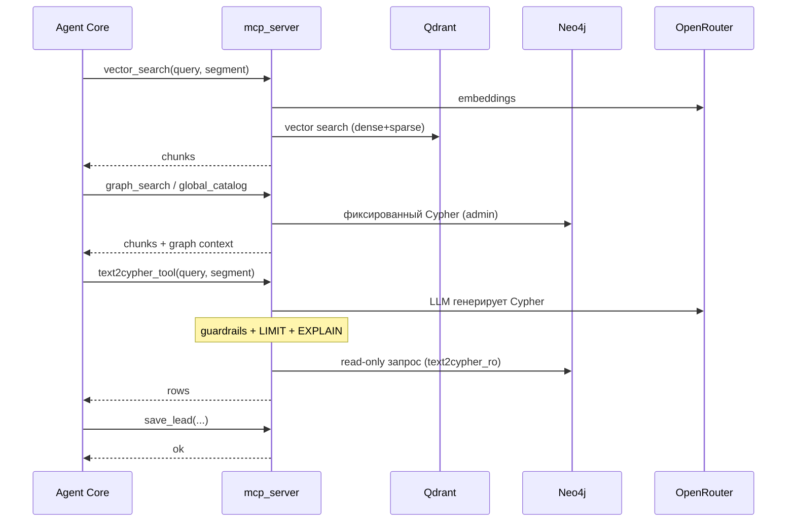
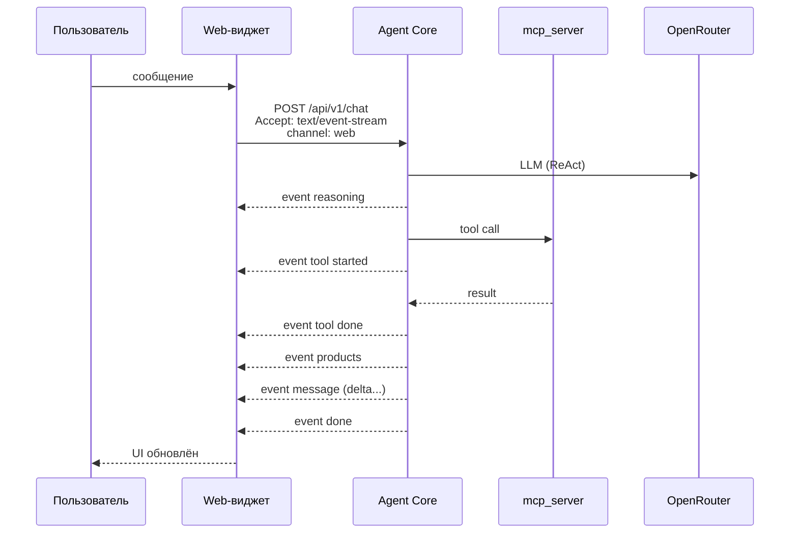
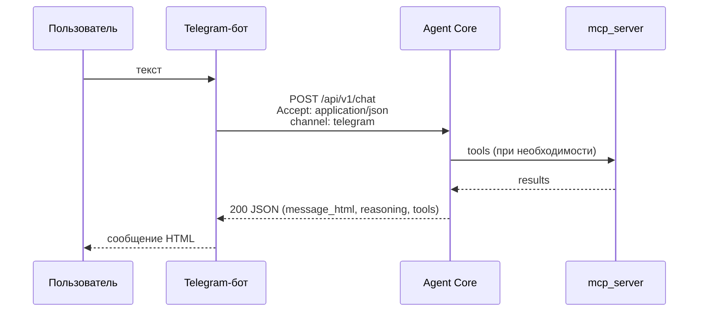
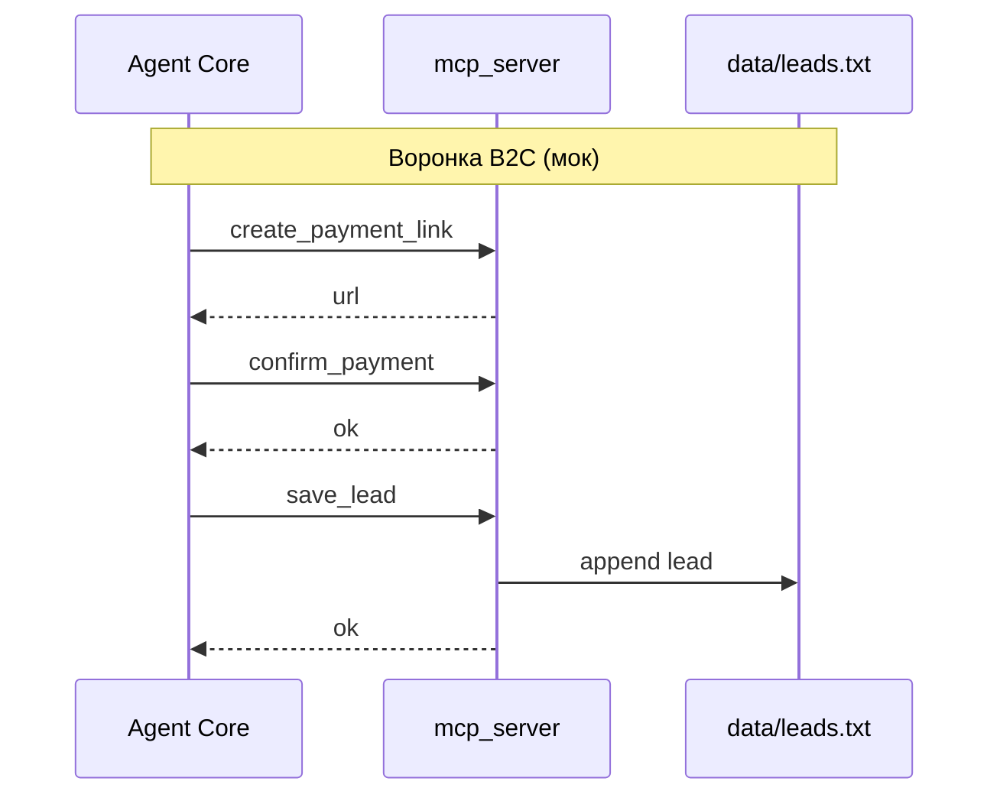
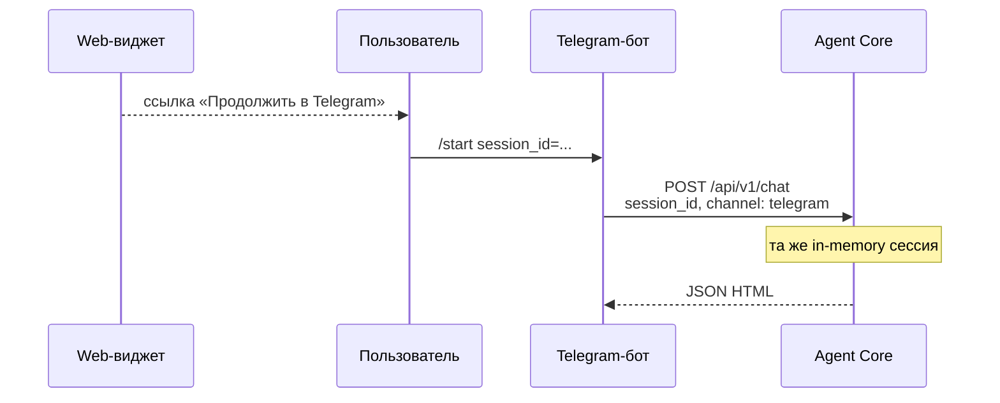
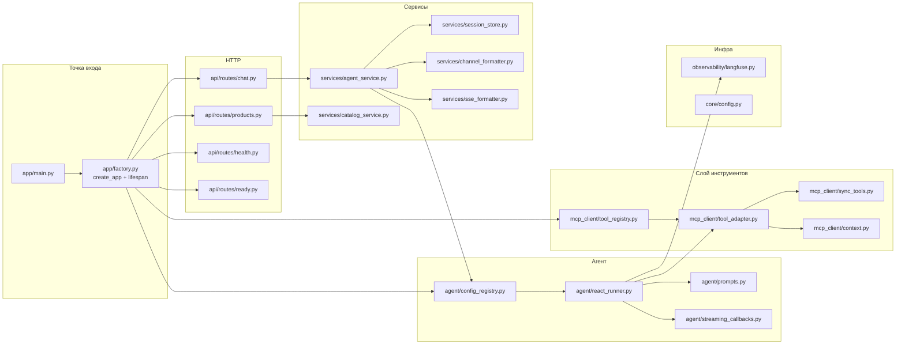
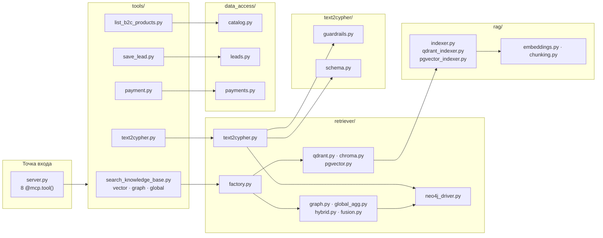
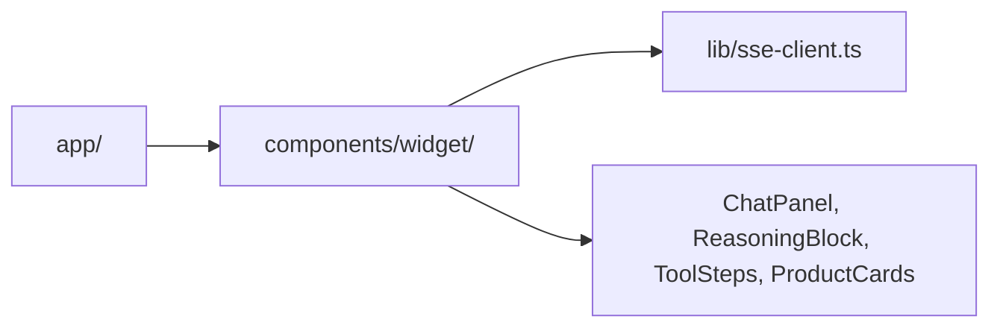

# Архитектура системы: LLMStart Agent

> Продуктовое видение и роли — в [vision.md](vision.md).  
> REST-контракты — в [api-contracts.md](api-contracts.md).  
> Интеграции — в [integrations.md](integrations.md).  
> Домен без БД на MVP — сущности описаны в [vision.md §7](vision.md#7-доменные-сущности).

---

## Контекст системы

Пользователи (B2C, B2B, студенты) общаются с агентом через **веб-виджет** (Next.js, SSE) или **Telegram-бот** (aiogram). Оба канала вызывают **Agent Core** (FastAPI): ReAct-агент, in-memory сессии, форматирование под `channel`. Побочные эффекты и RAG — только через **MCP-сервер инструментов** (`mcp_server/`). LLM — **OpenRouter**; трассировка — **Langfuse** (Docker).

RAG-слой в конфигурации по умолчанию использует **два хранилища**: **Qdrant** (семантический поиск по chunks) и **Neo4j** (граф структурных связей каталога), связанные по `id` (URL-slug курса). Векторная часть переключаема — `RETRIEVER_BACKEND` ∈ `qdrant` \| `chroma` \| `pgvector`.


```mermaid
flowchart TB
    subgraph users["Пользователи"]
        U1["Посетитель B2C/B2B"]
        U2["Студент"]
    end

    subgraph clients["Каналы"]
        WEB["frontend/<br/>Next.js"]
        BOT["bot/<br/>aiogram"]
    end

    subgraph core["Ядро"]
        API["backend/<br/>Agent Core"]
    end

    subgraph tools["Инструменты"]
        MCP["mcp_server/<br/>MCP tools"]
    end

    subgraph stores["Хранилища RAG"]
        QD["Qdrant v1.18.2<br/>dense+sparse chunks"]
        N4J["Neo4j 2026.04<br/>граф каталога"]
    end

    subgraph data["Данные"]
        DATA["data/b2b, b2c, leads.txt"]
    end

    subgraph ext["Внешние"]
        OR["OpenRouter"]
        LF["Langfuse"]
    end

    U1 --> WEB
    U1 --> BOT
    U2 --> WEB
    WEB -->|"HTTP /api/v1"| API
    BOT -->|"HTTP /api/v1"| API
    API -->|"in-process tools"| MCP
    MCP --> QD
    MCP --> N4J
    MCP --> DATA
    API --> OR
    API --> LF
    QD -.->|"id (slug)"| N4J
```

---

## Контейнеры и ответственность

| Компонент | Назначение | Технологии | Документация |
|-----------|------------|------------|--------------|
| **backend/** | Agent Core: `/chat`, `/products`, `/health`, `/ready`; сессии, ReAct, слой инструментов, channel-адаптация, Langfuse, реестр eval-конфигов | Python 3.12, FastAPI, LangChain | ADR-0001, ADR-0002, ADR-0006…0008 |
| **mcp_server/** | Tools: RAG (vector / graph / global / text2cypher), каталог, лиды, мок-оплата; доступ к `data/`, Qdrant, pgvector, Chroma, Neo4j | Python 3.12, MCP SDK | ADR-0002, ADR-0009, ADR-0010 |
| **frontend/** | Виджет: SSE UI, reasoning/tools/products; `GET /products` для витрины; CTA Telegram | Next.js, shadcn | — |
| **bot/** | Long polling → Core API, `channel=telegram` | aiogram | ADR-0001 |
| **data/** | B2B/B2C knowledge и `catalog.json`, `leads.txt`, `payments.json`, артефакты графа | PDF, MD, JSON | — |
| **evals/** | Конфиги прогонов (`evals/configs/*.yaml`) и скрипты экспериментов. Читается backend'ом **в рантайме**: поле `config_id` выбирает конфиг из этой директории | YAML, Python | — |
| **devops/** | docker-compose **инфраструктуры** (Langfuse v3, Qdrant, pgvector, Neo4j), env | Docker Compose | ADR-0009, ADR-0010 |

---

## MCP: Core ↔ mcp_server

| Аспект | Решение (факт) |
|--------|----------------|
| **Транспорт** | **Внутрипроцессный вызов**: `factory.py` при старте берёт определения через `mcp_client/tool_registry.py` и оборачивает их в LangChain-инструменты (`tool_adapter.py` → `sync_tools.py`), напрямую вызывая обработчики `mcp_server`. Отдельный процесс не поднимается. |
| **Stdio-клиент** | `mcp_client/client.py` поднимает `mcp_server` как subprocess по stdio, но подключается **только при инъекции** (тесты, изолированные прогоны). В обычном запуске не используется. |
| **Альтернатива (post-MVP)** | HTTP MCP в отдельном контейнере — при масштабировании или внешних MCP-клиентах. |
| **Контракт tools (8)** | Поиск: `vector_search`, `graph_search`, `global_catalog`, `text2cypher_tool`. Каталог: `list_b2c_products`. Воронка: `create_payment_link`, `confirm_payment`, `save_lead` |
| **Инъекция контекста** | `session_id` и `channel` **отсутствуют в схемах для LLM** и подставляются сервером из `TurnContext` в `tool_adapter.py`. Под контролем модели — только доменные аргументы (`query`, `segment`, `product_id`, поля лида) |
| **RAG** | Индексация и поиск в **mcp_server**; эмбеддинги через OpenRouter. Векторный backend переключается `RETRIEVER_BACKEND` ∈ `qdrant` \| `chroma` \| `pgvector`; ветка поиска — `RETRIEVER_BRANCH` ∈ `vector` \| `graph` \| `global` \| `hybrid` (`retriever/factory.py`). Граф каталога в **Neo4j** — `make graph-index` |
| **Доступ к Neo4j** | Две личности: **admin** (`NEO4J_USER`) для `graph_search` и `global_catalog` с фиксированными Cypher-шаблонами; **read-only** `text2cypher_ro` (`make graph-init-ro`) для `text2cypher_tool`, где Cypher генерирует LLM |
| **Каталог B2C** | `data/b2c/catalog.json` — 6 продуктов; `list_b2c_products` читает файл |
| **CRM / оплата** | Append в `data/leads.txt` (JSON Lines); состояние мок-платежей — `data/payments.json`, ключ `session_id + product_id` |

Core **не** читает `data/` напрямую — только через обработчики `mcp_server`.

**Ошибки инструментов** возвращаются модели строкой `{"error": ...}` и не прерывают ход рассуждения. Наружу в HTTP-ответ аргументы вызовов и сырые результаты **не сериализуются** — только `name`, `status`, `title`.


```mermaid
sequenceDiagram
    participant AC as Agent Core
    participant MCP as mcp_server
    participant QD as Qdrant
    participant N4J as Neo4j
    participant OR as OpenRouter

    AC->>MCP: vector_search(query, segment)
    MCP->>OR: embeddings
    MCP->>QD: vector search (dense+sparse)
    MCP-->>AC: chunks
    AC->>MCP: graph_search / global_catalog
    MCP->>N4J: фиксированный Cypher (admin)
    MCP-->>AC: chunks + graph context
    AC->>MCP: text2cypher_tool(query, segment)
    MCP->>OR: LLM генерирует Cypher
    Note over MCP: guardrails + LIMIT + EXPLAIN
    MCP->>N4J: read-only запрос (text2cypher_ro)
    MCP-->>AC: rows
    AC->>MCP: save_lead(...)
    MCP-->>AC: ok
```

---

## Взаимодействие клиентов с ядром

### Единая операция чата

Один эндпоинт **`POST /api/v1/chat`** — представление через заголовок **`Accept`**:

| Accept | Ответ |
|--------|--------|
| `application/json` | Полный ответ после завершения (Telegram, простые клиенты) |
| `text/event-stream` | SSE-поток событий (виджет) |

- **HTTP 200** на успех (не 201): сессия in-memory, не REST-ресурс в БД.
- **Сегмент B2B/B2C:** не передаётся в API — определяет агент (в т.ч. через tools/RAG).
- **Публичный API MVP:** `POST /api/v1/chat`, `GET /api/v1/products`, `GET /health`, `GET /ready`, плюс автодокументация FastAPI `/docs`, `/redoc`, `/openapi.json` — см. [api-contracts.md](api-contracts.md).
- **`GET /ready`** — readiness: наличие ключа LLM и число доступных инструментов не меньше `EXPECTED_TOOL_COUNT` (8), иначе 503.

> ADR-0006: один `/chat`, JSON vs SSE через `Accept`.

### Выбор конфигурации через `config_id`

Опциональное поле `config_id` в теле `POST /api/v1/chat` подключает контур экспериментов к рантайму: `AgentConfigRegistry.resolve_runner` (`agent/config_registry.py`) загружает YAML из `evals/configs/` и отдаёт **отдельный `ReactRunner`**.

| Что подменяется | Что не подменяется |
|---|---|
| Модель LLM, `temperature`, версия системного промпта из `PROMPT_REGISTRY` | Набор инструментов — общий для всех runner'ов |
| — | Retrieval-backend и ветка поиска — задаются окружением `mcp_server` |

Без `config_id` используется default-runner: модель из `OPENAI_MODEL`, промпт **V6** при `SECURITY_ENABLED=true` (default) и **V1** при `false`. Неизвестный `config_id` → HTTP 400.

При `SECURITY_ENABLED=true` поле `config_id` исполняется только с заголовком `X-LLMStart-Eval-Key`, совпадающим с `EVAL_ACCESS_KEY`. Без ключа (или если ключ в env пуст) runner не переключается, ответ — `[SECURITY_BLOCKED]`. При `SECURITY_ENABLED=false` поле публичное, как до sprint-11. Риск R-05 в [модели угроз](../../practice/redteam/threat-model.md); фикс — FIX-5.

### Форматирование под канал

Параметр **`channel`**: `web` | `telegram` в теле запроса. Core возвращает:

- **web** + SSE: структурированные события (`reasoning`, `tool`, `products`, …).
- **telegram** + JSON: `message_html`, `reasoning`, `tools[]` (`done` \| `error`), опционально `products`, `payment_link` — см. [api-contracts.md](api-contracts.md).

> ADR-0007: форматирование в Core, клиенты тонкие.

### SSE: типы событий

| event | data | Назначение |
|-------|------|------------|
| `reasoning` | `{ "text" }` | Рассуждение агента (блок «Рассуждение») |
| `tool` | `{ "name", "status", "title" }` | `started` ⟳ / `done` ✓ / `error` |
| `products` | `{ "items": [{ code, title, price, currency }] }` | Карточки подобранных продуктов |
| `message` | `{ "delta" }` | Чанк финального текста |
| `payment_link` | `{ "url" }` | Мок-ссылка («Купить») |
| `done` | `{ "session_id", "message" }` | Завершение; полный финальный текст |
| `error` | `{ "detail" }` | Ошибка генерации |


```mermaid
sequenceDiagram
    participant U as Пользователь
    participant W as Web-виджет
    participant B as Agent Core
    participant M as mcp_server
    participant L as OpenRouter

    U->>W: сообщение
    W->>B: POST /api/v1/chat<br/>Accept: text/event-stream<br/>channel: web
    B->>L: LLM (ReAct)
    B-->>W: event reasoning
    B->>M: tool call
    B-->>W: event tool started
    M-->>B: result
    B-->>W: event tool done
    B-->>W: event products
    B-->>W: event message (delta...)
    B-->>W: event done
    W-->>U: UI обновлён
```


```mermaid
sequenceDiagram
    participant U as Пользователь
    participant T as Telegram-бот
    participant B as Agent Core
    participant M as mcp_server

    U->>T: текст
    T->>B: POST /api/v1/chat<br/>Accept: application/json<br/>channel: telegram
    B->>M: tools (при необходимости)
    M-->>B: results
    B-->>T: 200 JSON (message_html, reasoning, tools)
    T-->>U: сообщение HTML
```


```mermaid
sequenceDiagram
    participant B as Agent Core
    participant M as mcp_server
    participant F as data/leads.txt

    Note over B,F: Воронка B2C (мок)
    B->>M: create_payment_link
    M-->>B: url
    B->>M: confirm_payment
    M-->>B: ok
    B->>M: save_lead
    M->>F: append lead
    M-->>B: ok
```


```mermaid
sequenceDiagram
    participant W as Web-виджет
    participant U as Пользователь
    participant T as Telegram-бот
    participant B as Agent Core

    W-->>U: ссылка «Продолжить в Telegram»
    U->>T: /start session_id=...
    T->>B: POST /api/v1/chat<br/>session_id, channel: telegram
    Note over B: та же in-memory сессия
    B-->>T: JSON HTML
```

Контракты путей и схем запросов — в [api-contracts.md](api-contracts.md).

---

## Сессии

| Параметр | MVP |
|----------|-----|
| Хранение | `dict[session_id → Session]` в процессе Core |
| Создание | Новый `session_id` (UUID), если не передан |
| TTL | **24 ч** с последней активности (in-memory sweep) |
| Handoff | `session_id` в deep link бота (`t.me/bot?start=s_<uuid>`) |
| Потеря | Рестарт Core — сессии сбрасываются (ADR-0005) |

---

## Agent Core (`backend/`) — внутренняя структура


```mermaid
flowchart LR
    subgraph entry["Точка входа"]
        M[app/main.py]
        F[app/factory.py<br/>create_app + lifespan]
    end

    subgraph http["HTTP"]
        R[api/routes/chat.py]
        P[api/routes/products.py]
        H[api/routes/health.py]
        RD[api/routes/ready.py]
    end

    subgraph agent["Агент"]
        RC[agent/react_runner.py]
        PR[agent/prompts.py]
        CR[agent/config_registry.py]
        SC[agent/streaming_callbacks.py]
    end

    subgraph services["Сервисы"]
        AG[services/agent_service.py]
        SS[services/session_store.py]
        CH[services/channel_formatter.py]
        SF[services/sse_formatter.py]
        CS[services/catalog_service.py]
    end

    subgraph toolsl["Слой инструментов"]
        TR[mcp_client/tool_registry.py]
        TA[mcp_client/tool_adapter.py]
        ST[mcp_client/sync_tools.py]
        CX[mcp_client/context.py]
    end

    subgraph infra["Инфра"]
        LF[observability/langfuse.py]
        CFG[core/config.py]
    end

    M --> F
    F --> R
    F --> P
    F --> H
    F --> RD
    F --> TR
    TR --> TA
    TA --> ST
    TA --> CX
    F --> CR
    R --> AG
    AG --> SS
    AG --> CR
    CR --> RC
    RC --> PR
    RC --> TA
    AG --> CH
    AG --> SF
    RC --> SC
    RC --> LF
    P --> CS
```

| Слой | Ответственность |
|------|-----------------|
| `main.py` / `factory.py` | `create_app` + `lifespan`: проверка ключа LLM, Langfuse, сборка инструментов, `ReactRunner`, `AgentConfigRegistry`, CORS, регистрация роутеров |
| `api/routes/chat.py` | `POST /chat`: входной guard, гейт `config_id`, Accept → JSON или SSE |
| `api/routes/products.py` | `GET /products`: каталог из `data/b2c/catalog.json` (тот же источник, что `list_b2c_products`) |
| `api/routes/health.py` / `ready.py` | `GET /health` (liveness) и `GET /ready` (ключ LLM + 8 инструментов) |
| `security/` | Входной/выходной guard, policy инструментов (`tool_adapter`), гейт `config_id`; флаг `SECURITY_ENABLED` |
| `services/agent_service.py` | Оркестрация turn: история, `TurnContext`, вызов runner'а, выходной guard на JSON и SSE |
| `services/session_store.py` | In-memory сессии + TTL |
| `services/channel_formatter.py`, `sse_formatter.py`, `message_chunker.py`, `sse_pacing.py`, `price_formatter.py` | Представление: web vs telegram HTML, сборка SSE-событий, нарезка и темп выдачи чанков, нормализация цен |
| `agent/react_runner.py`, `prompts.py` | LangChain ReAct, версии системного промпта в `PROMPT_REGISTRY` |
| `agent/config_registry.py`, `run_config.py` | Загрузка `evals/configs/*.yaml`, выбор runner'а по `config_id` |
| `mcp_client/` | Определения инструментов (`tool_registry`), обёртка в LangChain (`tool_adapter`), прямой вызов обработчиков (`sync_tools`), инъекция `TurnContext` (`context`), stdio-клиент для тестов (`client`) |

---

## MCP-сервер (`mcp_server/`) — внутренняя структура


```mermaid
flowchart LR
    subgraph entry["Точка входа"]
        S["server.py<br/>8 @mcp.tool()"]
    end

    subgraph tools_pkg["tools/"]
        T1[search_knowledge_base.py<br/>vector · graph · global]
        T5[text2cypher.py]
        T2[list_b2c_products.py]
        T3[save_lead.py]
        T4[payment.py]
    end

    subgraph retr["retriever/"]
        FAC[factory.py]
        QD[qdrant.py · chroma.py<br/>pgvector.py]
        GR[graph.py · global_agg.py<br/>hybrid.py · fusion.py]
        T2C[text2cypher.py]
        DRV[neo4j_driver.py]
    end

    subgraph t2c["text2cypher/"]
        GRD[guardrails.py]
        SCH[schema.py]
    end

    subgraph rag["rag/"]
        IDX[indexer.py<br/>qdrant_indexer.py<br/>pgvector_indexer.py]
        EMB[embeddings.py · chunking.py]
    end

    subgraph data_access["data_access/"]
        CAT[catalog.py]
        LEAD[leads.py]
        PAY[payments.py]
    end

    S --> tools_pkg
    T1 --> FAC
    FAC --> QD
    FAC --> GR
    T5 --> T2C
    T2C --> GRD
    T2C --> SCH
    T2C --> DRV
    GR --> DRV
    QD --> IDX
    IDX --> EMB
    T2 --> CAT
    T3 --> LEAD
    T4 --> PAY
```

- `tools/search_knowledge_base.py` обслуживает **три** инструмента — `vector_search`, `graph_search`, `global_catalog`, — выбирая ветку ретривера явно, а не через `RETRIEVER_BRANCH`.
- `text2cypher/guardrails.py` блокирует write-операции регуляркой, добавляет `LIMIT` и требует от `EXPLAIN` типа `READ_ONLY_QUERY_TYPE`; исполнение идёт под read-only пользователем с таймаутом.

---

## Web-виджет (`frontend/`)


```mermaid
flowchart LR
    APP[app/] --> W[components/widget/]
    W --> SSE[lib/sse-client.ts]
    W --> UI[ChatPanel, ReasoningBlock, ToolSteps, ProductCards]
```

- Режимы: **split-screen** и **floating pop-up** (один набор компонентов, разный layout).
- Парсит SSE по таблице событий; каталог витрины — `GET /api/v1/products`; MCP не вызывает.

---

## Telegram-бот (`bot/`)

```
bot/
├── main.py           # polling, startup
├── config.py
├── api/core_client.py  # HTTP → /api/v1/chat
└── handlers/
    ├── start.py      # /start с session_id
    └── message.py
```

Только HTTP-клиент Core; без локальной логики агента.

---

## Деплой — локально

Разделение простое: **в Docker живёт только инфраструктура, приложения запускаются локально** через `uv` и `pnpm`.

### Docker (`devops/docker-compose.yml`)

| Сервис | Порт (host) | Назначение |
|--------|-------------|------------|
| `qdrant` | 6333, 6334 | Vector DB (dense+sparse) |
| `pgvector` | 5434 | Vector DB, альтернативный backend ретривера |
| `neo4j` | 7474 (HTTP), 7687 (Bolt) | Graph DB каталога; плагин APOC |
| `langfuse-web` | 3001 (UI) | Observability |
| `langfuse-worker` | — | Обработка очереди трасс |
| `langfuse-db` | — | Postgres 15 для Langfuse |
| `clickhouse` | — | Аналитическое хранилище Langfuse v3 |
| `redis` | — | Очередь Langfuse v3 |
| `minio` | — | S3-совместимое хранилище Langfuse v3 |

Все опубликованные порты привязаны к `127.0.0.1` — наружу контейнеры не слушают.

Volumes: `qdrant_data`, `pgvector_data`, `neo4j_data`, `neo4j_logs`, `langfuse_postgres_data`, `langfuse_clickhouse_data`, `langfuse_clickhouse_logs`, `langfuse_redis_data`, `langfuse_minio_data` — named, данные переживают перезапуск.

### Локальные процессы (`make dev`)

| Процесс | Порт | Команда |
|---|---|---|
| Agent Core | **8003** (`BACKEND_PORT`) | `make dev-backend` → `uvicorn app.main:app --host 127.0.0.1` |
| Web-виджет | **3002** (`FRONTEND_PORT`) | `make dev-frontend` → `pnpm dev` |
| Telegram-бот | — | `make dev-bot`, outbound к Core |
| `mcp_server` | — | Отдельным процессом **не запускается**: обработчики вызываются внутри Core |

`make dev` поднимает инфраструктуру (`make up`) и затем все три приложения параллельно.

### Данные RAG

`make index` — индексация в Qdrant (по умолчанию), `BACKEND=chroma|pgvector` для остальных. `make graph-index` — сид и авто-извлечение графа Neo4j; `make graph-init-ro` один раз создаёт read-only пользователя для `text2cypher_tool`.

---

## Деплой — production

**Вне scope MVP.** Целевая схема (roadmap): VPS или облако, Docker Compose, reverse proxy (TLS), секреты в env; виджет — static/SSR на CDN, Core — один или несколько реплик с sticky sessions **или** переход на Redis для сессий.

---

## Безопасность

Базовый слой — sprint-11, флаг `SECURITY_ENABLED` (default **true**). Отчёт: [`practice/redteam/final-report.md`](../../practice/redteam/final-report.md).

| Тема | Состояние |
|------|-----------|
| Auth API | **Нет** ни на одном маршруте (демо-стенд). `X-Internal-Key` между bot ↔ Core обсуждался, но **не реализован** |
| CORS | `CORS_ORIGINS`, default `http://localhost:3002` (совпадает с `FRONTEND_PORT`), методы `GET`/`POST`/`OPTIONS`. На `curl` и скрипты не влияет — контролем доступа не является |
| Rate limit | **Отсутствует**; v0.3 TBD |
| Ограничение ввода | `message` — 1…4000 символов; `channel` — строгие литералы Pydantic. Плюс узкий входной denylist (`HACKED:`, обёртки `<system>` / `System:`, форматный медтест) → `[SECURITY_BLOCKED]` |
| Выходной guard | Canary, имена 8 tools + `search_knowledge_base`, имена params `product_id`/`session_id` (URL в query не режутся), формулы «оплата принята» без `confirmed` в сессии. JSON и SSE |
| Policy инструментов | `confirm_payment` / `save_lead` по состоянию сессии и каталогу; лимиты длины контактов |
| `config_id` | При включённой защите — только с `X-LLMStart-Eval-Key` = `EVAL_ACCESS_KEY` |
| Изоляция сессий | `session_id` не привязан к клиенту: знание чужого UUID даёт доступ к истории диалога |
| Доступ к инструментам | Модель не управляет `session_id`/`channel` (TurnContext). Policy режет оплату/лид в обход состояния; остальные вызовы по-прежнему исполняются |
| Neo4j | Разделение прав: admin для фиксированных Cypher-шаблонов, read-only пользователь для генерируемых LLM запросов |
| Секреты | `.env`, не в образах; порты контейнеров только на `127.0.0.1` |
| Canary | Runtime-обёртка в `ReactRunner.__init__`, вне `SECURITY_ENABLED` |

Полный guardrails (тематический классификатор, NLP third-party ПД, XSS виджета, rate limit) **не** закрыт — ASR после baseline 18.12%, open/partial и defer в [roadmap](../roadmap.md) v0.3. Карта рисков — [`practice/redteam/threat-model.md`](../../practice/redteam/threat-model.md).

---

## Связанные документы

- [vision.md](vision.md) — сценарии и принципы
- [api-contracts.md](api-contracts.md) — REST/SSE контракты
- [integrations.md](integrations.md) — OpenRouter, Langfuse, Telegram
- [`practice/redteam/threat-model.md`](../../practice/redteam/threat-model.md) — модель угроз, карта рисков, PROTECTED / DISCLOSABLE
- [`practice/redteam/final-report.md`](../../practice/redteam/final-report.md) — итог sprint-11, как повторить baseline
- [docs/adrs/](../adrs/) — ADR (в т.ч. `/chat` + Accept, channel в Core, HTTP 200)

### ADR по API (согласовано с api-contracts)

| № | Тема | Статус |
|---|------|--------|
| ADR-0006 | Один `POST /api/v1/chat`, JSON vs SSE через `Accept` | Принято |
| ADR-0007 | Форматирование ответа в Core по `channel` | Принято |
| ADR-0008 | HTTP 200 на `/chat` (in-memory, не 201) | Принято |

### ADR по хранилищам

| № | Тема | Статус |
|---|------|--------|
| ADR-0009 | Qdrant v1.18.2 как vector DB | Принято |
| ADR-0010 | Neo4j 2026.04 как graph DB для GraphRAG | Принято |
