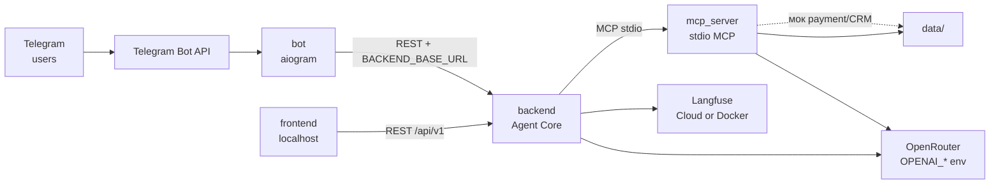

# Внешние интеграции: LLMStart Agent

> Архитектура потоков — в [architecture.md](architecture.md).  
> REST/SSE контракты — в [api-contracts.md](api-contracts.md).

---

## 1. Agent Core REST API (внутренний)

| Параметр | Значение |
|----------|----------|
| Назначение | Единая точка диалога для виджета и Telegram-бота |
| Направление | In (клиенты → backend) |
| Протокол | HTTP REST; JSON или SSE (`Accept`) |
| Базовый URL (локально) | `http://localhost:8000` |
| Документация | `/docs` (Swagger UI FastAPI) |

Полные контракты — в [api-contracts.md](api-contracts.md).

| Эндпоинт | Сценарий |
|----------|----------|
| `POST /api/v1/chat` | Сообщение в диалог; JSON или SSE |
| `GET /health` | Liveness |
| `GET /ready` | Готовность (Core + MCP subprocess) |

**Клиенты**

| Клиент | Переменная | Значение (dev) |
|--------|------------|----------------|
| frontend (Next.js) | `NEXT_PUBLIC_BACKEND_BASE_URL` (клиент), `BACKEND_BASE_URL` (SSR) | `http://localhost:8000` |
| bot (aiogram) | `BACKEND_BASE_URL` | `http://localhost:8000` |

Виджет в MVP встраивается только на **localhost** (разработка); production-домен `llmstart.ru` — post-MVP.

---

## 2. MCP-сервер инструментов (внутренняя интеграция)

| Параметр | Значение |
|----------|----------|
| Назначение | RAG, каталог B2C, лиды, мок-оплата — единая граница side-effects |
| Направление | Out (backend → mcp_server) |
| Протокол | **MCP over stdio** (subprocess, запускается Core) |
| Критичность | **MVP** — без MCP агент не выполняет tools |
| Замена | HTTP MCP / отдельный контейнер — post-MVP |

**Как подключается:** `backend/mcp_client/` поднимает `mcp_server` при старте приложения; LangChain ReAct вызывает tools через MCP SDK.

**Данные:** монтирование `data/` (read/write для `leads.txt`, Chroma в `data/.chroma/`).

**Embeddings в mcp_server:** тот же OpenAI-совместимый API, что и Core — переменные `OPENAI_API_KEY`, `OPENAI_BASE_URL` (см. OpenRouter ниже).

> Платёж и CRM реализованы **за MCP-границей** в `mcp_server`, чтобы позже подменить реальные провайдеры без изменения Core.

---

## 3. OpenRouter (LLM и embeddings)

Документация: [https://openrouter.ai/docs](https://openrouter.ai/docs)

| Параметр | Значение |
|----------|----------|
| Назначение | Chat-модель для ReAct-агента; embeddings для RAG в mcp_server |
| Направление | Out (backend, mcp_server → API) |
| Протокол | HTTPS REST, **OpenAI-совместимый** API |
| Критичность | **MVP** — без LLM агент недоступен |
| Клиент | LangChain / OpenAI SDK с кастомным `base_url` |

### Переменные окружения

| Переменная | Описание |
|------------|----------|
| `OPENAI_API_KEY` | API-ключ OpenRouter |
| `OPENAI_BASE_URL` | `https://openrouter.ai/api/v1` (или актуальный base URL провайдера) |
| `OPENAI_MODEL` | ID chat-модели (MVP: на усмотрение реализации, например `openai/gpt-4o-mini`) |

Модель embeddings для RAG задаётся в конфиге `mcp_server` (MVP: на усмотрение реализации, например `openai/text-embedding-3-small` через тот же `OPENAI_BASE_URL`).

### Поведение при сбоях

| Сбой | Поведение |
|------|-----------|
| OpenRouter недоступен / 429 / invalid key | Ошибка на `/chat`, SSE `event: error`; **fallback на другой LLM нет** |
| Таймаут | Настраиваемый timeout в клиенте; пользователю — понятное сообщение |

---

## 4. Langfuse (observability)

Документация: [https://langfuse.com/docs](https://langfuse.com/docs)

| Параметр | Значение |
|----------|----------|
| Назначение | Трассировка диалогов, LLM-вызовов, tool calls |
| Направление | Out (backend → Langfuse) |
| Протокол | HTTPS (SDK: traces, generations) |
| Критичность | **Важно**, не блокирует MVP-функции |

### Развёртывание (MVP)

Допускаются оба варианта:

| Вариант | `LANGFUSE_HOST` |
|---------|-----------------|
| **Langfuse Cloud** | `https://cloud.langfuse.com` (или регион US/JP) |
| **Self-hosted** | `http://langfuse:3000` в docker-compose (`devops/`) |

### Переменные окружения

| Переменная | Описание |
|------------|----------|
| `LANGFUSE_PUBLIC_KEY` | Public key проекта |
| `LANGFUSE_SECRET_KEY` | Secret key проекта |
| `LANGFUSE_HOST` | Base URL инстанса Langfuse |

Подключение через LangChain callback / OpenTelemetry в `backend/observability/`.

### Поведение при сбоях

| Сбой | Поведение |
|------|-----------|
| Langfuse недоступен | **Диалог продолжается**; ошибки трассировки логируются, не показываются пользователю |

---

## 5. Telegram Bot API

Документация: [https://core.telegram.org/bots/api](https://core.telegram.org/bots/api)

| Параметр | Значение |
|----------|----------|
| Назначение | Канал `telegram`; доставка HTML-ответов пользователю |
| Направление | Bidirectional (bot ↔ Telegram; bot → Core) |
| Протокол | HTTPS long **polling** (MVP, финально) |
| Критичность | **MVP** для сценария Telegram; web работает без бота |

### Переменные окружения

| Переменная | Описание |
|------------|----------|
| `TELEGRAM_BOT_TOKEN` | Токен от @BotFather |
| `TELEGRAM_BOT_USERNAME` | Username без `@` (для ссылок) |
| `BACKEND_BASE_URL` | URL Agent Core, напр. `http://localhost:8000` |

### Handoff web → Telegram

Deep link (с сайта / виджета):

```text
https://t.me/<TELEGRAM_BOT_USERNAME>?start=s_<session_id>
```

`session_id` — UUID сессии Core (in-memory). Бот парсит payload `s_<uuid>` и передаёт в `POST /api/v1/chat` с `channel: telegram`.

---

## 6. Платёжный провайдер (мок, MVP)

| Параметр | Значение |
|----------|----------|
| Назначение | Имитация ссылки на оплату и подтверждения «оплатил» |
| Направление | Out (tool `create_payment_link` / `confirm_payment` в mcp_server) |
| Протокол | Локальная логика + фиктивный URL |
| Критичность | MVP (демо воронки) |

**MVP (на усмотрение реализации):**

- URL: `https://pay.mock.llmstart.ru/checkout?product_id={id}&session_id={sid}&token={random}`
- `confirm_payment`: принимает текстовое подтверждение пользователя + `session_id`; без проверки реального платежа.

**Post-MVP:** ЮKassa / Stripe / Robokassa — замена реализации tools в `mcp_server` без изменения контракта Core.

---

## 7. CRM (мок, MVP)

| Параметр | Значение |
|----------|----------|
| Назначение | Сохранение лидов после воронки |
| Направление | Out (tool `save_lead` → файл) |
| Протокол | Append в `data/leads.txt` |
| Критичность | MVP (демо сбора контактов) |

**MVP (на усмотрение реализации):** одна JSON-строка на лид (JSON Lines):

```json
{"ts":"2026-06-04T12:00:00Z","email":"...","phone":"...","name":"...","product_id":"deep-agents","channel":"web","segment":"b2c"}
```

**Post-MVP:** AmoCRM, Bitrix24, HubSpot — интеграция в `mcp_server` или отдельный adapter.

---

## 8. Интеграции вне MVP (справочно)

| Система | Назначение | Статус |
|---------|------------|--------|
| Реальная платёжка | Оплата курсов | Post-MVP |
| CRM (Amo / Bitrix / …) | Синхронизация лидов | Post-MVP |
| Email / SMS | Уведомления, рассылки | Post-MVP |
| Сайт llmstart.ru (embed) | Production-виджет | Post-MVP |
| Postgres / Redis | Сессии, каталог | Post-MVP |

---

## 9. Диаграмма интеграций



---

## 10. Зависимости и риски

| Интеграция | Риск | Митигация |
|------------|------|-----------|
| **OpenRouter** | Недоступность, лимиты, смена моделей | Явные ошибки; конфиг `OPENAI_MODEL`; мониторинг в Langfuse; без LLM-fallback |
| **Langfuse** | Недоступность облака / Docker | **Работа без трейсов**; логи в stdout |
| **MCP stdio** | Падение subprocess | `/ready` false; перезапуск процесса Core |
| **Telegram API** | Блокировки, rate limits | Retry в bot; web-канал независим |
| **Платёж / CRM (моки)** | Не отражают реальное поведение | Явно помечены как моки; вынесены за MCP-границу для будущей замены |
| **In-memory сессии** | Потеря при рестарте Core | Документировано; Redis — post-MVP |

### Критичность для MVP

| Уровень | Интеграции |
|---------|------------|
| **Блокирующие** | OpenRouter, MCP stdio, Agent Core API |
| **Канал web** | frontend → Core (localhost) |
| **Канал telegram** | Telegram API + bot + Core |
| **Неблокирующие** | Langfuse |
| **Демо-логика** | Мок платёж + `leads.txt` |

---

## 11. Сводка переменных окружения

| Компонент | Переменные |
|-----------|------------|
| backend | `OPENAI_API_KEY`, `OPENAI_BASE_URL`, `OPENAI_MODEL`, `LANGFUSE_*`, MCP launch config |
| mcp_server | `OPENAI_API_KEY`, `OPENAI_BASE_URL`, (+ embedding model в config) |
| bot | `TELEGRAM_BOT_TOKEN`, `TELEGRAM_BOT_USERNAME`, `BACKEND_BASE_URL` |
| frontend | `NEXT_PUBLIC_BACKEND_BASE_URL`, `NEXT_PUBLIC_TELEGRAM_BOT_USERNAME` |

Пример — в корневом `.env.example`.
