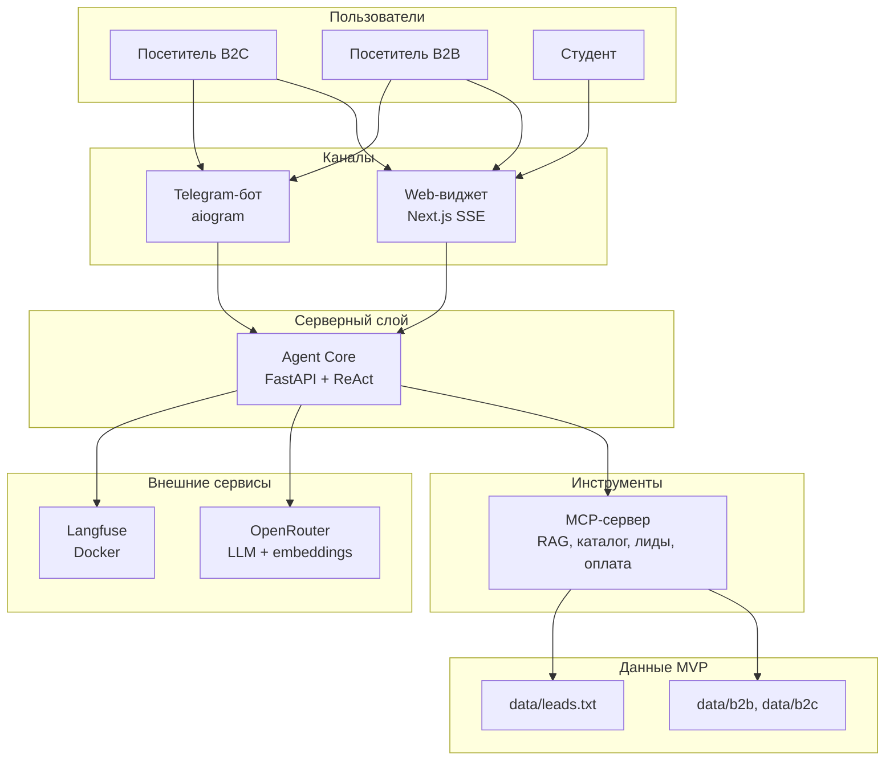

# Техническое видение: LLMStart Agent

---

## 1. Система в целом

**LLMStart Agent** — мульти канальная система AI-продаж и консультаций для llmstart.ru. Ядро — **Agent Core** (Python, FastAPI, LangChain ReAct): диалог, память, оркестрация LLM. Все прикладные инструменты (RAG, каталог, лиды, оплата) вынесены в **MCP-сервер инструментов**; Core подключается к нему как **MCP-клиент**.

Каналы **web** и **telegram** — тонкие адаптеры поверх единого HTTP API Core; отдельной «роли Telegram» в домене нет, только параметр `channel`.

Продукт — **демо курса с production-паттернами**: архитектура и observability как в production, внешние платежи и CRM на MVP — моки.

---

## 2. Роли


| Роль                 | Описание                                                                                                |
| -------------------- | ------------------------------------------------------------------------------------------------------- |
| **Посетитель (B2C)** | Физлицо на сайте или в Telegram: вопросы по курсам, выбор из каталога, мок-оплата, оставление контакта. |
| **Посетитель (B2B)** | Представитель компании: корп. обучение, заказ разработки, консультации; ответы из B2B RAG, сбор лида.   |
| **Студент курса**    | Организационные вопросы (формат, сроки, материалы); без выдачи доступа и эскалации в MVP.               |


> Канал (`web` / `telegram`) — свойство сессии, не отдельная роль.

---

## 3. Пользовательские сценарии

### Посетитель (B2C)

- **С-1: Консультация по курсу** — задаёт вопрос; агент уточняет потребность, ищет в B2C RAG, предлагает продукт из каталога (6 позиций).
- **С-2: Покупка (мок)** — запрашивает оплату; Core вызывает `create_payment_link`; виджет показывает карточку с ценой и «Купить», в Telegram — ссылка в HTML.
- **С-3: Подтверждение и лид** — пишет «оплатил»; `confirm_payment` (мок) → `save_lead` с email, телефон, имя, product_id, channel, segment.
- **С-4: Демо экспертизы (web)** — в виджете в реальном времени видит блок «Рассуждение» и шаги инструментов (✓ / ⟳) по SSE.

### Посетитель (B2B)

- **С-5: Уточнение сегмента** — при смешанном запросе агент определяет B2B vs B2C и переключает контекст RAG.
- **С-6: Корпоративный запрос** — вопрос по обучению/заказу; `search_knowledge_base` с фильтром B2B; при интересе — сбор лида (те же поля, segment=B2B).
- **С-7: Сравнение с B2C** — «курс для себя / для компании»; агент объясняет разницу сегментов без юридической консультации.

### Каналы (web / telegram)

- **С-8: Виджет на сайте** — split-screen или плавающий pop-up; стриминг ответа; карточки продуктов.
- **С-9: Переход в Telegram** — с сайта: «продолжить в Telegram»; пользователь открывает бота с `session_id` (deep link / параметр), история в рамках in-memory сессии Core.
- **С-10: Только Telegram** — новый диалог в боте, `channel=telegram`, форматирование HTML.

### Студент курса

- **С-11: Орг. вопрос** — сроки, формат, материалы; ответ из базы знаний; при необходимости доступа — объяснение политики (выдача доступа вне MVP).

---

## 4. Архитектура (high-level)

> Детальные диаграммы и потоки — в `[architecture.md](architecture.md)`.




---

## 5. Компоненты системы

### Agent Core (FastAPI)

- Держит ReAct-агента, оркестрацию диалога и **in-memory** память сессии.
- Вызывает инструменты **только через MCP-клиент**.
- Знает `channel` (`web` / `telegram`) для адаптации формата ответа (например Markdown → HTML в Telegram).
- Отдаёт SSE-поток для виджета (текст, reasoning, события tools).
- **Не делает:** реализацию tools, рендер UI, запись в `leads.txt` напрямую, индексацию RAG.
- **Статус:** MVP

### MCP-сервер инструментов

- Публикует tools по MCP: `search_knowledge_base`, `list_b2c_products`, `save_lead`, `create_payment_link`, `confirm_payment`.
- Доступ к `data/b2b/`, `data/b2c/` и `data/leads.txt`.
- Единая точка side-effects; может использоваться другими MCP-клиентами, не только этим Core.
- **Статус:** MVP

### Web-виджет (Next.js)

- Встраивается на llmstart.ru: **split-screen** и **плавающий pop-up**.
- SSE: стриминг ответа; UI «Рассуждение» + шаги tools (✓ / ⟳).
- Карточки продуктов с ценами, кнопка «Купить» (мок-ссылка).
- Развилка: остаться в виджете / перейти в Telegram.
- **Не делает:** бизнес-логику агента, прямые вызовы MCP tools (только API Core).
- **Статус:** MVP

### Telegram-бот (aiogram)

- Long polling, тот же Core через API, `channel=telegram`.
- HTML-форматирование ответов.
- **Статус:** MVP

### Observability (Langfuse)

- Трассировка диалогов, LLM и tool calls; локально в Docker (`devops/`).
- **Статус:** MVP

---

## 6. Структура проекта

```
llmstart-agent/
├── backend/           # Agent Core: FastAPI, ReAct, диалог, MCP-клиент
├── frontend/          # Next.js веб-виджет (SSE, reasoning/tools UI)
├── bot/               # Telegram-бот (aiogram)
├── mcp_server/        # MCP-сервер инструментов (RAG, каталог, лиды, оплата)
├── data/
│   ├── b2b/           # база знаний B2B (PDF, MD)
│   ├── b2c/           # база знаний B2C (PDF, MD) + каталог
│   └── leads.txt      # мок CRM
├── devops/            # docker-compose, Dockerfile'ы, Langfuse, env
└── docs/
    ├── concept/
    ├── decisions/
    ├── roadmap.md
    └── sprints/
```

---

## 7. Доменные сущности

> Персистентная БД в MVP нет; сущности в памяти Core и в файлах `data/`.


| Сущность           | Смысл                                                                        |
| ------------------ | ---------------------------------------------------------------------------- |
| **Session**        | Диалог пользователя; `session_id`, `channel`, история сообщений (in-memory). |
| **Message**        | Реплика user / assistant в рамках сессии.                                    |
| **Segment**        | `b2b` | `b2c` — контекст RAG и формулировок.                                 |
| **Product**        | Позиция B2C-каталога (6 slug'ов, цена, описание).                            |
| **Lead**           | Зафиксированный контакт после воронки; append в `data/leads.txt`.            |
| **PaymentLink**    | Мок-ссылка на оплату, привязка к `product_id`.                               |
| **KnowledgeChunk** | Фрагмент из RAG (b2b/b2c), метаданные для фильтра сегмента.                  |


### Lead (MVP) — обязательные поля


| Поле         | Описание                                                         |
| ------------ | ---------------------------------------------------------------- |
| `email`      | Email                                                            |
| `phone`      | Телефон                                                          |
| `name`       | Имя                                                              |
| `product_id` | Slug продукта B2C (или согласованный идентификатор для B2B-лида) |
| `channel`    | `web` | `telegram`                                               |
| `segment`    | `b2c` | `b2b`                                                    |


---

## 8. Внешние связи

> Детализация — в `[integrations.md](integrations.md)`.


| Интеграция                  | Назначение                                                |
| --------------------------- | --------------------------------------------------------- |
| **OpenRouter**              | LLM и embeddings для агента и RAG                         |
| **Langfuse**                | Трассировка (локальный Docker)                            |
| **MCP-сервер (внутренний)** | Tools: RAG, каталог, лиды, мок-оплата                     |
| **Платёжный провайдер**     | **Мок** на MVP (`create_payment_link`, `confirm_payment`) |
| **CRM**                     | **Мок** — `data/leads.txt`                                |


**Деплой MVP:** локальный стек (`make dev`, `devops/docker-compose`); выкладка на production-хостинг — вне scope MVP.

---

## 9. Принципы разработки

- **KISS** — простые решения, без лишней абстракции.
- **YAGNI** — только то, что нужно для MVP и текущего спринта.
- **DRY** — общая логика в Core и MCP, не дублировать в каналах.
- **Один мозг — много каналов** — вся логика в Agent Core; виджет и бот — тонкие адаптеры.
- **Production-grade архитектура, мок-интеграции** — паттерны (ReAct, MCP, SSE, observability) настоящие; платежи и CRM имитируются явно.
- **Tools — единая точка side-effects** — только MCP-сервер пишет в `data/` и отдаёт мок-оплату.

---

## 10. Технологии


| Область             | Решение                                               |
| ------------------- | ----------------------------------------------------- |
| Runtime (Core, MCP) | Python 3.12+, `uv`                                    |
| API / Core          | FastAPI, uvicorn                                      |
| Агент               | LangChain ReAct                                       |
| MCP                 | MCP SDK (stdio/HTTP — уточняется в `architecture.md`) |
| LLM + embeddings    | OpenRouter (OpenAI-совместимый API)                   |
| Observability       | Langfuse (Docker, `devops/`)                          |
| Web-виджет          | Next.js (App Router), TypeScript, Tailwind, shadcn/ui |
| Telegram            | aiogram                                               |
| Качество            | ruff, mypy (backend); ESLint, Prettier (frontend)     |
| Запуск              | `make` + `docker-compose` в `devops/`                 |


---

## 11. Архитектурные и прочие принятые решения

> Полные ADR — в `docs/decisions/` (создаются по мере детализации).


| №        | Решение                                                          | Статус  |
| -------- | ---------------------------------------------------------------- | ------- |
| ADR-0001 | Единое Agent Core, тонкие канальные адаптеры (`web`, `telegram`) | Принято |
| ADR-0002 | Все инструменты агента — отдельный MCP-сервер                    | Принято |
| ADR-0003 | LLM-провайдер — OpenRouter                                       | Принято |
| ADR-0004 | Платежи и CRM — моки на MVP                                      | Принято |
| ADR-0005 | Память диалога in-memory, без БД на MVP                          | Принято |


