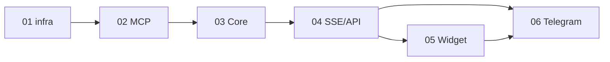

# Roadmap — LLMStart Agent

> **Vision:** [concept/vision.md](concept/vision.md)  
> **Последнее обновление:** 2026-06-06 (v0.1 MVP закрыт)

---

## Цель продукта

Публичный AI-ассистент llmstart.ru: первая линия продаж и консультаций (B2C/B2B), демо курса с production-паттернами — единый Agent Core, инструменты в MCP, каналы web и Telegram.

---

## Легенда

- 📋 Planned — запланирован
- 🚧 In Progress — в работе
- ✅ Done — завершён
- ⏸ Paused — на паузе
- 🗄 Archived — отменён

---

## Версии / Этапы

### v0.1 — MVP: агент продаёт в двух каналах ✅

**Цель:** работающий агент, который ведёт воронку от вопроса до мок-оплаты и лида, доступен в Telegram и в веб-виджете, с инструментами в MCP-сервере; Langfuse UI поднимается локально, полные трейсы — в v0.2.

**Ключевые результаты:**

- [x] Каркас в удалённом репозитории; стек поднимается одной командой (`make dev`); работает в облачном окружении (Codespaces / аналог)
- [x] Агент отвечает по базе знаний (RAG) с учётом сегмента B2B/B2C (сегмент определяет агент) — JSON API, sprint-03
- [x] Полная воронка: подбор продукта → мок-ссылка → подтверждение → лид в `data/leads.txt` — sprint-06
- [x] Веб-виджет (SSE, reasoning/tools, карточки продуктов) — sprint-05
- [x] Telegram (JSON + HTML) — sprint-06
- [x] Инструменты через `mcp_server` (handlers in-process в Core); Langfuse SDK/callbacks в Core — sprint-03 (см. v0.2 для рабочих трейсов)

**Спринты:**

| # | Sprint | Цель | Статус | Документ |
|---|--------|------|--------|----------|
| 01 | [infra-bootstrap](sprints/sprint-01-infra-bootstrap/README.md) | Репозиторий, `devops/`, Makefile, `GET /health`, облачное dev-окружение | ✅ | sprint-01 |
| 02 | [mcp-tools-rag](sprints/sprint-02-mcp-tools-rag/README.md) | MCP-сервер: RAG B2B/B2C, каталог, моки лид/оплата, `data/` | ✅ | sprint-02 |
| 03 | [agent-core](sprints/sprint-03-agent-core/README.md) | Core: ReAct, `POST /chat` (JSON), MCP-клиент, сессии, Langfuse | ✅ | sprint-03 |
| 04 | [api-stream-catalog](sprints/sprint-04-api-stream-catalog/README.md) | `POST /chat` (SSE), `GET /products`, контракты API | ✅ | sprint-04 |
| 05 | [web-widget](sprints/sprint-05-web-widget/README.md) | Next.js виджет: SSE UI, reasoning/tools, витрина, CTA Telegram | ✅ | sprint-05 |
| 06 | [telegram-funnel](sprints/sprint-06-telegram-funnel/README.md) | Telegram-бот, handoff `session_id`, E2E воронка до лида | ✅ | sprint-06 |

**Критерии приёмки v0.1 (сводка):**

| # | Проверка |
|---|----------|
| 1 | Клон из удалённого репо → `make dev` → backend :8003, frontend :3002, bot + Langfuse UI |
| 2 | Вопрос по B2C/B2B → ответ с релевантным RAG-контекстом (не галлюцинация каталога) |
| 3 | Запрос оплаты → мок-URL → «оплатил» → запись лида (6 полей) в `leads.txt` |
| 4 | Web: SSE-поток с `reasoning`, `tool`, `products`, `payment_link`, `done` |
| 5 | Telegram: `message_html`, диалог с тем же `session_id` после deep link |
| 6 | Langfuse UI доступен (`make up`); трейсы в UI — **v0.2** (см. ниже) |

---

### v0.2 — Промышленные атрибуты (hardening) 📋

**Цель:** превратить учебный стенд в систему, устойчивую к нагрузке и злоупотреблениям.

**Ключевые результаты:**

- [ ] **Langfuse v3 self-hosted:** апгрейд `devops/docker-compose.yml` с `langfuse:2.95.11` на v3+ (ClickHouse, Redis, S3/Blob); end-to-end трейсы LLM + tool spans в UI
- [ ] Guardrails: валидация ввода, ограничение тематики, безопасные ответы
- [ ] Rate limiting и базовая защита от DDoS / абьюза
- [ ] Лимиты на длину диалога / стоимость запросов к LLM
- [ ] Проверки безопасности (секреты, заголовки, CORS)

**Контекст Langfuse (отложено из v0.1):** backend уже инициализирует SDK v3 (`init_langfuse`, `CallbackHandler`, metadata `session_id`/`channel`), но self-hosted **v2.95.11** не принимает OTLP (`/api/public/otel/v1/traces` → 404). До апгрейда сервера трейсы в UI не появляются.

**Спринты:** будут детализированы после закрытия v0.1.

| # | Sprint | Цель | Статус | Документ |
|---|--------|------|--------|----------|
| — | TBD | Langfuse v2 → v3: compose, миграция dev-данных, DoD «trace за turn» | 📋 | — |
| — | TBD | Guardrails + policy layer в Core | 📋 | — |
| — | TBD | Rate limits, квоты LLM, observability алертов | 📋 | — |
| — | TBD | Security review: CORS production, headers, secrets CI | 📋 | — |

---

### v1.0 — Production-релиз 📋

**Цель:** заменить моки реальными интеграциями и добавить устойчивое хранение.

**Ключевые результаты:**

- [ ] Реальные платежи вместо мок-ссылок
- [ ] Реальная CRM вместо `leads.txt`
- [ ] Persistence диалогов (Postgres) вместо in-memory
- [ ] Эскалация на эксперта, выдача доступа после оплаты
- [ ] Embed виджета на llmstart.ru, production deploy

**Спринты:** будут детализированы после v0.2.

| # | Sprint | Цель | Статус | Документ |
|---|--------|------|--------|----------|
| — | TBD | Postgres + миграции сессий/сообщений | 📋 | — |
| — | TBD | Платёжный провайдер + webhooks | 📋 | — |
| — | TBD | CRM-интеграция, эскалация, выдача доступа | 📋 | — |

---

## Зависимости между спринтами (v0.1)

Спринты 05 и 06 можно вести параллельно после 04.

---

## История изменений

| Дата | Изменение |
|------|-----------|
| 2026-06-06 | Закрыт sprint-06 telegram-funnel; **v0.1 MVP** завершён |
| 2026-06-06 | Апгрейд Langfuse v2→v3 перенесён в v0.2; критерий трейсов v0.1 смягчён |
| 2026-06-05 | Закрыт sprint-05 web-widget |
| 2026-06-05 | Закрыт sprint-04 api-stream-catalog |
| 2026-06-05 | Закрыт sprint-03 agent-core |
| 2026-06-05 | Закрыт sprint-02 mcp-tools-rag |
| 2026-06-05 | Закрыт sprint-01 infra-bootstrap |
| 2026-06-04 | Создан roadmap: v0.1 (6 спринтов), v0.2 hardening, v1.0 production |
