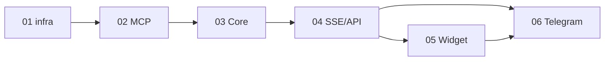

# Roadmap — LLMStart Agent

> **Vision:** [concept/vision.md](concept/vision.md)  
> **Последнее обновление:** 2026-08-16 (sprint-11 red-teaming-baseline закрыт; backlog security размещён в v0.3 / v1.0)

---

## Цель продукта

Публичный AI-ассистент llmstart.ru: первая линия продаж и консультаций (B2C/B2B), демо курса с production-паттернами — единый Agent Core, инструменты в MCP, каналы web и Telegram.

---

## Легенда

- 📋 Planned — запланирован
- 🚧 In Progress — в работе
- ✅ Done — завершён
- ⏸ Paused — на паузе
- 🗄 Archived — отменён

---

## Версии / Этапы

### v0.1 — MVP: агент продаёт в двух каналах ✅

**Цель:** работающий агент, который ведёт воронку от вопроса до мок-оплаты и лида, доступен в Telegram и в веб-виджете, с инструментами в MCP-сервере; Langfuse UI поднимается локально, полные трейсы — в v0.2.

**Ключевые результаты:**

- [x] Каркас в удалённом репозитории; стек поднимается одной командой (`make dev`); работает в облачном окружении (Codespaces / аналог)
- [x] Агент отвечает по базе знаний (RAG) с учётом сегмента B2B/B2C (сегмент определяет агент) — JSON API, sprint-03
- [x] Полная воронка: подбор продукта → мок-ссылка → подтверждение → лид в `data/leads.txt` — sprint-06
- [x] Веб-виджет (SSE, reasoning/tools, карточки продуктов) — sprint-05
- [x] Telegram (JSON + HTML) — sprint-06
- [x] Инструменты через `mcp_server` (handlers in-process в Core); Langfuse SDK/callbacks в Core — sprint-03 (см. v0.2 для рабочих трейсов)

**Спринты:**

| # | Sprint | Цель | Статус | Документ |
|---|--------|------|--------|----------|
| 01 | [infra-bootstrap](sprints/sprint-01-infra-bootstrap/README.md) | Репозиторий, `devops/`, Makefile, `GET /health`, облачное dev-окружение | ✅ | sprint-01 |
| 02 | [mcp-tools-rag](sprints/sprint-02-mcp-tools-rag/README.md) | MCP-сервер: RAG B2B/B2C, каталог, моки лид/оплата, `data/` | ✅ | sprint-02 |
| 03 | [agent-core](sprints/sprint-03-agent-core/README.md) | Core: ReAct, `POST /chat` (JSON), MCP-клиент, сессии, Langfuse | ✅ | sprint-03 |
| 04 | [api-stream-catalog](sprints/sprint-04-api-stream-catalog/README.md) | `POST /chat` (SSE), `GET /products`, контракты API | ✅ | sprint-04 |
| 05 | [web-widget](sprints/sprint-05-web-widget/README.md) | Next.js виджет: SSE UI, reasoning/tools, витрина, CTA Telegram | ✅ | sprint-05 |
| 06 | [telegram-funnel](sprints/sprint-06-telegram-funnel/README.md) | Telegram-бот, handoff `session_id`, E2E воронка до лида | ✅ | sprint-06 |
| 08 | [vector-db](sprints/sprint-08-vector-db/README.md) | Выбрать и перевести RAG-слой на выбранную векторную БД | ✅ | [sprint-08](sprints/sprint-08-vector-db/README.md) |

**Критерии приёмки v0.1 (сводка):**

| # | Проверка |
|---|----------|
| 1 | Клон из удалённого репо → `make dev` → backend :8003, frontend :3002, bot + Langfuse UI |
| 2 | Вопрос по B2C/B2B → ответ с релевантным RAG-контекстом (не галлюцинация каталога) |
| 3 | Запрос оплаты → мок-URL → «оплатил» → запись лида (6 полей) в `leads.txt` |
| 4 | Web: SSE-поток с `reasoning`, `tool`, `products`, `payment_link`, `done` |
| 5 | Telegram: `message_html`, диалог с тем же `session_id` после deep link |
| 6 | Langfuse UI доступен (`make up`); трейсы в UI — **sprint-07** (v0.2) |

---

### v0.2 — Развитие RAG-ассистента 📋

**Цель:** перейти от базового dense-RAG к GraphRAG + мультимодальности; заложить архитектуру агента с управляемой памятью и планированием.

**Ключевые результаты:**

- [x] GraphRAG: Knowledge Graph в Neo4j, GraphRAG-ретривер заменяет/дополняет Qdrant — sprint-09 ✅
- [x] Мультимодальный RAG: 5 методов индексации на визуально-плотном корпусе; вердикт — метод C default — sprint-10 ✅ · [final report](../evals/reports/multimodal-final.md)
- [ ] Управление контекстным окном, памятью и состоянием агента; планирование, декомпозиция задач, Skills, Subagents, Long-term memory
- [ ] RAG: hybrid search (dense + BM25/sparse) для точных term-запросов
- [ ] RAG: PDF chunking — структурный парсер (заголовки, таблицы); сейчас `pypdf` → plain text → blind window

**Контекст RAG:** Markdown чанкится структурно (по `##`-заголовкам, sprint-08 ✅). PDF извлекается `pypdf` страницами → слепое окно; структурного парсера нет. Hybrid search явно исключён из scope sprint-08.

**Спринты:**

| # | Sprint | Цель | Статус | Документ |
|---|--------|------|--------|----------|
| 09 | [graphrag](sprints/sprint-09-graphrag/README.md) | **GraphRAG** — KG каталога (Neo4j), graph/global/text2cypher retrieval, маршрутизация по типу вопроса, реранкер | ✅ | [sprint-09](sprints/sprint-09-graphrag/README.md) |
| 10 | [multimodal-rag](sprints/sprint-10-multimodal-rag/README.md) | **Мультимодальный RAG** — 5 методов индексации (naive text / OCR / caption / unified image-embed / multivector) на визуально-плотном B2B-корпусе; сегментный анализ (текст/чарты/раскладка/multi-hop/unanswerable), цена (время, $, объём) на каждый метод | ✅ | [sprint-10](sprints/sprint-10-multimodal-rag/README.md) · [final report](../evals/reports/multimodal-final.md) |
| 12 | TBD | **Context-engineering и агентное планирование** — sliding window / summarization, персистентная память (граф/БД), Plan-and-Execute, task decomposition, Skills, Subagents | 📋 | — |
| 13 | TBD | **RAG-улучшения** — hybrid search (BM25 + dense), структурный PDF-чанкинг (заголовки, таблицы) | 📋 | — |

> Номер 11 занят sprint-11 red-teaming-baseline (v0.3): security-baseline нужен до наращивания агентной автономии.

---

### v0.3 — Промышленные атрибуты (hardening) 📋

**Цель:** превратить учебный стенд в систему, устойчивую к нагрузке и злоупотреблениям.

**Ключевые результаты:**

- [x] **Langfuse v3 self-hosted:** апгрейд `devops/docker-compose.yml` с `langfuse:2.95.11` на v3+ (ClickHouse, Redis, S3/Blob); end-to-end трейсы LLM + tool spans в UI — sprint-07
- [x] **Red teaming baseline:** воспроизводимый прогон Promptfoo «до/после» на `POST /api/v1/chat`, модель угроз, фиксы за `SECURITY_ENABLED` — sprint-11 ✅ · [final-report](../practice/redteam/final-report.md)
- [ ] Guardrails + policy layer в Core: тематический классификатор (D-12; open F-13/F-16–F-18/F-20/F-21/F-24, partial F-22/F-23), NLP third-party ПД (D-06 / F-09), усиление формул ложной оплаты (F-06), фильтрация Cypher/меток в `message` (D-08/D-09), изоляция инструкций в чанках RAG (D-10 / R-11), XSS/`message_html` на клиенте (D-03 / R-15)
- [ ] Rate limiting и базовая защита от DDoS / абьюза (D-01 / R-13); лимиты на длину диалога / стоимость запросов к LLM
- [ ] Проверки безопасности: секреты, заголовки, CORS production (D-02)
- [ ] Redteam extended + регрессия харнесса sprint-11: crescendo/goat/`stateful`, encoding-стратегии без canary-JS (D-11); повторный `redteam eval` на замороженных yaml после hotfix denylist URL

**Контекст security:** sprint-11 закрыт — baseline ASR 36.23%→18.12%, FIX-1…FIX-5 за `SECURITY_ENABLED` (default true), харнесс в `practice/redteam/` ([final-report](../practice/redteam/final-report.md)). Остаются open/partial находки и defer D-01…D-12; публичный `/chat` без auth и без rate limit — по-прежнему.

**Контекст Langfuse:** backend на SDK v3 (`init_langfuse`, `CallbackHandler`); self-hosted **v3** (sprint-07) принимает OTLP. Runbook trace: `backend/README.md`, `devops/README.md`.

**Спринты:**

| # | Sprint | Цель | Статус | Документ |
|---|--------|------|--------|----------|
| 07 | [langfuse-v3](sprints/sprint-07-langfuse-v3/README.md) | Langfuse v2→v3 compose, clean start, DoD «trace за turn» | ✅ | sprint-07 |
| 11 | [red-teaming-baseline](sprints/sprint-11-red-teaming-baseline/README.md) | **Red teaming baseline** — Promptfoo, baseline «до/после», фиксы за `SECURITY_ENABLED` | ✅ | [sprint-11](sprints/sprint-11-red-teaming-baseline/README.md) · [final-report](../practice/redteam/final-report.md) |
| — | TBD | Guardrails + policy layer в Core (хвосты sprint-11: D-03, D-06–D-10, D-12; open/partial F-*) | 📋 | — |
| — | TBD | Rate limits, квоты LLM, observability алертов (D-01) | 📋 | — |
| — | TBD | Security review: CORS production, headers, secrets CI (D-02) | 📋 | — |
| — | TBD | Redteam extended + regression harness sprint-11 (D-11; crescendo/encoding; rerun eval) | 📋 | — |

---

### v1.0 — Production-релиз 📋

**Цель:** заменить моки реальными интеграциями и добавить устойчивое хранение.

**Ключевые результаты:**

- [ ] Реальные платежи вместо мок-ссылок
- [ ] Реальная CRM вместо `leads.txt`
- [ ] Persistence диалогов (Postgres) вместо in-memory
- [ ] Эскалация на эксперта, выдача доступа после оплаты
- [ ] Embed виджета на llmstart.ru, production deploy

**Спринты:** будут детализированы после v0.3.

| # | Sprint | Цель | Статус | Документ |
|---|--------|------|--------|----------|
| — | TBD | Postgres + миграции сессий/сообщений; привязка сессии / auth (D-04 / R-12) | 📋 | — |
| — | TBD | Платёжный провайдер + webhooks; защита чужого `payment_link` (D-05 / R-14) | 📋 | — |
| — | TBD | CRM-интеграция, эскалация, выдача доступа | 📋 | — |
| — | TBD | Embed виджета на llmstart.ru — XSS/`message_html` в scope клиента (D-03 / R-15) | 📋 | — |

---

## Зависимости между спринтами (v0.1)

```mermaid
flowchart LR
    S01["01 infra"] --> S02["02 MCP"]
    S02 --> S03["03 Core"]
    S03 --> S04["04 SSE/API"]
    S04 --> S05["05 Widget"]
    S04 --> S06["06 Telegram"]
    S05 --> S06
```

Спринты 05 и 06 можно вести параллельно после 04.

---

## История изменений

| Дата | Изменение |
|------|-----------|
| 2026-08-16 | Закрыт sprint-11 red-teaming-baseline: ASR 36.23%→18.12%, FIX-1…5, [final-report](../practice/redteam/final-report.md); backlog D-01…D-12 и open/partial влиты в TBD v0.3/v1.0 без дубликатов |
| 2026-08-10 | Номер 11 отдан sprint-11 red-teaming-baseline (v0.3, security-трек); context-engineering → 12, RAG-улучшения → 13 |
| 2026-07-11 | Закрыт sprint-10 multimodal-rag: 7 конфигураций × 5 сегментов, вердикт — метод C default, D — S4-upgrade; [multimodal-final.md](../evals/reports/multimodal-final.md) |
| 2026-07-05 | Создан план sprint-10 multimodal-rag: 8 задач (анализ корпуса → датасеты/метрики → контракт индексатора → методы A/OCR, B/caption, C/unified-embed, D/multivector → сводный отчёт и вердикт) |
| 2026-06-23 | sprint-08: payload index для `segment` в Qdrant; отдельный путь чанкинга PDF |
| 2026-06-25 | Добавлен v0.2 Развитие RAG-ассистента (GraphRAG, мультимодал, context-eng); hardening → v0.3 |
| 2026-06-24 | Закрыт sprint-08 vector-db: Qdrant + pgvector + ChromaDB bench; production-бэкенд Qdrant |
| 2026-06-22 | Добавлен sprint-08 vector-db (In Progress): RAG-слой на векторную БД |
| 2026-06-10 | Закрыт sprint-07 langfuse-v3: self-hosted Langfuse v3, trace за turn |
| 2026-06-06 | Закрыт sprint-06 telegram-funnel; **v0.1 MVP** завершён |
| 2026-06-06 | Апгрейд Langfuse v2→v3 перенесён в v0.2; критерий трейсов v0.1 смягчён |
| 2026-06-05 | Закрыт sprint-05 web-widget |
| 2026-06-05 | Закрыт sprint-04 api-stream-catalog |
| 2026-06-05 | Закрыт sprint-03 agent-core |
| 2026-06-05 | Закрыт sprint-02 mcp-tools-rag |
| 2026-06-05 | Закрыт sprint-01 infra-bootstrap |
| 2026-06-04 | Создан roadmap: v0.1 (6 спринтов), v0.2 hardening, v1.0 production |
