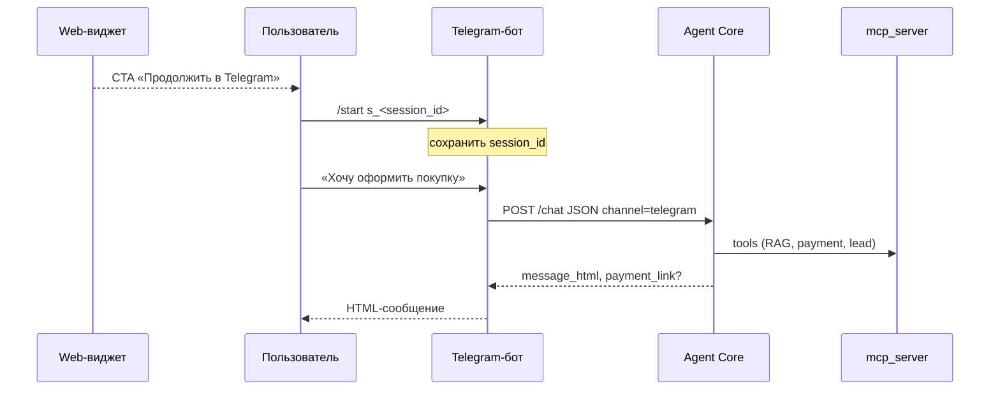
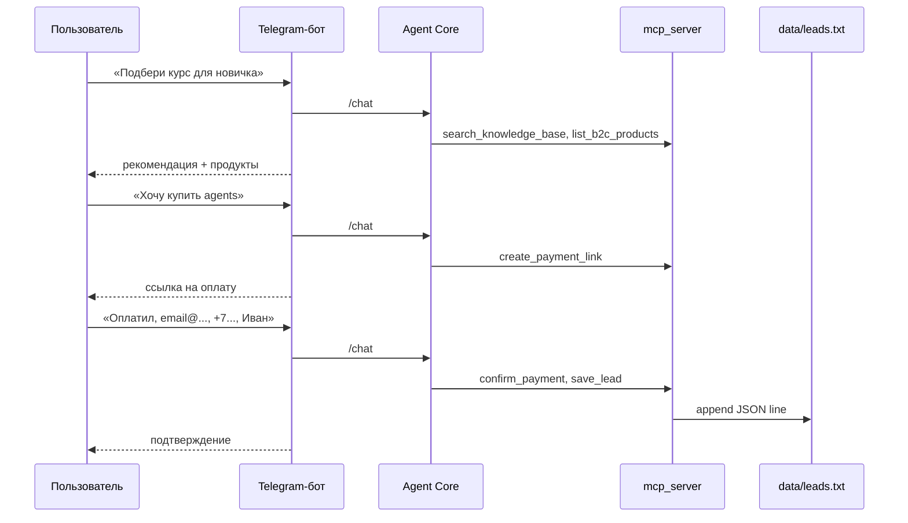

# Sprint 06: telegram-funnel

> **Версия roadmap:** v0.1 (финальный спринт MVP)  
> **Roadmap:** [../../roadmap.md](../../roadmap.md)  
> **Зависит от:** [sprint-04-api-stream-catalog](../sprint-04-api-stream-catalog/README.md), [sprint-05-web-widget](../sprint-05-web-widget/README.md)  
> **Статус:** ✅ Done  
> **Открыт:** 2026-06-06  
> **Закрыт:** 2026-06-06  
> **Summary:** [summary.md](./summary.md)

---

## Цель спринта

Реализовать **Telegram-бот** в `bot/` (aiogram 3, long polling): тонкий адаптер к **`POST /api/v1/chat` (JSON, `channel: telegram`)** без локальной логики агента. Закрыть **канал Telegram** и **E2E-воронку v0.1** — от консультации и подбора продукта до мок-оплаты, подтверждения «оплатил» и записи лида в `data/leads.txt`. Поддержать **handoff web → Telegram** по deep link `t.me/<bot>?start=s_<session_id>` (ссылку формирует виджет sprint-05). После спринта v0.1 MVP считается завершённым по критериям roadmap #3 и #5.

---

## DoD спринта

Sprint считается завершённым, когда:

| # | Критерий | Способ проверки |
|---|----------|-----------------|
| 1 | `make dev-bot` (или `make dev` с ботом) → long polling без ошибок при валидном `TELEGRAM_BOT_TOKEN` | Логи бота + ответ в Telegram |
| 2 | Новый диалог в боте: текст → `POST /api/v1/chat` с `channel: telegram`, `Accept: application/json` → пользователю уходит `message_html` (parse_mode HTML) | Ручной сценарий «Привет» |
| 3 | `/start` без payload — приветствие + краткая инструкция; сессия создаётся на первом сообщении | `/start` → первый вопрос |
| 4 | `/start s_<uuid>` (deep link с виджета) — бот парсит `session_id`, передаёт в Core; история web-диалога доступна в следующем turn | Web: 1–2 сообщения → CTA Telegram → продолжение в боте с контекстом |
| 5 | Невалидный / истёкший `session_id` в `/start` — понятное сообщение пользователю, бот не падает; новая сессия на следующем сообщении | Подставить случайный UUID |
| 6 | Сценарий B2C: «подбери курс» → ответ с релевантным контекстом; при запросе оплаты — `payment_link` доставлен пользователю (ссылка в HTML или отдельное сообщение с кнопкой/URL) | Ручной сценарий |
| 7 | Сценарий воронки: «оплатил» (+ контакты email/телефон/имя по запросу агента) → запись в `data/leads.txt` с **6 полями** (`email`, `phone`, `name`, `product_id`, `channel`, `segment`) и `channel: telegram` | Просмотр последней строки `leads.txt` |
| 8 | Ошибки Core: `503` / сеть / таймаут — сообщение пользователю на русском, бот остаётся живым | Остановить backend → отправить текст |
| 9 | Два turn подряд в Telegram с одним `session_id` — контекст сохраняется (уточняющий вопрос после подбора) | Два сообщения без `/start` |
| 10 | Langfuse: trace с LLM + tool spans за один turn | ⏭ **v0.2** (server v2.95 ↔ SDK v3+); SDK/callbacks готовы |
| 11 | `make lint` / `make typecheck` / `make test` / `make ci` зелёные (включая `bot/`) | CI |
| 12 | `bot/README.md` обновлён: env, запуск, структура, 3 ручных сценария (новый диалог, handoff, воронка до лида) | Ручной просмотр |
| 13 | Корневой `README.md` и `.env.example` — цели Makefile для бота, обязательные `TELEGRAM_*` | Ручной просмотр |

---

## Scope

### В scope

| Область | Содержание |
|---------|------------|
| **Пакет `bot/`** | `pyproject.toml` (uv), aiogram 3.x, httpx, pydantic-settings |
| **Структура** | `main.py`, `config.py`, `api/core_client.py`, `handlers/start.py`, `handlers/message.py` — по [architecture.md § Telegram](../../concept/architecture.md#telegram-бот-bot) |
| **Core-клиент** | `post_chat(message, session_id?, channel="telegram")` → `ChatResponse`; заголовки `Content-Type`, `Accept: application/json`; timeout, маппинг HTTP-ошибок |
| **Long polling** | Единственный режим MVP ([integrations.md §5](../../concept/integrations.md#5-telegram-bot-api)) |
| **`/start`** | Парсинг deep link `s_<uuid>`; сохранение `session_id` в FSM / in-memory store per `chat_id` |
| **Текстовые сообщения** | Проксирование в Core; ответ — `message_html` через `parse_mode=HTML` |
| **Доп. поля ответа** | При `payment_link` — явная доставка ссылки (в HTML или follow-up с `InlineKeyboardButton` url); `products` — опционально краткий список, если не вошли в `message_html` |
| **UX** | `send_chat_action(typing)` на время запроса к Core; разбиение только при превышении лимита Telegram (~4096 символов) |
| **Makefile** | `dev-bot`, `lint-bot`, `typecheck-bot`, `test-bot`; опционально включение бота в `make dev` (`-j3`) |
| **Env** | `TELEGRAM_BOT_TOKEN`, `TELEGRAM_BOT_USERNAME`, `BACKEND_BASE_URL` (согласован с dev-портами backend, см. sprint-05: `:8003`) |
| **Тесты** | pytest: парсинг `/start` payload, `CoreClient` с httpx mock, маппинг ошибок 400/503 |
| **Документация** | `bot/README.md`, дополнение корневого README |
| **E2E-приёмка** | Ручные сценарии закрывают критерии v0.1 roadmap #3, #5, #6 |

### Вне scope

| Область | Спринт / версия |
|---------|-----------------|
| Изменения контракта `POST /chat`, SSE, MCP tools | sprint-03/04 (стабильно); только bugfix при блокере |
| Доработки виджета, новый UI | sprint-05 (стабильно) |
| Webhook вместо polling | Post-MVP |
| Inline-меню каталога, callback-кнопки «Купить» | Post-MVP; достаточно текст + URL |
| Вложения, голос, стикеры | Post-MVP |
| Локальная память диалога в боте | Запрещено ADR-0001; только `session_id` → Core |
| `X-Internal-Key` между bot ↔ Core | Опционально в compose; не блокер MVP |
| Docker-образ бота в production | Post-MVP; локальный `uv run` достаточно |
| Postgres, rate limits, guardrails | v0.2 / v1.0 |
| Автотест E2E с реальным Telegram API | Ручная приёмка; CI — unit/integration с моками |

---

## Контракты (потребление)

Источник истины: [api-contracts.md](../../concept/api-contracts.md), [integrations.md § Handoff](../../concept/integrations.md#handoff-web--telegram).

### `POST /api/v1/chat` (JSON)

```http
POST /api/v1/chat
Content-Type: application/json
Accept: application/json

{"message": "...", "session_id": "<optional-uuid>", "channel": "telegram"}
```

**Ответ `200` — ключевые поля для бота:**

| Поле | Действие бота |
|------|----------------|
| `session_id` | Сохранить для следующих сообщений в этом чате |
| `message_html` | Основное сообщение (`parse_mode=HTML`) |
| `payment_link` | Если не в HTML — отправить ссылку отдельно |
| `products` | Опционально форматировать список, если агент не включил в текст |
| `tools` / `reasoning` | Не показывать в Telegram на MVP (тонкий адаптер) |

### Deep link handoff

```text
https://t.me/<TELEGRAM_BOT_USERNAME>?start=s_<session_id>
```

Telegram передаёт боту `/start s_<uuid>`. Бот извлекает UUID (префикс `s_`), валидирует формат, сохраняет как текущий `session_id` для `chat_id`.



### Воронка до лида (E2E)



---

## Шаги реализации

### 1. Bootstrap пакета `bot/`

- Инициализировать `bot/pyproject.toml` через uv: Python 3.12+, `aiogram` 3.x, `httpx`, `pydantic-settings`.
- Структура каталогов по architecture.md; удалить заглушку `.gitkeep` после появления кода.
- `bot/config.py` — `Settings` с fail-fast на отсутствие `TELEGRAM_BOT_TOKEN`; default `BACKEND_BASE_URL` согласовать с `Makefile` (`http://127.0.0.1:8003`).
- Точка входа `bot/main.py`: создание `Bot` + `Dispatcher`, регистрация роутеров, `asyncio.run(main())`.

### 2. HTTP-клиент Core

- `bot/api/core_client.py`:
  - Pydantic-модели ответа (минимум: `session_id`, `message_html`, `payment_link`, `products`, `detail` для ошибок).
  - `async def chat(message: str, session_id: str | None) -> ChatResponse`.
  - `httpx.AsyncClient` с настраиваемым timeout (например 120 с — turn с LLM).
  - Маппинг: `400` → «Сессия устарела…», `503` → «Сервис временно недоступен», сетевые ошибки → общее сообщение.
- Без дублирования бизнес-логики агента; без прямых вызовов MCP.

### 3. Хранение `session_id` per chat

- In-memory `dict[chat_id, str]` или aiogram FSM / `MemoryStorage` с ключом `session_id`.
- API: `get_session(chat_id)`, `set_session(chat_id, uuid)`, `clear_session(chat_id)`.
- Обновлять `session_id` из каждого успешного ответа Core (на случай ротации).

### 4. Handler `/start`

- `handlers/start.py`:
  - Без аргументов — приветствие («Я консультант LLMStart…»), подсказка писать вопрос; **не** вызывать Core на `/start` (YAGNI).
  - С аргументом `s_<uuid>` — `uuid.UUID` валидация; `set_session`; подтверждение «Продолжаем диалог с сайта».
  - Невалидный payload — сообщение об ошибке, `clear_session`.
- Unit-тесты: парсинг `s_…`, граничные случаи (`s_`, не-UUID).

### 5. Handler текстовых сообщений

- `handlers/message.py`:
  - Игнорировать non-text на MVP (вежливый ответ «Пока только текст»).
  - `send_chat_action(typing)` → `core_client.chat(text, session_id)` → `set_session` из ответа.
  - Отправка `message_html` с `parse_mode=HTML`; при `TelegramBadRequest` (битый HTML) — fallback на plain `message` из ответа.
  - Если `payment_link` и ссылка не видна в HTML — follow-up с URL (текст или `InlineKeyboardMarkup` с одной url-кнопкой «Перейти к оплате»).
  - Длинный текст — разбить по 4000 символов с сохранением границ абзацев.

### 6. Запуск и интеграция в Makefile

- `make dev-bot`: `cd bot && uv run python -m bot.main` (или `uv run python main.py`).
- Расширить `make dev`: `up` + `dev-backend` + `dev-frontend` + `dev-bot` (parallel `-j3`) **или** документировать отдельный терминал для бота.
- `lint-bot`, `typecheck-bot`, `test-bot`; включить в агрегаты `lint`, `typecheck`, `test`, `ci`.
- Проверить `.env.example`: `BACKEND_BASE_URL=http://localhost:8003` согласован с backend dev-портом.

### 7. Обработка ошибок и устойчивость

- Retry 1–2 раза на сетевые сбои httpx (exponential backoff короткий).
- Telegram rate limit (429) — лог + пауза (aiogram может обрабатывать частично).
- Логирование stdout: `chat_id`, `session_id` (только ID), статус HTTP; **не** логировать тексты сообщений и токен.
- Graceful shutdown: обработка `SIGINT` / остановка polling.

### 8. Тесты

- `bot/tests/test_start_payload.py` — парсинг deep link.
- `bot/tests/test_core_client.py` — httpx `MockTransport`: 200 JSON, 400, 503, timeout.
- `bot/tests/test_session_store.py` — get/set/clear.
- Smoke: импорт `main`, создание `Dispatcher` без реального токена (mock env).
- CI без live Telegram и без live LLM.

### 9. Документация

- `bot/README.md`: зависимости, env, `make dev-bot`, структура файлов.
- Три ручных сценария:
  1. Новый пользователь: `/start` → вопрос по курсу → ответ HTML.
  2. Handoff: web-диалог → deep link → продолжение темы в Telegram.
  3. Воронка: подбор → оплата → «оплатил» + контакты → строка в `leads.txt`.
- Корневой `README.md`: секция Telegram, ссылка на sprint-06.

### 10. Приёмка и закрытие v0.1

- Пройти таблицу DoD и критерии roadmap v0.1 (#3, #5, #6).
- `make ci` зелёный.
- Обновить [roadmap.md](../../roadmap.md): sprint-06 → ✅, галочки Telegram и полной воронки.
- После явного «ок» на самопроверку — `summary.md` спринта (отдельная задача по методологии).

---

## Зависимости и env

| Переменная | Компонент | Назначение |
|------------|-----------|------------|
| `TELEGRAM_BOT_TOKEN` | bot | Токен @BotFather; **обязателен** для запуска |
| `TELEGRAM_BOT_USERNAME` | bot, frontend | Username без `@`; deep link (виджет уже использует `NEXT_PUBLIC_*`) |
| `BACKEND_BASE_URL` | bot | URL Agent Core, default `http://127.0.0.1:8003` |
| `OPENAI_*`, `LANGFUSE_*` | backend | Без изменений; бот не обращается напрямую |
| `DATA_DIR` | mcp_server | `leads.txt` — проверка воронки |

**Предусловия:** backend и mcp_server работают (`make dev-backend` или `make up` + backend); для handoff — frontend `:3002` с настроенным `NEXT_PUBLIC_TELEGRAM_BOT_USERNAME`.

---

## Риски и допущения

| Риск | Митигация |
|------|-----------|
| Долгий turn LLM (> timeout httpx) | Timeout 120 с; typing indicator; сообщение «Думаю…» при повторном запросе |
| `message_html` невалиден для Telegram | Fallback на plain `message`; лог WARNING без текста в production-стиле |
| In-memory сессия Core сброшена после рестарта | Сообщение пользователю; новый диалог без `/start` создаст новую сессию |
| Polling на Windows / Codespaces | Документировать запуск; outbound HTTPS к `api.telegram.org` |
| Дублирование `payment_link` в тексте и поле JSON | Отправлять follow-up только если URL отсутствует в `message_html` |
| Несовпадение портов backend | Единый источник: `BACKEND_PORT` в Makefile + `BACKEND_BASE_URL` в `.env` |

**Допущения:**

- Один бот — один инстанс polling (без горизонтального масштабирования).
- Пользователь — один `chat_id` ↔ один активный `session_id` (без мульти-диалогов).
- B2B-воронка в Telegram — тот же API; segment определяет агент, бот не передаёт `segment`.
- Reasoning и шаги tools в Telegram **не** рендерятся (в отличие от web SSE); только финальный HTML.
- Docker-сервис `bot` в compose — опционально; достаточно локального `make dev-bot`.
- Виджет sprint-05 уже формирует корректный deep link — изменений frontend не требуется.

---

## Skills

Перед реализацией прочитать:

- `modern-python` — uv, ruff, mypy для нового пакета
- `python-testing-patterns` — pytest, httpx mock, async tests
- `api-design-principles` — потребление REST-контракта, обработка ошибок
- `sharp-edges` — секреты (`TELEGRAM_BOT_TOKEN`), логирование без PD

Контракт Core уточнять по [api-contracts.md](../../concept/api-contracts.md), не по памяти. Telegram API — [integrations.md §5](../../concept/integrations.md#5-telegram-bot-api).

---

## Итог

Telegram-бот как тонкий клиент Core; handoff `session_id` web → Telegram; E2E-воронка до `data/leads.txt`. **v0.1 MVP закрыт.**

Подробности: [summary.md](./summary.md).
