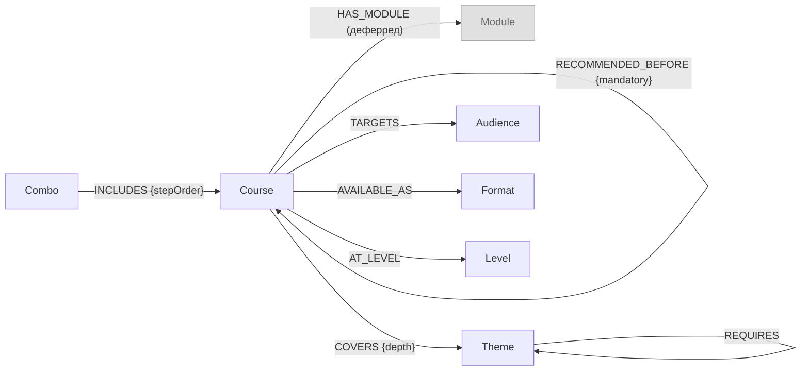

# LPG-схема каталога курсов — Sprint 09 GraphRAG

> **Задача:** Task 03 graph-schema-adr  
> **Источник:** [`analysis.md`](analysis.md) (инвентаризация, черновик схемы, нестыковки)  
> **ADR:** [`ADR-0010-graphrag.md`](../../adrs/ADR-0010-graphrag.md)

---

## 1. Узлы (Node Labels)

### `Course`

Центральная сущность каталога — один учебный курс.

| Свойство | Тип | Описание | Ключ нормализации |
|----------|-----|----------|-------------------|
| `id` | `STRING` | URL-slug (каноничный): `vibe-coding`, `fullstack-aidd`, `agents`, `deep-agents` | **UNIQUE** — ключ MERGE |
| `title` | `STRING` | Полное название | — |
| `priceRub` | `INTEGER` | Цена в рублях (источник: `real_data/*.md`, не `catalog.json`) | — |
| `level` | `STRING` | `intensive` \| `intermediate` \| `advanced` | — |
| `format` | `STRING` | `self-paced` \| `hybrid` \| `live` | — |
| `durationWeeks` | `INTEGER` | Продолжительность в неделях | — |
| `lessonsCount` | `INTEGER` | Кол-во занятий | — |
| `segment` | `STRING` | `b2c` \| `b2b` \| `both` | — |

> **Entity resolution:** алиасы `vibe-coding-intensive`, `ai-coding-agents-base` и т.п. → канонический `id` по URL-slug; детали в `analysis.md §5.4`.

---

### `Combo`

Комплект из нескольких курсов, продающийся единым SKU.

| Свойство | Тип | Описание | Ключ нормализации |
|----------|-----|----------|-------------------|
| `id` | `STRING` | Slug: `ai-agents-combo` | **UNIQUE** |
| `title` | `STRING` | Название | — |
| `priceRub` | `INTEGER` | Цена комбо (< суммы курсов) | — |
| `discountPct` | `FLOAT` | Процент скидки | — |
| `descriptionShort` | `STRING` | Короткое описание (≤ 200 символов) | — |

> **Источник цены:** пересчитать из цен отдельных курсов (`analysis.md §5.2`), не брать из таблицы в `ai-agents-combo.md` (редакционная ошибка на 5 000 ₽).

---

### `Theme`

Тема или концепт, раскрываемый в курсе.

| Свойство | Тип | Описание | Ключ нормализации |
|----------|-----|----------|-------------------|
| `id` | `STRING` | Нормализованный slug: `rag-basic`, `rag-advanced`, `observability`, … | **UNIQUE** |
| `name` | `STRING` | Каноническое название | — |
| `aliases` | `LIST<STRING>` | Все вариации написания из источников | — |

> **Entity resolution:** алиасы из `analysis.md §5.5` сводятся к каноническому `id` через MERGE; поиск по алиасам через `WHERE t.id = $q OR $q IN t.aliases`.

---

### `Audience`

Целевая аудитория курса.

| Свойство | Тип | Описание | Ключ нормализации |
|----------|-----|----------|-------------------|
| `id` | `STRING` | `non-dev`, `dev`, `executive`, `team`, `ai-engineer` | **UNIQUE** |
| `role` | `STRING` | Роль (то же значение, что `id`) | — |
| `segment` | `STRING` | `b2c` \| `b2b` | — |

---

### `Module`

Учебный модуль внутри курса. Вводится при расширении каталога (≥ 10 курсов).

| Свойство | Тип | Описание | Ключ нормализации |
|----------|-----|----------|-------------------|
| `id` | `STRING` | `{courseId}--module-{N}` | **UNIQUE** |
| `title` | `STRING` | Название модуля | — |
| `position` | `INTEGER` | Порядковый номер в курсе | — |

> **Статус:** **деферред**. На текущем объёме (4 курса) темы прикреплены напрямую к `Course`. Вводить узел `Module` при детализации программ или при добавлении ≥ 2 новых курсов.

---

### `Format`

Формат обучения как первоклассный объект (позволяет фильтровать и агрегировать по формату).

| Свойство | Тип | Описание | Ключ нормализации |
|----------|-----|----------|-------------------|
| `id` | `STRING` | `self-paced`, `hybrid`, `live`, `workshop`, `corporate`, `mentoring` | **UNIQUE** |
| `name` | `STRING` | Человекочитаемое название | — |
| `durationDaysMin` | `INTEGER` | Мин. длительность в днях | — |
| `durationDaysMax` | `INTEGER` | Макс. длительность в днях | — |

---

### `Level`

Уровень подготовки курса.

| Свойство | Тип | Описание | Ключ нормализации |
|----------|-----|----------|-------------------|
| `id` | `STRING` | `intensive`, `intermediate`, `advanced` | **UNIQUE** |
| `name` | `STRING` | Название уровня | — |
| `sortOrder` | `INTEGER` | 1 / 2 / 3 для сортировки | — |

> **Альтернатива:** при отсутствии traversal-запросов по уровню достаточно хранить `level` как свойство на `Course`. Выделить в отдельный узел, если понадобится фильтрация `MATCH (c:Course)-[:AT_LEVEL]->(l:Level)` по всему каталогу.

---

## 2. Отношения (Relationships)

| Тип | Направление | Свойства | Семантика |
|-----|-------------|----------|-----------|
| `INCLUDES` | `(:Combo)→(:Course)` | `stepOrder: INTEGER` (1–4) | Курс входит в комбо с порядковым номером ступени |
| `RECOMMENDED_BEFORE` | `(:Course)→(:Course)` | `mandatory: BOOLEAN`, `source: STRING` (`explicit`/`implicit`) | Ранний курс рекомендован до позднего; обход от корня к листу даёт цепочку prerequisites |
| `HAS_MODULE` | `(:Course)→(:Module)` | — | Курс включает модуль (деферред, вводится вместе с `Module`) |
| `COVERS` | `(:Course)→(:Theme)` | `depth: STRING` (`intro`/`core`/`advanced`) | Курс раскрывает тему |
| `REQUIRES` | `(:Theme)→(:Theme)` | — | Тема-источник концептуально требует темы-цели; направление: «для изучения A нужна B» → `(A)-[:REQUIRES]->(B)` |
| `TARGETS` | `(:Course)→(:Audience)` | — | Курс ориентирован на аудиторию |
| `AVAILABLE_AS` | `(:Course)→(:Format)` | — | Курс предлагается в данном формате |
| `AT_LEVEL` | `(:Course)→(:Level)` | — | Уровень сложности курса |

### Обоснование направлений рёбер

| Ребро | Почему направление именно такое |
|-------|--------------------------------|
| `(Combo)-[:INCLUDES]->(Course)` | Комбо является «владельцем» состава; обход «что входит в комбо» — из `Combo` в `Course` |
| `(earlier)-[:RECOMMENDED_BEFORE]->(later)` | Направление совпадает с порядком прохождения; `MATCH ()-[:RECOMMENDED_BEFORE*]->(c)` находит все prerequisites `c` |
| `(Course)-[:COVERS]->(Theme)` | Курс раскрывает тему; «какие темы в курсе» = от `Course` к `Theme` |
| `(Theme)-[:REQUIRES]->(prereq)` | «A требует B» = `(A)-[:REQUIRES]->(B)`; «что нужно для изучения A» = `(A)-[:REQUIRES*]->()` |
| `(Course)-[:TARGETS]->(Audience)` | Курс адресован аудитории; фильтр «курсы для X» = `(:Audience {role:X})<-[:TARGETS]-(c)` |

---

## 3. Mermaid-диаграмма



---

## 4. Boundary Rule: граф vs Qdrant vs свойства узла

| Что | Где хранить | Обоснование |
|-----|-------------|-------------|
| Структурные связи (порядок курсов, состав комбо, покрытие тем, аудитории) | **Neo4j** — рёбра | Обход и пересечение множеств — сила графа |
| Идентификаторы нормализации (`id`, aliases) | **Neo4j** — свойства узлов | Нужны для MERGE и entity resolution |
| Метаданные фильтрации (priceRub, level, format, segment) | **Neo4j** — свойства узлов | Server-side фильтрация без Qdrant |
| Полные описания программ, тексты модулей, FAQ | **Qdrant** — payload | Семантический поиск по dense+sparse |
| Отзывы, описания итоговых проектов | **Qdrant** | Длинные тексты, релевантны для single-hop |
| Данные лидов, транзакций | **НЕ в граф и не в Qdrant** | `data/leads.txt`, вне индексирования |

**Связь хранилищ:** оба хранилища связаны через `id` (URL-slug курса/комбо).

```
Neo4j:  (c:Course {id: "agents", priceRub: 39990, ...})
                          ↕ id = "agents"
Qdrant: { id: "agents--chunk-3", payload: { "course_id": "agents", segment: "b2c", ... } }
```

При получении структурного контекста из Neo4j его `id` используется как фильтр `course_id` в Qdrant для подгрузки семантических chunks.

---

## 5. Маршруты обхода по классу вопросов

### 5.1 Single-hop — прямой факт

Описание: вопрос о конкретном курсе/комбо, разрешаемый одним узлом.  
Маршрут: Qdrant semantic search или прямой MATCH по `id`.

**Пример вопроса:** «Сколько стоит курс agents?»

```cypher
// Прямой lookup — без обхода рёбер
MATCH (c:Course {id: $courseId})
RETURN c.title, c.priceRub, c.format, c.level
```

**Вывод:** этот класс обслуживается Qdrant (семантика) или прямым lookup без графа. Граф не включается, чтобы не создавать регрессию метрики.

---

### 5.2 Multi-hop — обход цепочек и пересечений

#### MH-1: Prerequisite-цепочка («что нужно пройти перед X»)

```cypher
// Все курсы, которые нужно пройти до $targetId (inclusive chain)
MATCH p = (start:Course)-[:RECOMMENDED_BEFORE*1..]->(target:Course {id: $targetId})
WHERE NOT ()-[:RECOMMENDED_BEFORE]->(start)  // начало цепочки
RETURN [n IN nodes(p) | n.id] AS prerequisiteChain,
       length(p) AS hops
```

#### MH-2: Все темы комбо («что охватывает комбо целиком»)

```cypher
MATCH (cb:Combo {id: $comboId})-[:INCLUDES]->(c:Course)-[:COVERS]->(t:Theme)
RETURN DISTINCT t.id, t.name
ORDER BY t.name
```

#### MH-3: Через какой курс добраться до темы

```cypher
MATCH (t:Theme {id: $themeId})<-[:COVERS]-(c:Course)
OPTIONAL MATCH chain = ()-[:RECOMMENDED_BEFORE*]->(c)
RETURN c.id, c.title,
       [n IN nodes(chain) | n.id] AS learningPath
```

#### MH-4: Пересечение тем двух курсов

```cypher
MATCH (c1:Course {id: $courseA})-[:COVERS]->(t:Theme)<-[:COVERS]-(c2:Course {id: $courseB})
RETURN t.id, t.name AS sharedTheme
```

#### MH-5: Темы-prerequisites для изучения данной темы

```cypher
MATCH (t:Theme {id: $themeId})-[:REQUIRES*1..]->(prereq:Theme)
RETURN prereq.id, prereq.name
```

#### MH-6: Какие темы из курса A являются базой для тем курса B

```cypher
MATCH (ca:Course {id: $courseA})-[:COVERS]->(base:Theme)
MATCH (cb:Course {id: $courseB})-[:COVERS]->(adv:Theme)-[:REQUIRES*1..]->(base)
RETURN DISTINCT base.id AS prerequisiteTheme,
       collect(DISTINCT adv.id) AS requiredBy
```

---

### 5.3 Global — агрегаты по каталогу

#### GL-1: Сколько курсов и какие

```cypher
MATCH (c:Course)
RETURN count(c) AS total,
       collect({id: c.id, title: c.title, priceRub: c.priceRub}) AS courses
ORDER BY c.priceRub
```

#### GL-2: Полный список форматов обучения

```cypher
MATCH (f:Format)<-[:AVAILABLE_AS]-(:Course)
RETURN DISTINCT f.id, f.name
```

#### GL-3: В каких курсах встречается тема

```cypher
MATCH (c:Course)-[:COVERS]->(t:Theme)
WHERE t.id = $themeId OR $themeId IN t.aliases
RETURN c.id, c.title
```

#### GL-4: Курсы для конкретной аудитории

```cypher
MATCH (c:Course)-[:TARGETS]->(a:Audience {role: $role})
RETURN c.id, c.title, c.priceRub, c.level
ORDER BY c.priceRub
```

#### GL-5: Агрегат объёма каталога по уровням

```cypher
MATCH (c:Course)-[:AT_LEVEL]->(l:Level)
RETURN l.name AS level, count(c) AS coursesCount,
       sum(c.priceRub) AS totalPriceRub
ORDER BY l.sortOrder
```

---

## 6. DDL — constraints и indexes

```cypher
// === Uniqueness constraints (обязательны перед любым MERGE) ===
CREATE CONSTRAINT course_id_unique IF NOT EXISTS
  FOR (c:Course) REQUIRE c.id IS UNIQUE;

CREATE CONSTRAINT combo_id_unique IF NOT EXISTS
  FOR (cb:Combo) REQUIRE cb.id IS UNIQUE;

CREATE CONSTRAINT theme_id_unique IF NOT EXISTS
  FOR (t:Theme) REQUIRE t.id IS UNIQUE;

CREATE CONSTRAINT audience_id_unique IF NOT EXISTS
  FOR (a:Audience) REQUIRE a.id IS UNIQUE;

CREATE CONSTRAINT format_id_unique IF NOT EXISTS
  FOR (f:Format) REQUIRE f.id IS UNIQUE;

CREATE CONSTRAINT level_id_unique IF NOT EXISTS
  FOR (l:Level) REQUIRE l.id IS UNIQUE;

// Module — добавить при активации узла
// CREATE CONSTRAINT module_id_unique IF NOT EXISTS
//   FOR (m:Module) REQUIRE m.id IS UNIQUE;

// === Range indexes ===
CREATE INDEX course_price_idx IF NOT EXISTS
  FOR (c:Course) ON (c.priceRub);

CREATE INDEX course_level_idx IF NOT EXISTS
  FOR (c:Course) ON (c.level);

// === Fulltext index — поиск по названиям и алиасам ===
CREATE FULLTEXT INDEX theme_name_ft IF NOT EXISTS
  FOR (t:Theme) ON EACH [t.name, t.id];
```

---

## 7. Нерешённые вопросы (передаются в Task 05)

| Вопрос | Решение |
|--------|---------|
| `aidd-program.md` — дублирует `fullstack-aidd`? | Один узел `Course(fullstack-aidd)`, `aidd-program.md` — алиас; уточнить у владельца данных (Task 05) |
| `consultation` из `catalog.json` | Не включать как `Course` без real_data; хранить как `Service`-узел или пропустить |
| `Format` и `Level` как узлы vs свойства | При отсутствии traversal-запросов по этим узлам — вернуть как свойства на `Course` (Task 06 покажет) |
| Эксперты (`TAUGHT_BY`) | ~~Данные есть, но связь не критична для GraphRAG~~ → **убраны из схемы** (Task 05); данные неполны по всем курсам |
