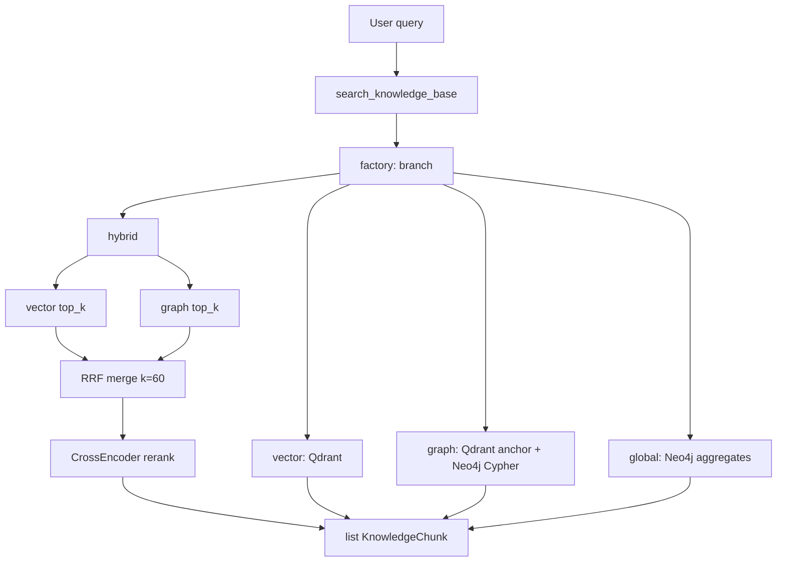

# Task 06: graph-retrieval — Plan

> **Sprint:** [../../README.md](../../README.md)  
> **Тип:** feat  
> **Ветка:** `feat/graphrag-06-graph-retrieval`  
> **Spec:** [schema.md](../../schema.md), [ADR-0010](../../../../adrs/ADR-0010-graphrag.md), baseline [graphrag-baseline.md](../../../../../evals/reports/graphrag-baseline.md)

---

## Цель

Реализовать graph-, global- и hybrid-ветки retrieval через расширенный абстрактный интерфейс, добавить RRF-слияние и мультиязычный реранкер, прогнать eval и подтвердить рост метрик на multi-hop/global относительно baseline без регрессии single-hop.

---

## Текущее состояние (as-is)

### Retriever-интерфейс

```text
mcp_server/mcp_server/retriever/
├── base.py      # Protocol BaseRetriever.search(query, segment, top_k) → list[KnowledgeChunk]
├── factory.py   # RETRIEVER_BACKEND → qdrant | chroma | pgvector
├── qdrant.py    # dense-only query_points (без sparse/hybrid в коде)
├── chroma.py    # legacy wrapper
└── pgvector.py  # bench stub
```

- Единая точка вызова: `handle_search_knowledge_base()` → `get_retriever().search(...)`.
- Eval-контур: `AgentTaskRunner` бьёт в backend API; retrieval backend **не** передаётся из YAML в runtime — фактически управляется env (`RETRIEVER_BACKEND`, `RAG_TOP_K`).
- Neo4j: infra + seed готовы (Task 04–05); `neo4j==6.2.0`, `neo4j-graphrag==1.16.0` уже в `mcp_server/pyproject.toml`.
- Вектор **не** в Neo4j (boundary rule ADR-0010) → `VectorCypherRetriever` с Neo4j vector index **не** используем; якорь — Qdrant.

### Baseline-провалы (v002 multi-hop, v001 global)

| Сегмент | Метрика | Baseline | Δ vs single-hop |
|---------|---------|----------|-----------------|
| single-hop | answer_correctness | **0.662** | — |
| multi-hop | answer_correctness | **0.383** | −42% |
| multi-hop | required_entity_recall@5 | **0.618** | — |
| global | answer_correctness | **0.200** | −70% |
| global | required_entity_recall@5 | **0.292** | — |

**Паттерны провала** (из [graphrag-baseline.md](../../../../../evals/reports/graphrag-baseline.md)):

| Паттерн | Примеры датасета | Что нужно от graph/global |
|---------|------------------|---------------------------|
| Path traversal | MH-01, MH-10, MH-12 (prerequisite) | `RECOMMENDED_BEFORE*1..3` от anchor-курса |
| Intersection | MH-03, MH-08 (общие темы двух курсов) | `COVERS` ∩ по двум `Course.id` |
| Combo expansion | MH-02 (темы комбо) | `Combo→INCLUDES→Course→COVERS→Theme` |
| Theme routing | MH-06, MH-11 (3+ узла) | `Theme←COVERS←Course` + `REQUIRES*` / prerequisite chain |
| COUNT / LIST | GL-01, GL-03, GL-04 | `MATCH (c:Course)…`, `COVERS` по теме, `TARGETS` по audience |
| SUM агрегат | GL-05 (ак. часы комбо) | SUM по свойствам курсов комбо — **см. gap §7** |
| Entity gap | GL-06 (авторы) | Instructor убран из схемы Task 05 — **вне scope улучшения** |

**faithfulness** ≥ 0.75 на обоих сегментах — галлюцинаций мало; фокус на retrieval, не на generation.

---

## Целевая архитектура (to-be)

### Двухуровневая конфигурация

| Переменная | Уровень | Значения | Назначение |
|------------|---------|----------|------------|
| `RETRIEVER_BACKEND` | storage | `qdrant` (default), `chroma`, `pgvector` | Где лежат chunks (без изменений) |
| `RETRIEVER_BRANCH` | strategy | `vector`, `graph`, `global`, `hybrid` | Как искать (новое) |

Eval YAML (`retrieval.branch`) — **документирует** ожидаемую ветку; перед прогоном выставляется env (или wrapper в Makefile), т.к. MCP server читает Settings, не RunConfig backend.

```text
search_knowledge_base(query, segment)
        │
        ▼
   get_retriever()  ← factory: backend × branch
        │
   ┌────┴────┬──────────┬─────────┐
   ▼         ▼          ▼         ▼
Vector    Graph     Global    Hybrid
(Qdrant)  (Qdrant   (Neo4j    (RRF +
          +Neo4j)   Cypher)   rerank)
```

### Расширение интерфейса

**Минимальный diff** — сохранить `BaseRetriever` Protocol; расширить `KnowledgeChunk`:

```python
class KnowledgeChunk(TypedDict, total=False):
    text: str
    source: str
    segment: str
    # новые optional-поля для eval/trace:
    branch: str          # vector | graph | global | hybrid
    entity_id: str       # course/combo/theme slug
    rank: float          # post-RRF / rerank score
```

Отдельный `GraphContext` TypedDict **не** вводим (YAGNI) — graph/global возвращают те же chunks с structured `text`.

**Neo4j lifecycle:** общий модуль `mcp_server/retriever/neo4j_driver.py` — singleton `GraphDatabase.driver`, `verify_connectivity`, `GraphNotReadyError` (аналог `IndexNotReadyError`).

**Config (`mcp_server/config.py`):**

```python
retriever_branch: str = Field(default="vector", alias="RETRIEVER_BRANCH")
neo4j_uri: str = Field(default="bolt://localhost:7687", alias="NEO4J_URI")
neo4j_user: str = Field(default="neo4j", alias="NEO4J_USER")
neo4j_password: str = Field(default="", alias="NEO4J_PASSWORD")
reranker_model: str = Field(
    default="BAAI/bge-reranker-v2-m3",
    alias="RERANKER_MODEL",
)
rrf_k: int = Field(default=60, alias="RRF_K")
graph_expand_hops: int = Field(default=2, alias="GRAPH_EXPAND_HOPS")
```

`.env.example` — добавить `RETRIEVER_BRANCH`, `RERANKER_MODEL`, `RRF_K`, `GRAPH_EXPAND_HOPS`.

---

## Graph-ветка (`GraphRetriever`)

### Паттерн: Qdrant anchor → Cypher expansion

Используем **`QdrantNeo4jRetriever`** из `neo4j-graphrag` (vectors external, graph in Neo4j) **или** эквивалентную обёртку:

1. Qdrant dense search (top_k=10 anchor) с filter `segment`.
2. Из payload извлечь `course_id` / `source` → canonical `Course.id` (slug).
3. `retrieval_query` — Cypher-фрагмент после match по `node:Course`:

```cypher
// retrieval_query (фрагмент; node + score инжектируются SDK)
MATCH (node:Course)
OPTIONAL MATCH prereqPath = (start:Course)-[:RECOMMENDED_BEFORE*1..3]->(node)
WHERE NOT ()-[:RECOMMENDED_BEFORE]->(start)
WITH node, score,
     [p IN collect(DISTINCT prereqPath) | [n IN nodes(p) | n.id]] AS prereqChains
OPTIONAL MATCH (node)-[:COVERS]->(t:Theme)
OPTIONAL MATCH (node)<-[:INCLUDES]-(cb:Combo)
RETURN node.id AS courseId,
       node.title AS title,
       node.priceRub AS priceRub,
       node.level AS level,
       node.format AS format,
       collect(DISTINCT t.id) AS themes,
       collect(DISTINCT cb.id) AS combos,
       prereqChains,
       score
```

4. Сериализация в `KnowledgeChunk.text` — компактный JSON-like блок (русский labels):

```text
[graph] course=agents | title=… | price=39990 | prerequisites=[vibe-coding, fullstack-aidd] | themes=[rag-basic, mcp, …]
```

5. **Intersection sub-query** (для запросов с двумя курсами): если regex/heuristic находит 2 slug'а в query → дополнительный read-only Cypher MH-4 из [schema.md §5.2](../../schema.md).

### Entity extraction (anchor без LLM-routing)

Heuristic resolver в `graph_entities.py`:

- Regex slug'ов: `vibe-coding`, `fullstack-aidd`, `agents`, `deep-agents`, `ai-agents-combo`.
- Alias map из `graph_common.COURSE_ALIAS_OVERRIDES`.
- Theme lookup: fulltext `theme_name_ft` по ключевым словам (MCP, GraphRAG, …).
- Fallback: top Qdrant hit → `course_id` из payload (добавить в indexer если отсутствует — см. §7).

**Scope Task 06:** routing по типу вопроса делает **ветка**, не агент (Task 08). При `RETRIEVER_BRANCH=graph` всегда graph pipeline; agent по-прежнему вызывает `search_knowledge_base`.

---

## Global-ветка (`GlobalRetriever`)

Прямой Cypher **без** vector search. Возвращает 1–N chunks-агрегатов.

### Query router (rule-based, без LLM)

| Trigger (keywords / pattern) | Cypher-шаблон | Датасет |
|------------------------------|---------------|---------|
| «сколько» + «курс» | GL-1: `MATCH (c:Course) RETURN count, collect(…)` | GL-01 |
| «формат» / «форматы обучения» | GL-2: `Format←AVAILABLE_AS` | GL-02 |
| тема + «в каких курсах» / «встречается» | GL-3: `COVERS` + aliases | GL-03 |
| «менеджер» / «продакт» / «без кода» / `non-dev` | GL-4: `TARGETS Audience` | GL-04 |
| «акadem» / «ак. ч» / «нагрузка» / «часов» | GL-5: SUM `academicHours` по комбо | GL-05 |
| «кто ведёт» / «автор» / «преподав» | — | GL-06 (**skip**, см. §7) |
| default | Snapshot каталога: все Course + Combo + counts | fallback |

Формат chunk:

```text
[global] catalog_summary | courses=4 | combo=ai-agents-combo | formats=[self-paced, hybrid, live] | …
```

---

## Hybrid-ветка + RRF + реранкер

### Pipeline

```text
query
  ├─► VectorRetriever.search(top_k=2×final_k)
  └─► GraphRetriever.search(top_k=2×final_k)
           │
           ▼
      RRF merge (k=RRF_K, default 60)
      dedupe by entity_id || hash(text)[:200]
           │
           ▼
      CrossEncoder rerank (top 2×final_k → final_k)
           │
           ▼
      list[KnowledgeChunk]  branch=hybrid
```

### RRF (Reciprocal Rank Fusion)

```python
def rrf_score(rank: int, *, k: int = 60) -> float:
    return 1.0 / (k + rank)  # rank 1-based

# score(chunk) = sum(rrf_score(rank_vector), rrf_score(rank_graph))
```

- Объединяем списки vector + graph; один chunk может получить score с обеих веток.
- `final_k = settings.rag_top_k` (eval: `top_k: 5` из YAML → env `RAG_TOP_K=5` перед прогоном).

### Мультиязычный реранкер

| Кандидат | Плюсы | Минусы |
|----------|-------|--------|
| **`BAAI/bge-reranker-v2-m3`** (default) | RU+EN, SOTA multilingual | ~570M, CPU ok для top-10 |
| `jinaai/jina-reranker-v2-base-multilingual` | RU support | extra dep |
| `cross-encoder/ms-marco-Multilingual-MiniLM-L-12-v2` | легче | слабее на RU domain terms |

**Выбор:** `BAAI/bge-reranker-v2-m3` через `sentence-transformers` (`CrossEncoder`).

- Lazy load + `@lru_cache` singleton.
- Rerank только в `hybrid` (graph/global — без rerank, чтобы не добавлять latency).
- `RERANKER_ENABLED=false` env для отключения в dev без GPU.

---

## Factory

```python
# factory.py — псевдокод
def _create_retriever(backend: str, branch: str) -> BaseRetriever:
    vector = _vector_impl(backend)  # QdrantRetriever / …
    match branch:
        case "vector":  return vector
        case "graph":   return GraphRetriever(vector=vector, driver=…)
        case "global":  return GlobalRetriever(driver=…)
        case "hybrid":  return HybridRetriever(
                             vector=vector,
                             graph=GraphRetriever(…),
                             reranker=…,
                         )
        case _: raise ValueError(f"unknown RETRIEVER_BRANCH: {branch}")
```

`get_retriever(backend=…, branch=…)` — optional overrides для тестов.

---

## Eval-конфигурация

### Новые/обновлённые файлы

**`evals/configs/graphrag-graph.yaml`:**

```yaml
config_id: graphrag-graph
comment: "GraphRAG Task 06 — hybrid branch (Qdrant anchor + Neo4j + RRF + rerank)"

agent:
  impl: langchain-react
  api_url: http://127.0.0.1:8003/api/v1/chat

retrieval:
  backend: qdrant
  branch: hybrid          # NEW — metadata; env RETRIEVER_BRANCH=hybrid перед прогоном
  db_version: "v1.18.2"
  embedding_model: openai/text-embedding-3-small
  chunk_size: 800
  top_k: 5
  rrf_k: 60
  reranker_model: BAAI/bge-reranker-v2-m3

model:
  provider: openrouter
  name: openai/gpt-4o-mini
  temperature: 0.0

judge:
  provider: openrouter
  name: google/gemini-2.5-flash-lite
  temperature: 0.0

prompt:
  source: code
  name: agent-system-prompt-v2

datasets:
  multi-hop: v002
  global: v001
```

**Дополнительные конфиги для сегментного сравнения** (опционально, один прогон на ветку):

| Config | `RETRIEVER_BRANCH` | Датасет | Цель |
|--------|-------------------|---------|------|
| `graphrag-baseline.yaml` | `vector` | multi-hop + global | уже есть |
| `graphrag-graph-branch.yaml` | `graph` | multi-hop | изолировать graph |
| `graphrag-global-branch.yaml` | `global` | global | изолировать global |
| `graphrag-graph.yaml` | `hybrid` | multi-hop + global | **основной** отчёт Task 06 |

**Расширение `RetrievalConfigBlock`** (`backend/app/agent/run_config.py`):

```python
branch: str | None = None
rrf_k: int | None = None
reranker_model: str | None = None
```

Только metadata для run reports; runtime — env.

### Makefile / прогон

```bash
# Перед experiment (document in devops/README or evals/README):
export RETRIEVER_BRANCH=hybrid
export RAG_TOP_K=5
make -C evals experiment CONFIG=configs/graphrag-graph.yaml DATASET=multi-hop
make -C evals experiment CONFIG=configs/graphrag-graph.yaml DATASET=global
```

Или make-цель-обёртка:

```makefile
eval-graph-hybrid:
	RETRIEVER_BRANCH=hybrid RAG_TOP_K=5 $(MAKE) -C evals experiment CONFIG=configs/graphrag-graph.yaml
```

### Отчёт `evals/reports/graphrag-graph.md`

Структура:

1. Конфигурация (branch, reranker, RRF).
2. Таблица **baseline vs graph** по сегментам (answer_correctness, required_entity_recall, faithfulness).
3. Target gates:
   - multi-hop answer_correctness **>** 0.383 (baseline)
   - global answer_correctness **>** 0.200
   - single-hop proxy **≥** 0.642 (0.662 − 0.02) — прогон `candidate-rag-first-prompt-e2e-qa-v002` с `RETRIEVER_BRANCH=hybrid` или `vector`
4. Разбор 2–3 улучшенных items + оставшихся провалов (GL-06).
5. Decision log: что дала каждая ветка.

---

## Состав работ

- [ ] **Config:** `RETRIEVER_BRANCH`, Neo4j settings, reranker env в `config.py` + `.env.example`.
- [ ] **`neo4j_driver.py`:** driver singleton, readiness check.
- [ ] **`graph_entities.py`:** slug/alias/theme resolution из query + Qdrant payload.
- [ ] **`graph.py` — `GraphRetriever`:** Qdrant anchor + Cypher expansion (prerequisite, COVERS, combo, intersection).
- [ ] **`global_agg.py` — `GlobalRetriever`:** rule-based router + GL-1…GL-5 Cypher templates.
- [ ] **`fusion.py`:** RRF merge + dedupe.
- [ ] **`reranker.py`:** `CrossEncoder` wrapper (`bge-reranker-v2-m3`).
- [ ] **`hybrid.py` — `HybridRetriever`:** vector + graph → RRF → rerank.
- [ ] **`factory.py`:** branch-aware factory; backward compat `RETRIEVER_BRANCH=vector`.
- [ ] **Qdrant payload:** убедиться что `course_id` в payload (patch `qdrant_indexer.py` + reindex note если нужно).
- [ ] **Seed gap GL-05:** добавить `academicHours` на `Course` в `seed.cypher` (80/80/104/40) — минимальный patch, `make graph-seed`.
- [ ] **Tests:** `tests/test_graph_retriever.py`, `tests/test_global_retriever.py`, `tests/test_rrf_rerank.py`, `tests/test_retriever_factory.py` (branch switching).
- [ ] **Eval:** `graphrag-graph.yaml`, прогоны, `graphrag-graph.md`.
- [ ] **Sanitize:** ruff + pytest `make test-mcp`.
- [ ] Самопроверка по DoD → ждать «ок» → `summary.md`.

---

## Критерии готовности (DoD)

| # | Критерий | Способ проверки |
|---|----------|-----------------|
| 1 | `RETRIEVER_BRANCH=vector\|graph\|global\|hybrid` переключает поведение без правки tool/agent | unit-тест factory + manual smoke |
| 2 | Graph: prerequisite chain для «что нужно пройти перед deep-agents» | smoke query → chunks содержат `vibe-coding`, `fullstack-aidd`, `agents` |
| 3 | Global: GL-03 MCP → 3 курса | smoke → `fullstack-aidd`, `agents`, `deep-agents` |
| 4 | Hybrid: RRF + rerank включены | log/metadata `branch=hybrid`, unit test RRF scores |
| 5 | `graphrag-graph.md`: multi-hop и global **выше** baseline | compare tables |
| 6 | Single-hop proxy ≥ baseline − 0.02 | hybrid или vector на e2e-v002 |
| 7 | `make test-mcp` зелёный | CI local |
| 8 | GL-06 (авторы) задокументирован как known gap | раздел в отчёте |

---

## Артефакты

| Файл | Назначение |
|------|------------|
| `mcp_server/mcp_server/retriever/neo4j_driver.py` | Neo4j driver lifecycle |
| `mcp_server/mcp_server/retriever/graph_entities.py` | Entity/slug resolution |
| `mcp_server/mcp_server/retriever/graph.py` | GraphRetriever |
| `mcp_server/mcp_server/retriever/global_agg.py` | GlobalRetriever |
| `mcp_server/mcp_server/retriever/fusion.py` | RRF |
| `mcp_server/mcp_server/retriever/reranker.py` | CrossEncoder rerank |
| `mcp_server/mcp_server/retriever/hybrid.py` | HybridRetriever |
| `mcp_server/mcp_server/retriever/factory.py` | branch-aware factory |
| `mcp_server/mcp_server/retriever/base.py` | расширенный KnowledgeChunk |
| `mcp_server/mcp_server/config.py` | новые env |
| `mcp_server/tests/test_graph_retriever.py` | graph smoke + mocks |
| `mcp_server/tests/test_global_retriever.py` | global templates |
| `mcp_server/tests/test_rrf_rerank.py` | fusion/rerank unit |
| `scripts/seed.cypher` | `academicHours` (GL-05) |
| `evals/configs/graphrag-graph.yaml` | eval config |
| `evals/reports/graphrag-graph.md` | comparison report |
| `.env.example` | RETRIEVER_BRANCH, reranker |

---

## Scope

**In:** retriever branches, RRF, reranker, factory, config, tests, eval config/report, seed patch для academicHours.

**Out (Task 07–08):**
- `text2cypher` tool и guardrails
- Agent routing (`graph_search`, `global_catalog` отдельные tools)
- `ToolsRetriever` / LLM-based branch selection
- Community summaries (Leiden)
- Instructor node / GL-06 fix
- Sparse/hybrid Qdrant (roadmap v0.2 — отдельный sprint)
- Изменения системного промпта агента

---

## Skills

| Skill | Применение |
|-------|------------|
| `neo4j-graphrag-skill` | QdrantNeo4jRetriever, retrieval_query, external vectors |
| `neo4j-cypher-skill` | MH/GL templates, EXPLAIN validation |
| `neo4j-driver-python-skill` | execute_read, RoutingControl, driver lifecycle |
| `python-testing-patterns` | mock driver, factory tests |
| `langfuse` | eval прогоны, run metadata |

---

## Риски и допущения

| Риск | Митигация |
|------|-----------|
| Agent не использует graph context при том же промпте | Task 06 измеряет retrieval via entity_recall; Task 08 — routing rules |
| `course_id` отсутствует в Qdrant payload | Patch indexer + `make index`; fallback parse `source` filename |
| Reranker медленный на CPU | Rerank top-10 only; env disable; кеш модели |
| GL-05 без `academicHours` в графе | Patch seed.cypher в scope |
| GL-06 не улучшится | Explicit known gap; не блокирует DoD по GL-01–05 |
| Heuristic global router промахнётся | Default = full catalog snapshot; логировать matched template |
| Eval env drift (забыли RETRIEVER_BRANCH) | Makefile wrapper + comment в yaml |

---

## Открытые вопросы

- [ ] **Q1:** Прогон Task 06 только `hybrid` или три отдельных конфига (graph/global/hybrid)? *Рекомендация:* hybrid — основной; graph/global — smoke configs для debug.*
- [ ] **Q2:** Добавлять `sentence-transformers` в `pyproject.toml` или optional extra `[reranker]`? *Рекомендация:* optional extra, hybrid без extra → skip rerank с warning.*
- [ ] **Q3:** Reindex Qdrant обязателен в DoD или достаточно parse `source`? *Рекомендация:* patch indexer + note в summary; reindex — на пользователе.*

---

## Диаграмма потоков



---

## Связь провалов baseline → решения Task 06

| Item | Baseline failure | Решение в Task 06 |
|------|------------------|-------------------|
| MH-01 prerequisite | flat chunks, no chain | Graph: `RECOMMENDED_BEFORE*` |
| MH-02 combo themes | 4 files, top-5 bias | Graph: `Combo→INCLUDES→COVERS` |
| MH-03/08 intersection | single search | Graph: dual-slug + MH-4 Cypher |
| MH-06/11 3-hop | entity recall 0.618 | Graph: expand hops=3, REQUIRES |
| GL-01 count courses | partial list | Global: GL-1 full collect |
| GL-03 MCP courses | top-1/2 | Global: GL-3 theme→courses |
| GL-04 non-dev | semantic miss | Global: GL-4 TARGETS |
| GL-05 sum hours | one file in top-5 | Global: GL-5 SUM + seed `academicHours` |
| GL-06 authors | not in index | **Known gap** — вне scope |
