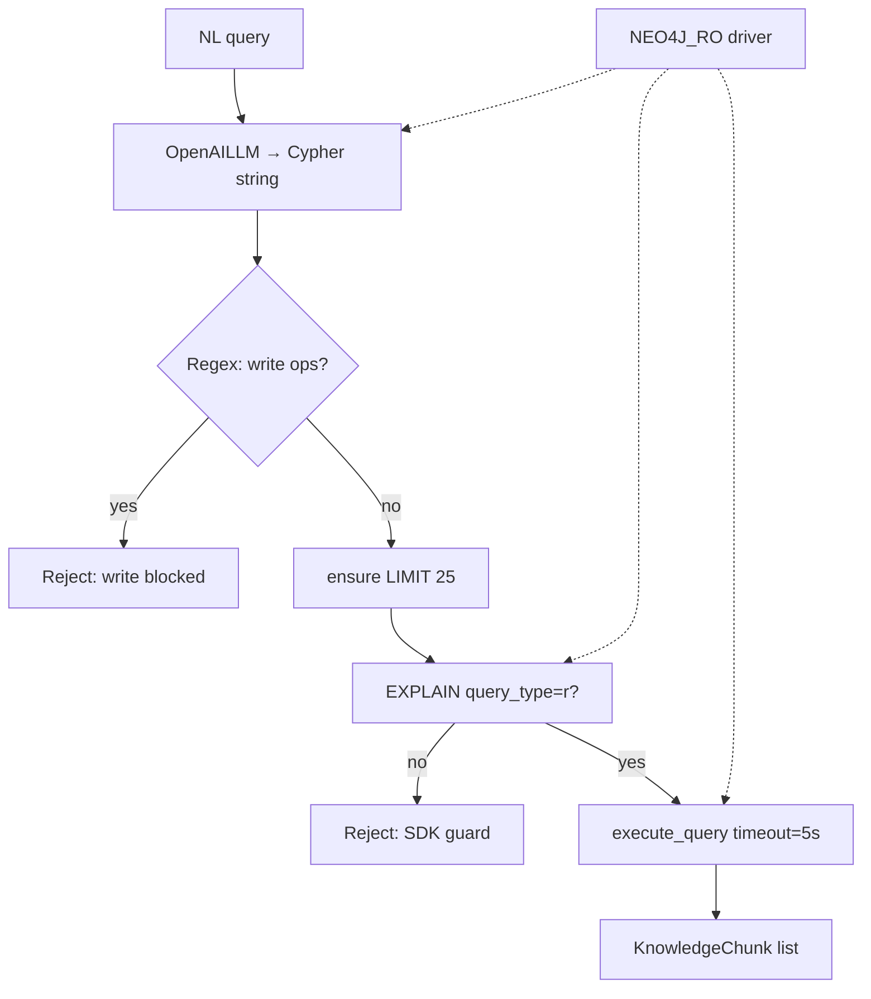

# Task 07: text2cypher — Plan

> **Sprint:** [../../README.md](../../README.md)  
> **Тип:** feat  
> **Ветка:** `feat/graphrag-07-text2cypher`  
> **Spec:** [schema.md](../../schema.md), [ADR-0010](../../../../adrs/ADR-0010-graphrag.md), infra [Task 04](../04-neo4j-infra/summary.md), retrieval [Task 06](../06-graph-retrieval/summary.md)

---

## Цель

Реализовать MCP-инструмент `text2cypher_tool` на базе `Text2CypherRetriever` (`neo4j-graphrag==1.16.0`) с **четырьмя обязательными guardrails** (ADR-0010 §5), enhanced schema + few-shot примерами из доменной схемы каталога, и автотестами на блокировку write и принудительный `LIMIT`.

**Не в scope Task 07:** agent routing rules, eval-прогоны, регистрация у backend-агента (Task 08). Tool регистрируется в MCP server с узким описанием (guardrail #4).

---

## Текущее состояние (as-is)

| Компонент | Статус |
|-----------|--------|
| Neo4j + seed + entity resolution | ✅ Task 05 (`make graph-index`) |
| RO-пользователь `text2cypher_ro` | ✅ Task 04 (`make graph-init-ro`; `GRANT ROLE reader` — Enterprise-only) |
| `NEO4J_RO_*` в `.env.example` | ✅ есть |
| `NEO4J_RO_*` в `mcp_server/config.py` | ❌ нет — admin-only `neo4j_user`/`neo4j_password` |
| Graph/Global/Hybrid retriever branches | ✅ Task 06 |
| `Text2CypherRetriever` / MCP tool | ❌ нет |
| Guardrail-тесты | ❌ нет |

**Community Edition caveat (Task 04 summary):** без RBAC `reader` RO-user не ограничен на уровне БД → guardrails #2–4 на Python-слое **обязательны**, не опциональны.

**SDK baseline:** `Text2CypherRetriever` (v1.16.0) уже делает `EXPLAIN` + проверку `query_type == 'r'` перед выполнением — это **дополнительный**, но не заменяющий regex-слой (defense in depth).

---

## Целевая архитектура (to-be)

```text
Agent / MCP client
        │
        ▼
text2cypher_tool (MCP, узкое описание)     ← guardrail #4
        │
        ▼
handle_text2cypher()                       mcp_server/tools/text2cypher.py
        │
        ▼
GuardedText2CypherRetriever                mcp_server/retriever/text2cypher.py
  ├─ RO driver (NEO4J_RO_*)                ← guardrail #1
  ├─ validate_read_only_cypher (regex)     ← guardrail #2
  ├─ ensure_limit + execute timeout        ← guardrail #3
  └─ Text2CypherRetriever (SDK)
        │  enhanced_schema + few-shot
        ▼
Neo4j (read routing)
```

**Отдельный RO driver:** не переиспользовать `get_neo4j_driver()` (admin creds). Новый `get_neo4j_ro_driver()` в `neo4j_driver.py` с кешем и `verify_connectivity`.

**Не добавляем** ветку `RETRIEVER_BRANCH=text2cypher` в factory Task 06 — text2cypher это **отдельный tool**, не замена `search_knowledge_base`. Eval-ветка `text2cypher` — Task 08.

---

## Реализация Text2CypherRetriever

### Выбор SDK

| Вариант | Решение |
|---------|---------|
| `Text2CypherRetriever` (`neo4j-graphrag`) | ✅ **Основной** — уже в `pyproject.toml`, EXPLAIN-guard встроен |
| `GraphCypherQAChain` (`langchain-neo4j`) | ❌ fallback не нужен (ADR-0010: langchain-neo4j опционален) |

### LLM

Паттерн как в `scripts/graph_indexer.py`:

```python
from neo4j_graphrag.llm import OpenAILLM

llm = OpenAILLM(
    model_name=settings.text2cypher_model,
    model_params={"temperature": 0},
    api_key=settings.openai_api_key,
    base_url=settings.openai_base_url,
)
```

### Enhanced schema

Источник: **live DB** через `neo4j_graphrag.schema.get_schema`:

```python
from neo4j_graphrag.schema import get_schema

enhanced_schema = get_schema(
    driver=ro_driver,
    is_enhanced=True,   # property types + sample values
    sanitize=True,       # strip sensitive values if any
    sample=100,          # catalog small — достаточно
)
```

**Дополнение из [schema.md](../../schema.md) §1–2 (статический trim):** при старте или в `scripts/build_text2cypher_schema.py` (опционально) можно кешировать enhanced schema в `data/graph/text2cypher-schema.txt` после `make graph-index` — для стабильных промптов и offline unit-тестов формата. На runtime: prefer live `is_enhanced=True`; fallback на trimmed markdown-схему только если Neo4j недоступен (fail fast в prod, не маскировать).

**Что включить в trim manual schema** (если нужен fallback):

- Labels: `Course`, `Combo`, `Theme`, `Audience`, `Format`, `Level`
- Relationships: `INCLUDES`, `RECOMMENDED_BEFORE`, `COVERS`, `REQUIRES`, `TARGETS`, `AVAILABLE_AS`, `AT_LEVEL`
- Ключевые свойства: `id`, `title`, `priceRub`, `name`, `aliases`, `role`
- Явное исключение: `Module` deferred, `Instructor` removed

### Few-shot примеры

Файл: `scripts/few_shot_examples.json` — массив `{ "question": "...", "cypher": "..." }`.  
Формат для SDK: `"Q: {question} A: {cypher}"` (см. `neo4j-graphrag-skill`).

Происхождение — Cypher-маршруты из [schema.md](../../schema.md) §5.2–5.3:

| # | NL (RU) | Cypher (из schema.md) | Класс |
|---|---------|----------------------|-------|
| 1 | Сколько курсов в каталоге? | `MATCH (c:Course) RETURN count(c) AS total` | GL-1 |
| 2 | В каких курсах встречается тема MCP? | `MATCH (c:Course)-[:COVERS]->(t:Theme) WHERE t.id = 'mcp' OR 'mcp' IN t.aliases RETURN c.id, c.title ORDER BY c.id` | GL-3 |
| 3 | Какие курсы входят в комбо ai-agents-combo? | `MATCH (cb:Combo {id: 'ai-agents-combo'})-[:INCLUDES]->(c:Course) RETURN c.id, c.title, c.priceRub ORDER BY c.id` | MH-2 |
| 4 | Какие темы покрывает комбо ai-agents-combo? | `MATCH (cb:Combo {id: 'ai-agents-combo'})-[:INCLUDES]->(c:Course)-[:COVERS]->(t:Theme) RETURN DISTINCT t.id, t.name ORDER BY t.name` | MH-2 |
| 5 | Какие курсы для аудитории non-dev? | `MATCH (c:Course)-[:TARGETS]->(a:Audience {role: 'non-dev'}) RETURN c.id, c.title, c.priceRub ORDER BY c.priceRub` | GL-4 |

**Загрузка:** `load_few_shot_examples()` → list[str] для параметра `examples=` retriever.

### GuardedText2CypherRetriever

Подкласс `Text2CypherRetriever`, override `get_search_results`:

```text
1. super().get_search_results internals OR copy SDK flow:
   LLM → extract_cypher(t2c_query)
2. validate_read_only_cypher(t2c_query)     → ValueError / Text2CypherGuardrailError
3. t2c_query = ensure_limit(t2c_query, 25)
4. EXPLAIN + query_type check (SDK)
5. execute_query(..., routing=READ, timeout=5s)
6. format → list[KnowledgeChunk] with branch=text2cypher, metadata cypher
```

**result_formatter:** сериализовать records в компактный текст для агента:

```text
[text2cypher] cypher=<...> | rows=<n>
row: {courseId: agents, title: ...}
```

### MCP tool handler

`mcp_server/mcp_server/tools/text2cypher.py`:

```python
def handle_text2cypher(query: str, segment: Literal["b2b", "b2c"]) -> list[KnowledgeChunk]:
    ...
```

- `segment` — фильтр/метаданные в chunk (как у `search_knowledge_base`); при необходимости добавить в custom prompt hint «каталог b2c/b2b».
- Ошибки guardrail → `ValueError` с явным кодом (`write_operation_blocked`, `missing_limit` — internal only in message).

Регистрация в `server.py`:

```python
@mcp.tool()
def text2cypher_tool(query: str, segment: Literal["b2b", "b2c"]) -> list[KnowledgeChunk]:
    """..."""
```

---

## Guardrails — детальная спецификация

Все 4 обязательны (ADR-0010 §5). Ни один не заменяет другой.

### Guardrail #1 — Read-only credentials в БД

| Аспект | Спецификация |
|--------|--------------|
| **Что** | Отдельный Bolt-пользователь `text2cypher_ro` (`NEO4J_RO_USER` / `NEO4J_RO_PASSWORD`) |
| **Где** | `get_neo4j_ro_driver()` — единственный driver для text2cypher |
| **Запрет** | Никогда не использовать `NEO4J_USER`/`NEO4J_PASSWORD` (admin) в text2cypher-пути |
| **Community** | `GRANT ROLE reader` недоступен → creds изолированы, но write теоретически возможен → #2–4 критичны |
| **Config** | Добавить в `Settings`: `neo4j_ro_user`, `neo4j_ro_password`; fail fast если RO password пуст при вызове tool |
| **Тест** | `@pytest.mark.neo4j` integration: под RO выполнить `CREATE (n:Test)` → Neo4j error или guardrail #2 до БД |

### Guardrail #2 — Regex-фильтр write-операций

| Аспект | Спецификация |
|--------|--------------|
| **Когда** | **До** `EXPLAIN` / `execute_query` — на сгенерированной строке Cypher |
| **Модуль** | `mcp_server/mcp_server/text2cypher/guardrails.py` — чистые функции для unit-тестов |
| **Блокировать** (case-insensitive, word boundary): `CREATE`, `MERGE`, `DELETE`, `DETACH DELETE`, `SET`, `REMOVE`, `DROP`, `FOREACH`, `LOAD CSV`, `CALL { ... }` с write (conservative: block `CALL` если после него write-ключевые слова) |
| **Разрешать** | `MATCH`, `OPTIONAL MATCH`, `WITH`, `RETURN`, `UNWIND`, `ORDER BY`, `WHERE`, `CALL` read-only subqueries |
| **Ошибка** | `Text2CypherGuardrailError("write operation blocked: ...")` → handler → `ValueError` |
| **Defense in depth** | SDK `EXPLAIN` + `query_type != 'r'` — второй слой; regex ловит явные write **до** round-trip |
| **Тест** | `test_text2cypher_blocks_write` — parametrized: `CREATE`, `MERGE`, `DELETE n`, `SET n.x=1`, `REMOVE n.x` |

**Regex-реализация (sketch):**

```python
_WRITE_PATTERN = re.compile(
    r"\b(CREATE|MERGE|DELETE|DETACH|SET|REMOVE|DROP|FOREACH)\b",
    re.IGNORECASE,
)

def validate_read_only_cypher(cypher: str) -> None:
    if _WRITE_PATTERN.search(cypher):
        raise Text2CypherGuardrailError(f"write operation blocked: {cypher[:120]}")
```

> `DETACH DELETE` покрывается `DELETE` + `DETACH` в одном паттерне или отдельным `\bDETACH\s+DELETE\b`.

### Guardrail #3 — Таймаут и LIMIT

| Аспект | Спецификация |
|--------|--------------|
| **LIMIT** | Если в Cypher **нет** `\bLIMIT\b` (case-insensitive) — append `\nLIMIT 25` |
| **Edge cases** | Subquery с LIMIT внутри — для MVP: простая эвристика «нет LIMIT в строке → добавить»; catalog малый, риск низкий |
| **Константа** | `TEXT2CYPHER_RESULT_LIMIT=25` (env), default 25 |
| **Timeout** | `driver.execute_query(..., timeout=timedelta(seconds=5))` на EXPLAIN и execute |
| **Env** | `TEXT2CYPHER_QUERY_TIMEOUT_SECONDS=5` |
| **Ошибка timeout** | `ValueError("text2cypher query timed out")` — без partial results |
| **Тест** | `test_text2cypher_adds_limit` — `MATCH (c:Course) RETURN c` → `... LIMIT 25`; `... LIMIT 10` → без изменений |

**Функция:**

```python
def ensure_limit(cypher: str, *, default: int = 25) -> str:
    if re.search(r"\bLIMIT\b", cypher, re.IGNORECASE):
        return cypher.strip()
    return f"{cypher.strip()}\nLIMIT {default}"
```

### Guardrail #4 — Узкое описание инструмента

| Аспект | Спецификация |
|--------|--------------|
| **Что** | Docstring MCP tool — единственный «контракт» для LLM-router до Task 08 system prompt |
| **Вызывать когда** | Точный подсчёт (`сколько`), списки по структуре (`какие курсы входят`, `в каких курсах тема X`), фильтры по свойствам графа (цена, аудитория, состав комбо) |
| **НЕ вызывать когда** | Описания программ, FAQ, «расскажи про курс Z», семантический поиск, мнения, длинные тексты → `search_knowledge_base` |
| **Примеры в docstring** | ✅ «Сколько курсов покрывают тему RAG?» / «Какие курсы в комбо ai-agents-combo?» · ❌ «Расскажи подробно про курс agents» |
| **Автотест** | `test_text2cypher_tool_description_scope` — assert keywords: `structural`, `count`, `NOT for descriptions` (smoke на docstring) |
| **Полная маршрутизация** | Task 08 — system prompt + Langfuse traces |

---

## Конфигурация

Добавить в `mcp_server/config.py` и `.env.example`:

| Переменная | Default | Назначение |
|------------|---------|------------|
| `NEO4J_RO_USER` | `text2cypher_ro` | RO user (уже в .env.example) |
| `NEO4J_RO_PASSWORD` | — | RO password (required for tool) |
| `TEXT2CYPHER_MODEL` | `openai/gpt-4o-mini` | LLM для NL→Cypher |
| `TEXT2CYPHER_RESULT_LIMIT` | `25` | Guardrail #3 LIMIT |
| `TEXT2CYPHER_QUERY_TIMEOUT_SECONDS` | `5` | Guardrail #3 timeout |

---

## Стратегия тестирования

### Уровни

| Уровень | Файл | Neo4j | LLM | Что проверяем |
|---------|------|-------|-----|---------------|
| **Unit** | `mcp_server/tests/test_text2cypher_guardrails.py` | ❌ | ❌ | Regex block, ensure_limit, docstring scope |
| **Unit (mocked retriever)** | тот же файл | ❌ | mock | Pipeline: mock LLM returns write Cypher → blocked before execute |
| **Integration** | `test_text2cypher_ro_blocks_create` | ✅ optional | ❌ | RO user + CREATE rejected (DB or guardrail) |
| **Smoke** | `test_text2cypher_search_smoke` | ✅ optional | ✅ | Live query «Сколько курсов?» → rows > 0 |

### Обязательные тесты (DoD)

```python
def test_text2cypher_blocks_write():
    """CREATE/MERGE/DELETE/SET/REMOVE отклоняются validate_read_only_cypher."""

def test_text2cypher_adds_limit():
    """К запросу без LIMIT добавляется LIMIT 25."""

def test_text2cypher_preserves_existing_limit():
    """LIMIT 10 не перезаписывается."""
```

### Mock-стратегия для LLM-пути

```python
class MockLLM:
    content: str  # raw Cypher or ```cypher ... ```

# Patch GuardedText2CypherRetriever.llm.invoke
# Driver — MagicMock execute_query returns ([], summary query_type='r', None)
```

Не мокать guardrail-функции в тестах guardrails — тестировать напрямую.

### Integration markers

```python
@pytest.mark.neo4j
@pytest.mark.skipif(not Neo4jSmokeSettings().neo4j_ro_password, reason="...")
```

Паттерн как `test_neo4j_smoke.py`.

### Команды верификации

```bash
make test-mcp          # основной gate (не test-backend — tool живёт в mcp_server)
uv run ruff check --fix mcp_server/mcp_server/text2cypher/
uv run ruff format mcp_server/mcp_server/text2cypher/
```

> **Note:** sprint DoD §5 ссылается на `make test-backend` — фактически тесты в `mcp_server/tests/`; при самопроверке использовать `make test-mcp` (+ `make test` для регрессии).

### Ручная верификация (для summary / Task 08)

| Вопрос | Ожидание |
|--------|----------|
| «Сколько курсов покрывают тему MCP?» | `text2cypher_tool` → count > 0 |
| «Какие курсы входят в комбо ai-agents-combo?» | `text2cypher_tool` → список course ids |
| «Расскажи подробно про курс agents» | tool **не** вызывается (Task 08 routing; в Task 07 — только docstring) |

---

## Критерии готовности (DoD)

### Агент проверяет

- [ ] `GuardedText2CypherRetriever` использует RO driver (`NEO4J_RO_*`)
- [ ] Enhanced schema: `get_schema(..., is_enhanced=True)` + 5 few-shot из `scripts/few_shot_examples.json`
- [ ] Guardrails #1–#4 реализованы по спецификации выше
- [ ] `make test-mcp` зелёный; `test_text2cypher_blocks_write` и `test_text2cypher_adds_limit` pass
- [ ] Integration (optional): RO не выполняет `CREATE` напрямую
- [ ] `make lint-mcp` / ruff на изменённых файлах

### Пользователь проверяет

- [ ] Smoke: `text2cypher_tool("Сколько курсов в каталоге?", "b2c")` возвращает осмысленный результат при поднятом Neo4j
- [ ] Docstring tool понятен: когда вызывать / когда нет

---

## Артефакты

| Файл | Назначение |
|------|------------|
| `mcp_server/mcp_server/text2cypher/guardrails.py` | validate_read_only_cypher, ensure_limit, exceptions |
| `mcp_server/mcp_server/text2cypher/schema.py` | load enhanced schema, load few-shot JSON |
| `mcp_server/mcp_server/retriever/text2cypher.py` | GuardedText2CypherRetriever |
| `mcp_server/mcp_server/tools/text2cypher.py` | handle_text2cypher |
| `mcp_server/mcp_server/server.py` | register `text2cypher_tool` |
| `mcp_server/mcp_server/config.py` | RO + text2cypher env |
| `mcp_server/mcp_server/retriever/neo4j_driver.py` | get_neo4j_ro_driver |
| `scripts/few_shot_examples.json` | 5 NL→Cypher пар |
| `mcp_server/tests/test_text2cypher_guardrails.py` | guardrail unit + mock tests |
| `.env.example` | TEXT2CYPHER_* vars |

---

## Scope

**In:** Text2Cypher retriever wrapper, 4 guardrails, MCP tool, config, few-shot JSON, tests, `.env.example`.

**Out (Task 08+):**

- Agent system prompt routing rules
- Backend agent registration (отдельные `vector_search` / `graph_search` tools)
- `RETRIEVER_BRANCH=text2cypher` в factory
- Eval config `graphrag-routing.yaml` / `graphrag-final.md`
- Langfuse trace verification (manual gate Task 08)
- `ToolsRetriever` LLM-based auto-routing

---

## Skills

| Skill | Применение |
|-------|------------|
| `neo4j-graphrag-skill` | Text2CypherRetriever, examples format, get_schema enhanced |
| `neo4j-cypher-skill` | Валидация few-shot, read-only patterns |
| `neo4j-driver-python-skill` | RO driver, execute_query timeout, RoutingControl.READ |
| `sharp-edges` | Defense in depth, fail-fast config, narrow tool API |
| `python-testing-patterns` | Pure guardrail tests, mock LLM/driver |

---

## Риски и митигация

| Риск | Митигация |
|------|-----------|
| Community RO-user не read-only на уровне БД | Regex + EXPLAIN + отдельные creds; integration test CREATE |
| LLM генерирует невалидный Cypher | Text2CypherRetrievalError → понятный ValueError; few-shot + enhanced schema |
| LIMIT-эвристика ломает сложный Cypher | Catalog small; при проблемах — refine regex (post-MVP) |
| OpenRouter latency > 5s | Timeout на execute only (не LLM); отдельный LLM timeout в OpenAILLM if needed |
| Дублирование guardrail SDK vs regex | Оставить оба — ADR requirement |
| Sprint DoD `test-backend` vs `test-mcp` | Документировать в summary; тесты только в mcp_server |

---

## Диаграмма guardrail pipeline



---

## Открытые вопросы

- [ ] **Q1:** Кешировать enhanced schema на диск после `graph-index` или fetch при каждом cold start? *Рекомендация: in-memory cache @lru_cache на process lifetime; refresh только restart.*
- [ ] **Q2:** Добавить `TEXT2CYPHER_ENABLED=false` kill-switch? *Рекомендация: YAGNI — fail fast if RO password missing.*
- [ ] **Q3:** Исправить sprint README DoD «make test-backend» → «make test-mcp» в Task 08 housekeeping? *Рекомендация: да, при закрытии спринта.*

---

## Порядок реализации

1. `guardrails.py` + unit tests (TDD: red → green)
2. `config.py` RO vars + `get_neo4j_ro_driver()`
3. `schema.py` + `scripts/few_shot_examples.json`
4. `GuardedText2CypherRetriever`
5. `tools/text2cypher.py` + `server.py` registration
6. Mock integration tests
7. Optional `@pytest.mark.neo4j` smoke
8. Edit → Sanitize → Verify (`ruff`, `make test-mcp`)
