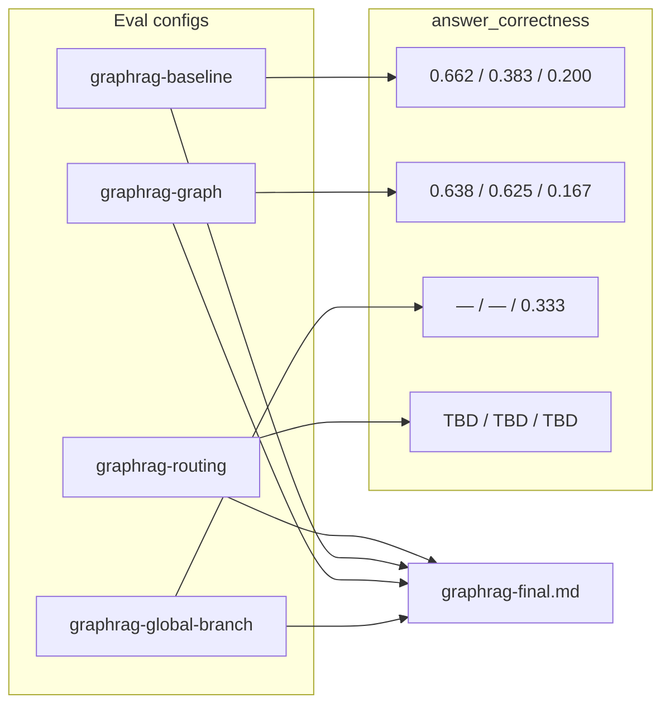

# Task 08: agent-routing — Plan

> **Sprint:** [../../README.md](../../README.md)  
> **Тип:** feat  
> **Ветка:** `feat/graphrag-08-agent-routing`  
> **Spec:** [ADR-0010](../../../../adrs/ADR-0010-graphrag.md) §3.5, [schema.md](../../schema.md), baseline [graphrag-baseline.md](../../../../../evals/reports/graphrag-baseline.md), Task 06 [summary](../06-graph-retrieval/summary.md)

---

## Цель

Зарегистрировать у агента четыре retrieval-инструмента с явной маршрутизацией по типу вопроса, закрыть follow-up Task 06 (GL-04 router, `academicHours`, optional reranker), провести финальный e2e eval по трём сегментам и зафиксировать `graphrag-final.md` с decision log для закрытия sprint-09 DoD #2–#3, #6.

---

## Текущее состояние (as-is)

### Agent + tools

| Слой | Факт |
|------|------|
| MCP server | 6 tools: `search_knowledge_base`, `text2cypher_tool`, `list_b2c_products`, payment×2, `save_lead` |
| Backend in-process | **5 tools** — `text2cypher_tool` **не** зарегистрирован; `tool_registry.py` / `sync_tools.py` / `tool_schemas.py` без graph tools |
| Retriever | `get_retriever()` читает `RETRIEVER_BRANCH` из env; один `search_knowledge_base` → одна ветка на весь прогон |
| Prompt | `agent-system-prompt-v2/v3` — RAG-first через `search_knowledge_base`; **нет** routing rules по ADR §3.5 |
| Побочный эффект | Global-вопросы (GL-03 MCP, GL-06 authors) → `list_b2c_products` вместо KB; hybrid e2e global AC **0.167** |

### Eval-метрики (зафиксированы)

| Реализация | single-hop | multi-hop | global | Run / config |
|---|---:|---:|---:|---|
| **Baseline** (vector) | **0.662** | **0.383** | **0.200** | `graphrag-baseline` |
| **Hybrid branch** (env) | **0.638** ⚠️ | **0.625** ✅ | **0.167** ❌ | `graphrag-graph` |
| **Global branch** (env smoke) | — | — | **0.333** ✅ | `graphrag-global-branch` |

Gates sprint DoD:
- multi-hop > 0.383 — ✅ hybrid; routing должен сохранить
- global > 0.200 — ✅ только при `global` branch; routing обязан активировать `global_catalog`
- single-hop ≥ 0.642 (baseline − 0.02) — ⚠️ hybrid 0.638; routing → `vector_search` — основной путь закрытия

### Оговорки Task 06 (учесть в Task 08)

| # | Оговорка | Следствие для Task 08 |
|---|----------|----------------------|
| **DoD #4** | Reranker skip без `uv sync --extra reranker` | Pre-eval: optional extra; в отчёте фиксировать rerank on/off |
| **DoD #6** | Single-hop proxy 0.638 vs gate 0.642 (−0.004) | Routing single-hop → `vector_search` (не hybrid/graph) |
| **Q2** (plan §Открытые) | Reranker = optional extra `[reranker]` | Не менять; документировать в decision log |
| **Q3** (plan §Открытые) | Reindex Qdrant vs parse `source` | Вне scope; anchor через `graph_entities.SOURCE_TO_COURSE` достаточен |

### Follow-up Task 06 (pre-eval fixes)

| Issue | Симптом | План fix |
|-------|---------|----------|
| **GL-04 / theme router** | E2e GL-03 (MCP): agent reformulates query → `_match_template` → `catalog_summary`; `theme_id=None` | Расширить `_match_template` + `_detect_theme_id` в `global_agg.py`; regression test на перефразировки |
| **GL-02 / academicHours** | Graph суммирует **304 ч** (seed); rubric eval **264 ч** (vibe без часов) | `vibe-coding.academicHours` → `null`/remove; `_hours_sum` считает только `WHERE c.academicHours IS NOT NULL`; `make graph-seed` |
| **Mock catalog** | GL-03 audience / GL-06 count → `list_b2c_products` | Prompt: catalog tool только для воронки продаж |

---

## Целевая архитектура (to-be)

### Принцип: tool = branch (без env-drift)

Агент выбирает инструмент → handler жёстко задаёт `RETRIEVER_BRANCH`, env `RETRIEVER_BRANCH` игнорируется для branch-specific tools (default `vector` для совместимости тестов).

```text
User question
      │
      ▼
 ReAct agent (prompt v4 routing rules)
      │
 ┌────┴─────┬────────────┬──────────────┬─────────────────┐
 ▼          ▼            ▼              ▼                 ▼
vector_   graph_      global_      text2cypher_     list_b2c_products
search    search      catalog      tool             (sales only)
 │          │            │              │
 ▼          ▼            ▼              ▼
branch=   branch=     branch=      Text2CypherRetriever
vector    graph       global       (RO driver)
 │          │            │
 └──────────┴────────────┴──► list[KnowledgeChunk] → agent answer
```

**`search_knowledge_base`:** убрать из agent-facing tools (оставить internal handler / backward compat в tests по необходимости).

### Маппинг ADR §3.5 → tools

| Класс вопроса | Tool | Retriever branch | Примеры |
|---------------|------|------------------|---------|
| **single-hop** | `vector_search` | `vector` | «Расскажи про deep-agents», формат одного курса |
| **multi-hop** | `graph_search` | `graph` | prerequisite, пересечение тем, состав комбо |
| **global** | `global_catalog` | `global` | агрегаты, форматы, audience, часы комбо, тема→курсы |
| **text2cypher** | `text2cypher_tool` | — (отдельный retriever) | точный COUNT/LIST, структура вне шаблонов global |

> **Правило ADR:** на single-hop **не** вызывать `graph_search` / `global_catalog` / `text2cypher_tool`.

> **Граница global vs text2cypher:** сначала `global_catalog` для типовых обзоров (шаблоны Task 06); `text2cypher_tool` — если нужен нестандартный structural query или global router не покрыл (fallback в prompt, не auto-fallback в коде).

---

## Регистрация инструментов

### MCP layer (`mcp_server/`)

| Tool | Handler | Описание для LLM |
|------|---------|------------------|
| `vector_search` | `handle_branch_search(..., branch="vector")` | Семантический поиск по описаниям программ, FAQ, одному курсу/теме |
| `graph_search` | `handle_branch_search(..., branch="graph")` | Зависимости курсов, prerequisite-цепочки, пересечения тем, обход графа |
| `global_catalog` | `handle_branch_search(..., branch="global")` | Обзор каталога: форматы, audience, суммы часов, тема→курсы, счётчики |
| `text2cypher_tool` | `handle_text2cypher` | *(уже есть)* read-only structural NL→Cypher |

**Рефакторинг:** `mcp_server/tools/search_knowledge_base.py` → общий `handle_branch_search(query, segment, branch)`; три thin wrappers или отдельные `@mcp.tool()` в `server.py`.

**Tool descriptions:** узкие, взаимоисключающие (по аналогии с `TEXT2CYPHER_TOOL_DESCRIPTION`); явный «NOT for …» в каждом.

### Backend layer (`backend/app/mcp_client/`)

| Файл | Изменение |
|------|-----------|
| `tool_registry.py` | 8 tools (4 retrieval + 4 business); `EXPECTED_TOOL_COUNT = 8` |
| `sync_tools.py` | handlers для `vector_search`, `graph_search`, `global_catalog`, `text2cypher_tool` |
| `tool_schemas.py` | Pydantic args (query + segment); удалить `search_knowledge_base` из `TOOL_ARGS_SCHEMAS` |
| `tool_adapter.py` | `TOOL_TITLES` для Langfuse spans |
| `factory.py` / tests | обновить conftest, `test_chat.py`, `test_sync_tools.py`, `test_prompts.py` |

### Prompt (`backend/app/agent/prompts.py`)

> **Примечание:** sprint README ссылается на `backend/prompts/system.md` — фактический registry: `backend/app/agent/prompts.py`. Новый **`agent-system-prompt-v4`**.

**Блок routing (v4 поверх v2, не v3 — eval-контур graphrag на v2):**

```
13. Маршрутизация retrieval (GraphRAG):
    - Факт о одном курсе/теме, описание программы → vector_search
    - Зависимости, «что пройти перед X», общие темы двух курсов, состав комбо → graph_search
    - Обзор каталога, форматы, audience, сумма часов, «в каких курсах тема Y» → global_catalog
    - Точный подсчёт/список по структуре графа (если global не подходит) → text2cypher_tool
    - НЕ используй graph_search / global_catalog / text2cypher для простых single-hop вопросов
14. list_b2c_products — ТОЛЬКО воронка продаж (рекомендация 1–3 курсов, оплата).
    Для структурных вопросов о каталоге (сколько курсов, форматы, темы, audience) → global_catalog или text2cypher_tool, НЕ list_b2c_products.
15. Цены из KB/graph tools; list_b2c_products — mock catalog (может быть устаревшим).
```

---

## Follow-up fixes (до eval)

### 1. `global_agg.py` — theme router (GL-03 / GL-04)

**Проблема:** unit-тест проходит на эталонной формулировке; e2e — agent перефразирует → fallback `catalog_summary`.

**Fix:**

```python
# _match_template — добавить паттерны:
("тема ", "тему ", "темы ") + ("mcp", "graphrag", "observability", ...)  # короткие theme queries
"model context protocol"
"покрывают тему", "где изуча", "где проходит"

# _detect_theme_id — расширить:
"model context protocol" → "mcp"
parenthetical "(MCP)" после lower()
fallback: scan THEME_KEYWORDS до template match

# theme_courses + theme_id is None:
return chunk с note=theme_unknown + список всех Theme (не catalog_snapshot)
```

**Тесты:** `test_global_retriever.py` — parametrized перефразировки GL-03; assert `entity_id` starts with `global:theme:`.

### 2. Reconcile `academicHours` seed vs rubric (GL-05)

| Course | Seed now | Target |
|--------|----------|--------|
| vibe-coding | 40 | **remove** (`academicHours` absent / null) |
| fullstack-aidd | 80 | 80 |
| agents | 80 | 80 |
| deep-agents | 104 | 104 |
| **SUM in `_hours_sum`** | 304 | **264** |

Cypher `_hours_sum`:

```cypher
sum(c.academicHours)  -- only nodes WHERE c.academicHours IS NOT NULL
```

После patch: `make graph-seed` (idempotent).

### 3. Optional reranker (Task 06 Q2)

Pre-eval checklist (не блокер DoD):

```bash
cd mcp_server && uv sync --extra reranker
```

Reranker влияет только на `graph`/`hybrid` internal paths; при `vector_search` / `global_catalog` — не задействован. Фиксировать в decision log: rerank on/off.

---

## Eval-конфиг: `graphrag-routing.yaml`

```yaml
config_id: graphrag-routing
comment: "GraphRAG Task 08 — agent tool routing (v4 prompt). Branch per tool, not env."

agent:
  impl: langchain-react
  api_url: http://127.0.0.1:8003/api/v1/chat

retrieval:
  backend: qdrant
  branch: agent-routing          # документирует режим; runtime = tool choice
  db_version: "v1.18.2"
  embedding_model: openai/text-embedding-3-small
  chunk_size: 800
  top_k: 5
  rrf_k: 60
  reranker_model: BAAI/bge-reranker-v2-m3

model:
  provider: openrouter
  name: openai/gpt-4o-mini
  temperature: 0.0

judge:
  provider: openrouter
  name: google/gemini-2.5-flash-lite
  temperature: 0.0

prompt:
  source: code
  name: agent-system-prompt-v4    # единственное отличие vs graphrag-graph

datasets:
  multi-hop: v002
  global: v001
  single-hop: v002                 # alias → e2e-qa v002 (n=26 proxy)
```

**Makefile:**

```makefile
eval-graph-routing:
	$(MAKE) -C evals experiment CONFIG=configs/graphrag-routing.yaml DATASET=$(if $(DATASET),$(DATASET),all)
```

**Pre-run:**

1. `make graph-seed` (после academicHours fix)
2. Backend restart (новые tools + prompt v4)
3. Optional: `uv sync --extra reranker` в `mcp_server/`
4. `.env`: `RETRIEVER_BRANCH=vector` (default; tools override)

**Прогоны (3 сегмента + optional full):**

```bash
make eval-graph-routing DATASET=multi-hop
make eval-graph-routing DATASET=global
make eval-graph-routing DATASET=single-hop   # или e2e-qa v002
make eval-graph-routing DATASET=all          # финальный consolidated
```

### Target gates (финальный)

| Сегмент | Метрика | Baseline | Task 06 best | Gate Task 08 |
|---------|---------|----------|--------------|--------------|
| single-hop | answer_correctness | 0.662 | 0.638 (hybrid) | **≥ 0.642** |
| multi-hop | answer_correctness | 0.383 | 0.625 (hybrid) | **> 0.383** (stretch: ≥ 0.55) |
| global | answer_correctness | 0.200 | 0.333 (global branch) | **> 0.200** (stretch: ≥ 0.30) |
| all | faithfulness | ≥ 0.75 baseline | hybrid ↓ | не ухудшать > −0.10 vs baseline segment |

**Routing verification (Langfuse):** manual gate — sample traces:

| Dataset item | Expected tool span |
|--------------|-------------------|
| MH-* prerequisite | `graph_search` |
| GL-03 MCP / GL-05 hours / GL-04 audience | `global_catalog` |
| e2e single-hop fact | `vector_search` |
| «Расскажи про agents» | `vector_search`, **не** `text2cypher_tool` |

---

## Структура `evals/reports/graphrag-final.md`

### 1. Header

- Эксперимент Task 08, config `graphrag-routing`, prompt v4
- Judge, git SHA, run IDs (3 сегмента)
- Ссылки: baseline, graph, global-branch отчёты

### 2. Конфигурация (таблица)

| Параметр | Baseline | Hybrid (T06) | Global branch (T06) | **Routing (T08)** |
|---|---|---|---|---|
| Tool selection | search_knowledge_base | search_knowledge_base | search_knowledge_base | 4 tools |
| Branch control | env=vector | env=hybrid | env=global | **agent prompt** |
| Prompt | v2 | v2 | v2 | **v4** |

### 3. Метрики по сегментам

Таблица: `answer_correctness`, `required_entity_recall@5`, `faithfulness`, `n`, Δ vs baseline, gate ✅/❌.

### 4. Сравнительная таблица реализаций (закрывает baseline.md §«Сравнительная таблица»)

| Реализация | single-hop | multi-hop | global | Статус |
|---|---:|---:|---:|---|
| Qdrant-hybrid (baseline) | 0.662 | 0.383 | 0.200 | ✅ |
| hybrid branch (T06) | 0.638 | 0.625 | 0.167 | partial |
| global branch (T06) | — | — | 0.333 | smoke |
| **agent routing (T08)** | *TBD* | *TBD* | *TBD* | final |

### 5. Routing verification

- Langfuse: 3–4 скриншота / trace IDs (multi-hop → graph, global → global_catalog, single → vector)
- Таблица misroutes (если есть): item ID, expected tool, actual tool, AC impact

### 6. Per-segment разбор (кратко)

- **Multi-hop:** лучшие / провалы (как graphrag-graph.md §Multi-hop)
- **Global:** item-by-item с `[global]` template / tool used
- **Single-hop:** регрессии vs 0.638 hybrid

### 7. Decision log (обязательная структура)

Каждая запись — одна строка таблицы + 1–2 предложения:

| # | Решение | Сегмент | Эффект (AC / recall) | Цена (latency / cost / ops) |
|---|---------|---------|----------------------|----------------------------|
| D1 | Tool-per-branch вместо env `RETRIEVER_BRANCH` | all | global 0.167→?; single-hop restore | +3 tool defs; agent token overhead |
| D2 | Prompt v4: запрет list_b2c на structural | global | GL-03/06 fix | — |
| D3 | global_catalog vs text2cypher split | global/text2cypher | GL-05 hours via template | text2cypher LLM latency |
| D4 | graph_search = branch `graph` (не hybrid env) | multi-hop | vs T06 0.625 hybrid | меньше RRF cost |
| D5 | academicHours seed fix (264 ч) | global GL-05 | GL-02 AC ↑ | `make graph-seed` |
| D6 | theme router broaden | global GL-03 | entity recall | minimal code |
| D7 | reranker optional extra | multi-hop | +recall если installed | +model load / CPU |
| D8 | GL-01 authors — known gap | global | AC=0 expected | Instructor deferred |
| D9 | Mock catalog остаётся для sales | — | не использовать для eval KB | doc only |

**Итог decision log (1 абзац):** что закрыло sprint DoD, что осталось backlog.

### 8. Known gaps + sprint DoD checklist

Таблица DoD #1–8 из sprint README с финальным статусом.

### 9. Appendix

- Run JSON paths в `evals/reports/runs/`
- Команды воспроизведения

---

## Состав работ

- [ ] **Pre-fix:** `global_agg.py` theme router + tests (GL-03/GL-04)
- [ ] **Pre-fix:** `seed.cypher` + `_hours_sum` academicHours reconcile; `make graph-seed`
- [ ] **`handle_branch_search`** + MCP tools: `vector_search`, `graph_search`, `global_catalog`
- [ ] **Deprecate** agent-facing `search_knowledge_base` (MCP + backend registry)
- [ ] **Backend wiring:** `tool_registry`, `sync_tools`, `tool_schemas`, `tool_adapter`
- [ ] **`agent-system-prompt-v4`** + registry + `test_prompts.py`
- [ ] **Tests:** `test_server.py` (8 tools), backend chat/sync tests, routing smoke (optional mock LLM)
- [ ] **`evals/configs/graphrag-routing.yaml`** + Makefile `eval-graph-routing`
- [ ] **Eval runs:** multi-hop, global, single-hop (+ optional all)
- [ ] **`evals/reports/graphrag-final.md`** по структуре §выше
- [ ] **Langfuse:** routing verification (manual DoD)
- [ ] **Docs:** sprint README (Task 08 ✅, итог), `roadmap.md` sprint-09 → Done
- [ ] Sanitize: ruff + `make test-mcp` + `make test-backend`
- [ ] Самопроверка DoD → ждать «ок» → `summary.md`

---

## Критерии готовности (DoD)

| # | Критерий | Способ проверки |
|---|----------|-----------------|
| 1 | 4 retrieval tools зарегистрированы у агента (8 total) | `GET /ready` → mcp_tools=8; `test_server_lists_eight_tools` |
| 2 | Prompt v4 содержит routing rules + запрет mock catalog на structural | `test_prompts.py` keywords |
| 3 | `graphrag-final.md` — сравнение baseline / T06 / routing по 3 сегментам + decision log | файл + gates |
| 4 | multi-hop AC > 0.383 | eval run |
| 5 | global AC > 0.200 | eval run |
| 6 | single-hop AC ≥ 0.642 | eval run |
| 7 | Langfuse: MH → `graph_search`, GL → `global_catalog`, single → `vector_search` | manual traces |
| 8 | Follow-up: GL-04 router + academicHours 264 | unit test + graph-seed |
| 9 | `make test-backend` + `make test-mcp` зелёные | CI local |
| 10 | Sprint README + roadmap обновлены | docs review |

---

## Артефакты

| Файл | Назначение |
|------|------------|
| `mcp_server/mcp_server/tools/search_knowledge_base.py` | refactor → `handle_branch_search` |
| `mcp_server/mcp_server/server.py` | 3 новых tool + remove/rename search_knowledge_base |
| `mcp_server/mcp_server/retriever/global_agg.py` | theme router + hours_sum fix |
| `scripts/seed.cypher` | academicHours reconcile |
| `backend/app/agent/prompts.py` | `SYSTEM_PROMPT_V4`, registry |
| `backend/app/mcp_client/tool_registry.py` | 8 tools |
| `backend/app/mcp_client/sync_tools.py` | branch handlers |
| `backend/app/mcp_client/tool_schemas.py` | args schemas |
| `backend/app/mcp_client/tool_adapter.py` | titles |
| `backend/tests/test_prompts.py`, `test_chat.py`, `test_sync_tools.py` | updated |
| `mcp_server/tests/test_global_retriever.py`, `test_server.py` | router + tool count |
| `evals/configs/graphrag-routing.yaml` | финальный eval config |
| `evals/reports/graphrag-final.md` | финальный отчёт |
| `Makefile` | `eval-graph-routing` |
| `docs/roadmap.md`, `docs/sprints/sprint-09-graphrag/README.md` | sprint close |

---

## Scope

**In:** tool registration, prompt v4 routing, follow-up fixes (router, academicHours), eval config/report, sprint close docs.

**Out:**
- `RETRIEVER_BRANCH=hybrid` как default для agent (hybrid — только Task 06 bench)
- `ToolsRetriever` / LLM auto-routing (beyond prompt)
- Instructor node (GL-01 / GL-06 data gap)
- Sparse Qdrant, community summaries
- Изменение eval judge / datasets
- `agent-system-prompt-v3` (generation track — другой эксперимент)

---

## Skills

| Skill | Применение |
|-------|------------|
| `neo4j-graphrag-skill` | ToolsRetriever pattern (reference); branch selection rationale |
| `langchain-fundamentals` | `create_agent` + StructuredTool registration |
| `langfuse` | trace verification, eval metadata |
| `python-testing-patterns` | tool handler tests, prompt smoke |
| `langfuse` (eval skill) | experiment runs |

---

## Риски и митигация

| Риск | Митигация |
|------|-----------|
| Agent игнорирует routing rules | Узкие tool descriptions; v4 explicit NOT-for; Langfuse audit |
| `graph_search` (graph-only) слабее hybrid 0.625 | Gate = baseline 0.383; stretch 0.55; decision log D4 |
| 8 tools → больше tokens / wrong tool | Mutual exclusive descriptions; eval misroute table |
| Backend/MCP tool list drift | Single source: MCP server → mirror in tool_registry |
| academicHours fix ломает graph-qa | graph-qa не проверяет sum; unit test `_hours_sum` |
| Reranker не установлен | Document D7; не блокер если graph gate pass |

---

## Диаграмма eval-потока



---

## Открытые вопросы

- [ ] **Q1:** `graph_search` → strict `graph` branch или internal `hybrid` для сохранения 0.625? *Рекомендация: strict `graph` per ADR; если eval < 0.55 — обсудить hybrid как implementation detail.*
- [ ] **Q2:** Удалять `search_knowledge_base` из MCP полностью или оставить hidden/internal? *Рекомендация: убрать из MCP list; handler остаётся для tests.*
- [ ] **Q3:** Single-hop eval dataset key: `single-hop` alias или явный `e2e-qa: v002`? *Рекомендация: alias в yaml + comment.*

---

## Порядок реализации

1. Follow-up fixes (`global_agg.py`, `seed.cypher`) + unit tests
2. `handle_branch_search` + MCP tool registration
3. Backend sync/registry/schemas
4. Prompt v4 + tests
5. Restart backend → smoke manual (3 question types)
6. `graphrag-routing.yaml` + Makefile
7. Eval runs (multi-hop → global → single-hop)
8. `graphrag-final.md` + Langfuse verification
9. Sprint README + roadmap
10. DoD self-check → ждать «ок»
