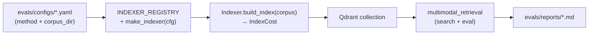

# Task 03: indexer-contract-configs

> **Sprint:** [../../README.md](../../README.md)
> **Тип:** feat (eval infra)
> **Spec:** [analysis.md](../../analysis.md), [metric_map.md](../../metric_map.md)
> **Предшественник:** [Task 02 summary](../02-datasets-metrics-baseline/summary.md)

---

## Цель

Зафиксировать контракт `Indexer.build_index(corpus) -> IndexCost`, единый реестр методов индексации (baseline, A, B, C, D) и 5 eval-конфигов так, чтобы **метод и входная папка корпуса задавались только конфигом**, а Qdrant-поиск и eval-контур оставались общим downstream-кодом без `if method == …`.

---

## Архитектура

### Граница ответственности



| Слой | Ответственность | Меняется между методами? |
|------|-----------------|--------------------------|
| **Indexer** | Валидация `corpus_dir`, ingestion, upsert в Qdrant, `IndexCost` | ✅ только здесь |
| **Retrieval + eval** | E5 query embed → Qdrant top-k → метрики по сегментам | ❌ общий код |
| **mcp_server** | prod RAG | ❌ **не трогаем** |

### Контракт

```python
@dataclass(frozen=True)
class IndexCost:
    collection: str
    index_size_mb: float | None
    build_time_s: float
    api_calls: int
    est_cost_usd: float
    is_multivector: bool

class Indexer(Protocol):
    def build_index(self, corpus_dir: Path) -> IndexCost: ...
```

- `corpus_dir` — **входная** папка с документами (из конфига).
- Baseline читает PDF из `corpus_dir`, пишет артефакт текста в `evals/artifacts/corpus/<method>/` (не в `data/multimodal-rag`).
- Методы A–D в Task 03 — **stub-классы** (регистрация + `NotImplementedError` в `build_index`); полная реализация — Task 04–07.

### Схема конфига (единая для всех методов)

```yaml
config_id: multimodal-baseline
dataset: evals/datasets/multimodal/multimodal-rag/v002_2026-07-05.json

indexer:
  method: baseline          # baseline | a_ocr | b_caption | c_unified | d_multivector
  corpus_dir: data/multimodal-rag   # ← единственный вход корпуса
  # method-specific (опционально):
  pdf: slide-01.pdf         # baseline: PDF внутри corpus_dir
  artifact_dir: evals/artifacts/corpus/text_naive

retrieval:                  # downstream — общий блок
  collection: multimodal_text_naive_v002
  embedding_model: intfloat/multilingual-e5-base
  embedding_dim: 768
  top_k: 5
  qdrant_url: http://localhost:6333
```

Переключение метода = другой YAML + другой `indexer.method`; retrieval-блок структурно одинаков (меняется только `collection` и флаги multivector для D).

### Pre-flight: чистота `corpus_dir`

**Обязательно перед `build_index`:**

```python
def validate_corpus_dir(corpus_dir: Path) -> None:
    """Fail fast: в corpus_dir допустимы только .pdf и .png."""
```

- Любой другой файл (`.txt`, `.md`, `.json`, …) → `ValueError` с перечислением нарушителей.
- Проверка вызывается в базовом классе / фабрике до делегирования конкретному индексатору.
- Текущий `data/multimodal-rag`: 1× PDF + 66× PNG — проходит валидацию.
- `corpus/text_naive/*.txt` **не** входят в `corpus_dir` — это выход baseline, не вход.

### Реестр

| `indexer.method` | Класс | Task реализации |
|------------------|-------|-----------------|
| `baseline` | `BaselineIndexer` | **03** (полная) |
| `a_ocr` | `AOcrIndexer` | 04 (stub в 03) |
| `b_caption` | `BCaptionIndexer` | 05 (stub в 03) |
| `c_unified` | `CUnifiedIndexer` | 06 (stub в 03) |
| `d_multivector` | `DMultivectorIndexer` | 07 (stub в 03) |

`make_indexer(cfg)` читает YAML → возвращает экземпляр по `INDEXER_REGISTRY[method]`.

### Env-переменные (для конфигов A–D)

| Переменная | Метод | Дефолт в конфиге |
|------------|-------|------------------|
| `OCR_ENGINE` | A | `tesseract` |
| `CAPTION_MODEL` | B | `nvidia/nemotron-nano-12b-v2-vl:free` |
| `D_MAX_SIDE` | D | `1024` |

Добавить секцию в `.env.example` с комментариями.

---

## Гипотеза baseline на chart-слайдах (зафиксировать числами)

**Гипотеза:** на визуально-плотном деке naive PDF extraction **не извлекает текст** с chart-слайдов → retrieval не может найти числа.

**Доказательная база (Task 02, подтверждаем в Task 03 отчёте):**

| Слайд | Число на PNG (эталон) | PDF text layer (chars) | Eval item | Recall@5 |
|-------|----------------------|------------------------|-----------|----------|
| **10** | 72% (Zapier) | **0** | S2-9 | **0.000** |
| **11** | 70% документооборот, 39% заголовок | **0** | S2-1 | 0.000* |
| **9** | ~45% Epoch AI 2026 | **0** | S2-3 | **0.000** |

\* S2-1 в прогоне v002 дал Recall=1.0 **случайно** (slide 11 на rank 3 при пустых passage) — в отчёте Task 03 явно пометить как **шум**, ingestion-failure = 0 chars на slide 11.

**Итог для отчёта:** минимум 3 провальных примера с тройкой «число на слайде → 0 chars extracted → Recall@5=0 (или шум с пометкой)». Сегмент S2_chart aggregate: Recall@5=0.333 — **не сигнал**, а артеfact пустого индекса (3/9 items случайно попали).

---

## Состав работ

- [ ] Модуль `evals/indexers/`:
  - [ ] `base.py` — `IndexCost`, `Indexer` protocol, `validate_corpus_dir()`
  - [ ] `registry.py` — `INDEXER_REGISTRY`
  - [ ] `factory.py` — `load_indexer_config()`, `make_indexer(cfg)`
  - [ ] `baseline.py` — `BaselineIndexer`: PDF text layer (pypdf, **не OCR**) → artifact `.txt` → e5 → Qdrant
  - [ ] `stubs.py` — A/B/C/D stub-классы с `NotImplementedError`
- [ ] Вынести общий downstream из `run_multimodal_baseline.py`:
  - [ ] `evals/scripts/multimodal_retrieval.py` — `E5Embedder`, `search_slides`, `run_retrieval_eval`
  - [ ] `evals/scripts/run_multimodal_eval.py` — generic runner: config → validate corpus → index → eval → report
  - [ ] `run_multimodal_baseline.py` — thin wrapper / deprecated alias → `run_multimodal_eval`
- [ ] Обновить `evals/configs/multimodal-baseline.yaml` под новую схему (`indexer.method` + `indexer.corpus_dir`)
- [ ] Создать 4 конфига-заготовки:
  - [ ] `multimodal-a-ocr.yaml`
  - [ ] `multimodal-b-caption.yaml`
  - [ ] `multimodal-c-unified.yaml`
  - [ ] `multimodal-d-multivector.yaml`
- [ ] `.env.example` — `OCR_ENGINE`, `CAPTION_MODEL`, `D_MAX_SIDE`
- [ ] `evals/tests/test_indexer_registry.py`:
  - [ ] `make_indexer` для каждого из 5 конфигов → правильный класс
  - [ ] `validate_corpus_dir` reject `.txt`
  - [ ] `BaselineIndexer.build_index` — mock Qdrant/e5, без API
- [ ] Обновить `evals/reports/multimodal-baseline.md` — секция «Ingestion failure examples» с таблицей 3 chart-слайдов
- [ ] `Makefile`: `eval-multimodal-baseline` → новый runner; опционально `eval-multimodal` с `CONFIG=`
- [ ] Самопроверка по DoD

---

## DoD

| # | Критерий | Способ проверки |
|---|----------|-----------------|
| 1 | Контракт `Indexer` + `IndexCost` реализован | code review `evals/indexers/base.py` |
| 2 | `INDEXER_REGISTRY` + `make_indexer(cfg)` для 5 конфигов | `cd evals && uv run pytest tests/test_indexer_registry.py -v` |
| 3 | `validate_corpus_dir`: только `.pdf`/`.png`; иначе fail | unit-тест с `.txt` в temp dir |
| 4 | Baseline прогоняется через новый runner; метрики ≈ Task 02 | `make eval-multimodal-baseline` |
| 5 | 3 chart-failure примера зафиксированы числами в отчёте | `evals/reports/multimodal-baseline.md` |
| 6 | Downstream общий: `git diff mcp_server/` = 0; retrieval/eval не дублируется per-method | `git diff --stat mcp_server/` |
| 7 | Lint + тесты evals зелёные | `cd evals && uv run ruff check . && uv run pytest` |

---

## Артефакты

| Путь | Описание |
|------|----------|
| `evals/indexers/base.py` | Контракт, `IndexCost`, `validate_corpus_dir` |
| `evals/indexers/registry.py` | `INDEXER_REGISTRY` |
| `evals/indexers/factory.py` | `make_indexer`, загрузка YAML |
| `evals/indexers/baseline.py` | `BaselineIndexer` (PDF text layer) |
| `evals/indexers/stubs.py` | Stub A/B/C/D |
| `evals/scripts/multimodal_retrieval.py` | Общий search + eval |
| `evals/scripts/run_multimodal_eval.py` | Generic runner |
| `evals/configs/multimodal-baseline.yaml` | Обновлённая схема |
| `evals/configs/multimodal-a-ocr.yaml` | Конфиг метод A |
| `evals/configs/multimodal-b-caption.yaml` | Конфиг метод B |
| `evals/configs/multimodal-c-unified.yaml` | Конфиг метод C |
| `evals/configs/multimodal-d-multivector.yaml` | Конфиг метод D |
| `evals/tests/test_indexer_registry.py` | Тесты реестра и валидации |
| `.env.example` | OCR/CAPTION/D env |
| `evals/reports/multimodal-baseline.md` | Re-run + ingestion failure table |
| `Makefile` | Обновление eval-целей |

---

## Scope

**Трогаем:** `evals/indexers/**`, `evals/scripts/multimodal_*`, `evals/configs/multimodal-*.yaml`, `evals/tests/test_indexer_registry.py`, `.env.example`, `Makefile` (eval-цели), `evals/reports/multimodal-baseline.md`.

**НЕ трогаем:**
- `mcp_server/**` — prod retriever/indexer
- Реализацию OCR/VLM/multivector (Task 04–07)
- Eval-датасет v002 (immutable)
- `docs/roadmap.md`, sprint README (до закрытия Task 03 после «ок»)

---

## Риски и допущения

| Риск | Митигация |
|------|-----------|
| Рефакторинг baseline ломает метрики Task 02 | Re-run и сравнение aggregates с `multimodal-baseline-20260705T154657Z.json` (допуск ±0.01 на шум) |
| Stub A–D без `build_index` блокирует end-to-end прогон | Только baseline runnable; A–D тестируются через factory unit-тест |
| `corpus_dir` перепутают с artifact dir | Явные имена полей в YAML + fail на `.txt` в corpus_dir |
| E5 embedding в baseline дублируется indexer/retrieval | Indexer пишет vectors; retrieval только читает — общий `E5Embedder` в `multimodal_retrieval.py` |

---

## Открытые вопросы

- [ ] **Artifact dir:** `evals/artifacts/corpus/text_naive/` vs сохранить `corpus/text_naive/` — предлагаю `evals/artifacts/corpus/` (не смешивать с `data/`), но оставить symlink/compat если что-то ссылается на старый путь.
- [ ] **Collection naming:** оставить `multimodal_text_naive_v002` или перейти на `multimodal_baseline_v002` — предлагаю **не менять** (less diff с Task 02).

---

## Порядок реализации (после «ок»)

1. `base.py` + `validate_corpus_dir` + тест валидации
2. `baseline.py` + перенос логики из `run_multimodal_baseline.py`
3. `registry.py` + `factory.py` + stubs
4. `multimodal_retrieval.py` + `run_multimodal_eval.py`
5. 5 конфигов + `.env.example`
6. `test_indexer_registry.py`
7. Re-run baseline, обновить отчёт с 3 failure examples
8. Self-check DoD
