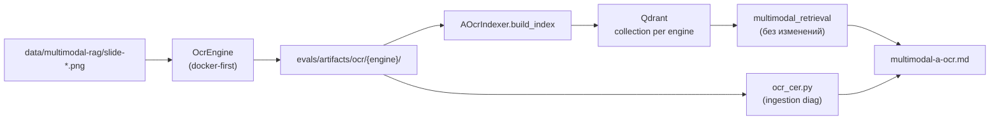

# Task 04: method-a-ocr

> **Sprint:** [../../README.md](../../README.md)
> **Тип:** feat (eval / ingestion)
> **Spec:** [analysis.md](../../analysis.md), [metric_map.md](../../metric_map.md)
> **Предшественник:** [Task 03 summary](../03-indexer-contract-configs/summary.md)

---

## Цель

Реализовать метод A (OCR → e5 → Qdrant) в **двух движках** — Tesseract (классика) и современный CPU-движок — через единый контракт индексатора, сохранить распознанный текст в артефакты, посчитать **CER** на фиксированной выборке и прогнать **retrieval eval по 5 сегментам** для обеих коллекций с `build_time_s` / `est_cost_usd`. Итог — отчёт с выводом, какой движок лучше на русском визуальном контенте этого корпуса.

---

## Архитектура

### Граница ответственности (наследуем Task 03)



| Слой | Меняется? | Комментарий |
|------|-----------|-------------|
| `OcrEngine` + Docker wrapper | ✅ новый | Только ingestion |
| `AOcrIndexer` | ✅ stub → full | Паттерн как `BaselineIndexer` |
| `multimodal_retrieval.py` | ❌ | Общий E5 search + eval |
| `mcp_server/` | ❌ | Prod не трогаем |

### Выбор современного CPU-движка

| Кандидат | Кириллица | CPU без GPU | Лицензия | Docker / deps | Вердикт |
|----------|-----------|-------------|----------|---------------|---------|
| **EasyOCR** | `ru`, `en` явно | `gpu=False` | Apache 2.0 | PyTorch CPU, ~500 MB моделей при первом прогоне | **✅ выбран** |
| PaddleOCR | есть `cyrillic` | да | Apache 2.0 | Paddle + OpenCV, тяжёлый образ, хрупкий на Windows | запасной |
| docTR | latin/cyrillic модели | да | Apache 2.0 | tf/torch; слабее документирован для RU слайдов | не первый выбор |

**Обоснование EasyOCR:** явная поддержка `ru+en`, CPU-режим из коробки, один pip-образ для Docker, предсказуемый API. PaddleOCR — fallback только если EasyOCR на CER-sample провалится catastrophically (зафиксировать в summary, не менять план без «ок»).

**Sharp-edges (тёмная тема):**
- Tesseract по умолчанию часто «слепнет» на тёмном фоне → **обязательный pre-process** (invert/grayscale/contrast) в общем пайплайне до вызова любого движка.
- `OCR_RUNTIME=local` — opt-in для отладки; **default = docker** (pit of success).
- Fail fast: если Docker недоступен и `OCR_RUNTIME=docker` — понятная ошибка на старте индексации, не пустой corpus.

### Контракт OCR

```python
class OcrEngine(Protocol):
    name: str  # "tesseract" | "easyocr"

    def recognize(self, image_path: Path) -> str: ...
```

Фабрика `make_ocr_engine(engine: str, *, runtime: str = "docker") -> OcrEngine`.

**Docker-стратегия (предпочтительная):**

```
devops/docker/ocr-tesseract/Dockerfile   # tesseract-ocr + rus+eng traineddata
devops/docker/ocr-easyocr/Dockerfile     # python:3.12-slim + easyocr CPU
evals/scripts/ocr_docker.py              # batch: mount corpus rw → artifacts rw
```

- Одноразовый batch: `docker compose run --rm ocr-tesseract python /app/run_batch.py …`
- Образы **не** добавляем в основной `devops/docker-compose.yml` (не держать OCR-сервисы always-on) — отдельный `devops/docker-compose.ocr.yml` + make-цели `ocr-build`, `ocr-run-tesseract`, `ocr-run-easyocr`.
- Host-пути: `REPO_ROOT/data/multimodal-rag` → `/corpus:ro`, `REPO_ROOT/evals/artifacts/ocr/{engine}` → `/out:rw`.

### Индексатор `AOcrIndexer`

Заменяет stub в `stubs.py` → вынос в `evals/indexers/a_ocr.py` (SRP: 1 класс = 1 файл).

Поток `build_index`:

1. `validate_corpus_dir(corpus_dir)`
2. Для `slide-01.png … slide-66.png`: pre-process → `OcrEngine.recognize` → `artifact_dir/slide-NN.txt` с header (как baseline):
   ```
   # slide-10
   # source: OCR tesseract (slide-10.png)
   # engine: tesseract | lang: rus+eng
   ```
3. e5 embed passages → Qdrant (recreate collection), payload `method: "ocr_{engine}"`
4. `IndexCost`: `est_cost_usd=0.0`, `api_calls=0`, `build_time_s` = OCR wall time + embed/upsert (раздельно в логах; в `IndexCost` — сумма)

`corpus_stats[slide_id]` = len(body) после strip header (как baseline).

### Два конфига → две коллекции

| config_id | ocr_engine | artifact_dir | collection |
|-----------|------------|--------------|------------|
| `multimodal-a-ocr-tesseract` | `tesseract` | `evals/artifacts/ocr/tesseract` | `multimodal_ocr_tesseract_v002` |
| `multimodal-a-ocr-easyocr` | `easyocr` | `evals/artifacts/ocr/easyocr` | `multimodal_ocr_easyocr_v002` |

Существующий `multimodal-a-ocr.yaml` (tesseract-only stub) — **переименовать/заменить** на `multimodal-a-ocr-tesseract.yaml`; добавить `multimodal-a-ocr-easyocr.yaml`.

`OCR_ENGINE` env — override `indexer.ocr_engine` (как в Task 03).

---

## CER (ingestion-quality)

### Формула (из metric_map.md)

```
CER = Levenshtein(ref, hyp) / len(ref)
```

- `ref` — ручная транскрипция **видимого текста PNG** (не speaker notes).
- `hyp` — OCR-текст из artifact (body без header).
- **CER > 1.0 допустим** при галлюцинации/длинном hyp — не clamp.
- Нормализация перед Levenshtein (зафиксировать в коде и отчёте):
  - lowercase;
  - `\s+` → один пробел;
  - **не** удалять пунктуацию и `%` (числа на S2 важны).

Зависимость: `rapidfuzz` (Levenshtein) в `evals/pyproject.toml` — лёгкая, без OCR на host.

### Golden-set (~10 слайдов)

Фиксированный manifest (immutable после создания):

`evals/datasets/multimodal/ocr-cer-golden/v001_2026-07-05.json`:

| slide | segment | зачем |
|------:|---------|-------|
| 2 | S1_text | плотный текст спикера |
| 6 | S1_text | формулы + мелкий текст |
| 37 | S1_text | сетка 6 препятствий |
| 45 | S1_text | карточки инструментов |
| 9 | S2_chart | кривая + % Google/Anthropic |
| 10 | S2_chart | 72%, bar-chart Zapier |
| 11 | S2_chart | 39%, бары СберАналитика |
| 44 | S2_chart | 24/52/24% bar-chart |
| 49 | S2_chart | 88% + layout |
| 15 | S3_layout | названия ступеней (конtrast: layout vs chart) |

Тексты ref: `evals/datasets/multimodal/ocr-cer-golden/refs/slide-NN.txt` — PNG-verified вручную при реализации.

`notes.md` (`data/multimodal-rag/notes.md`, если есть) — **только вспомогательный** черновик при транскрипции; в CER не подставлять текст, которого нет на PNG (антипаттерн Task 01/02).

Модуль: `evals/scripts/ocr_cer.py` — `compute_cer(ref, hyp)`, `score_engine(artifact_dir, golden_manifest) -> dict[slide, float]`.

---

## Eval и отчёт

### Прогоны

```bash
make eval-multimodal CONFIG=configs/multimodal-a-ocr-tesseract.yaml
make eval-multimodal CONFIG=configs/multimodal-a-ocr-easyocr.yaml
```

Опционально агрегирующая цель:

```bash
make eval-multimodal-a-ocr   # оба движка + CER + сводный отчёт
```

### `evals/reports/multimodal-a-ocr.md`

Секции:

1. **Конфигурация** — оба движка, версии (tesseract `--version`, easyocr + model cache), Docker images digest/tag.
2. **CER** — таблица slide × tesseract × easyocr; mean/median по sample; формула + список 10 слайдов.
3. **Retrieval по сегментам** — две таблицы (или одна с колонками engine): S1–S5, **не macro-average для выводов**.
4. **Время и стоимость** — `build_time_s`, `index_size_mb`, `est_cost_usd=0` для обоих.
5. **Вывод** — прямой ответ: «лучше на русском визуальном контенте — {engine}» с опорой на CER (ingestion) и Recall@5/nDCG по сегментам (retrieval); явно разделить «лучше читает пиксели» vs «лучше ищет».
6. **Типичные ошибки** — ссылки на artifact paths для ручной проверки (кириллица, разрывы строк, тёмная тема).

Run JSON: `evals/reports/runs/multimodal-a-ocr-{engine}-{timestamp}.json`.

Расширить `run_multimodal_eval.write_report` **минимально** — OCR-специфика в отдельном `write_ocr_report()` / `run_multimodal_a_ocr.py`, чтобы не раздувать baseline runner.

---

## Состав работ

- [ ] Docker OCR (предпочтительный runtime):
  - [ ] `devops/docker/ocr-tesseract/Dockerfile` + `run_batch.py` (`lang=rus+eng`, PSM auto/6)
  - [ ] `devops/docker/ocr-easyocr/Dockerfile` + `run_batch.py` (`Reader(['ru','en'], gpu=False)`)
  - [ ] `devops/docker-compose.ocr.yml` + Makefile: `ocr-build`, `ocr-run-tesseract`, `ocr-run-easyocr`
- [ ] `evals/indexers/ocr/` — `OcrEngine` protocol, pre-process (invert/grayscale), `make_ocr_engine`, docker/local adapters
- [ ] `evals/indexers/a_ocr.py` — `AOcrIndexer` (full); удалить stub `AOcrIndexer` из `stubs.py`, обновить `registry.py`
- [ ] Golden CER set: manifest + 10 ref-текстов PNG-verified
- [ ] `evals/scripts/ocr_cer.py` + `rapidfuzz` в pyproject
- [ ] Конфиги: `multimodal-a-ocr-tesseract.yaml`, `multimodal-a-ocr-easyocr.yaml`; deprecate/replace stub `multimodal-a-ocr.yaml`
- [ ] `evals/scripts/run_multimodal_a_ocr.py` — orchestration: index both → eval both → CER → `multimodal-a-ocr.md`
- [ ] Тесты:
  - [ ] `test_ocr_cer.py` — формула, CER>1, нормализация
  - [ ] `test_a_ocr_indexer.py` — mock `OcrEngine`, artifact headers, Qdrant mock
  - [ ] обновить `test_indexer_registry.py` — `AOcrIndexer` import path
- [ ] `.env.example` — `OCR_RUNTIME=docker`, комментарии к `OCR_ENGINE`
- [ ] Прогон end-to-end (Qdrant up) + артефакты `evals/artifacts/ocr/**`
- [ ] Самопроверка по DoD

---

## DoD

| # | Критерий | Способ проверки |
|---|----------|-----------------|
| 1 | CER по явной формуле на 10 зафиксированных слайдах; формула и sample в отчёте | `evals/reports/multimodal-a-ocr.md` + `test_ocr_cer.py` |
| 2 | Оба движка: 66 artifacts + Qdrant collections + eval по 5 сегментам | `make eval-multimodal-a-ocr` или два CONFIG |
| 3 | `build_time_s` и `est_cost_usd` зафиксированы для каждого движка | отчёт + run JSON |
| 4 | Вывод «какой движок лучше на русском» — с числами, не общими словами | §Вывод в отчёте |
| 5 | Артефакты OCR читаемы для ручной проверки | `evals/artifacts/ocr/tesseract/`, `…/easyocr/` |
| 6 | Downstream общий: `git diff mcp_server/` = 0 | `git diff --stat mcp_server/` |
| 7 | Lint + тесты evals зелёные | `cd evals && uv run ruff check . && uv run pytest` |

---

## Артефакты

| Путь | Описание |
|------|----------|
| `devops/docker/ocr-tesseract/` | Docker Tesseract + batch runner |
| `devops/docker/ocr-easyocr/` | Docker EasyOCR CPU + batch runner |
| `devops/docker-compose.ocr.yml` | Compose для OCR batch (не always-on) |
| `evals/indexers/ocr/` | Контракт и адаптеры OCR |
| `evals/indexers/a_ocr.py` | `AOcrIndexer` |
| `evals/datasets/multimodal/ocr-cer-golden/` | Manifest + ref-тексты для CER |
| `evals/scripts/ocr_cer.py` | Расчёт CER |
| `evals/scripts/ocr_docker.py` | Host wrapper для docker batch |
| `evals/scripts/run_multimodal_a_ocr.py` | Сводный прогон A |
| `evals/configs/multimodal-a-ocr-tesseract.yaml` | Конфиг Tesseract |
| `evals/configs/multimodal-a-ocr-easyocr.yaml` | Конфиг EasyOCR |
| `evals/artifacts/ocr/tesseract/slide-*.txt` | OCR output (66) |
| `evals/artifacts/ocr/easyocr/slide-*.txt` | OCR output (66) |
| `evals/reports/multimodal-a-ocr.md` | Сводный отчёт |
| `evals/reports/runs/multimodal-a-ocr-*.json` | Run JSON |
| `evals/tests/test_ocr_cer.py` | Тесты CER |
| `evals/tests/test_a_ocr_indexer.py` | Тесты индексатора |
| `Makefile` | `ocr-build`, `ocr-run-*`, `eval-multimodal-a-ocr` |
| `.env.example` | `OCR_RUNTIME` |

---

## Scope

**Трогаем:** `devops/docker/ocr-*`, `devops/docker-compose.ocr.yml`, `evals/indexers/`, `evals/scripts/ocr_*`, `evals/scripts/run_multimodal_a_ocr.py`, `evals/configs/multimodal-a-ocr-*.yaml`, `evals/datasets/multimodal/ocr-cer-golden/`, `evals/tests/`, `evals/pyproject.toml`, `Makefile`, `.env.example`, `evals/reports/multimodal-a-ocr.md`, `evals/artifacts/ocr/` (generated).

**НЕ трогаем:**
- `mcp_server/**`
- Eval-датасет v002 (`v002_2026-07-05.json`) — immutable
- Методы B/C/D (stubs остаются stubs)
- `docs/roadmap.md`, sprint README (до закрытия Task 04 после «ок»)
- `multimodal_retrieval.py` — только если нужен 1-line fix; без method-specific веток

---

## Риски и допущения

| Риск | Митигация |
|------|-----------|
| EasyOCR первый прогон качает модели (долго, offline fail) | Кэш volume в compose; документировать `ocr-build` + warmup slide-01 |
| Tesseract на тёмной теме — высокий CER | Общий pre-process invert; PSM 6/11; зафиксировать параметры в artifact header |
| OCR 66×2 медленно на CPU | Docker batch + лог progress; `build_time_s` — часть результата |
| CER ref субъективен | 10 слайдов + PNG-verified; manifest immutable; не использовать notes как ref |
| Windows path / Docker mount | Абсolute paths через `REPO_ROOT`; тест compose на host пользователя |
| Hallucination → CER>100% | Не clamp; описать в отчёте как диагностический сигнал |

**Допущения:**
- Qdrant доступен (`make up` или локальный `:6333`).
- Docker Desktop / engine установлен для default runtime.
- `est_cost_usd=0` для локальных OCR (как baseline e5).

---

## Открытые вопросы

- [ ] **Pre-process:** invert для всех слайдов или только при mean luminance < порога? — предлагаю **adaptive** (порог в коде + зафиксировать в отчёте).
- [ ] **Tesseract PSM:** auto (3) vs single block (6) — прогнать на slide-10 в реализации, зафиксировать победителя в summary.
- [ ] **Коммит artifacts:** 66×2 `.txt` — большой diff; предлагаю **коммитить** (DoD sprint: ручная проверка); `.gitignore` не исключать `evals/artifacts/ocr/`.

---

## Порядок реализации (после «ок»)

1. Golden CER manifest + ref-тексты (PNG-verified, 10 slides)
2. `ocr_cer.py` + tests
3. Docker images + `ocr_docker.py` + make targets; smoke на slide-01/10
4. `evals/indexers/ocr/` + `a_ocr.py`; registry/stubs cleanup
5. Два YAML-конфига
6. `run_multimodal_a_ocr.py` + report template
7. Full index + eval оба движка
8. `multimodal-a-ocr.md` + self-check DoD
