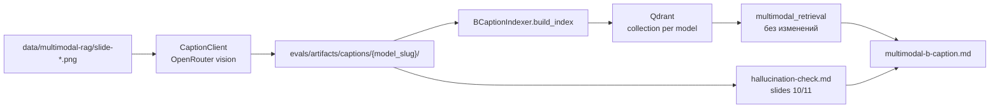

# Task 05: method-b-caption

> **Sprint:** [../../README.md](../../README.md)
> **Тип:** feat (eval / ingestion)
> **Spec:** [analysis.md](../../analysis.md), [metric_map.md](../../metric_map.md)
> **Предшественник:** [Task 04 summary](../04-method-a-ocr/summary.md)

---

## Цель

Реализовать метод B под контракт индексатора: **PNG → VLM caption (OpenRouter) → artifact txt → e5 → Qdrant**. Прогнать **две VLM** (дешёвая + более мощная), сравнить **retrieval по 5 сегментам**, **build_time_s**, **est_cost_usd** и риск **галлюцинаций чисел** на S2 (слайды 10–11). Итог — прямой ответ «да/нет»: оправдывает ли мощная модель прирост качества и как влияет на скорость.

---

## Архитектура

| Слой | Меняется? | Комментарий |
|------|-----------|-------------|
| `evals/indexers/caption/` | ✅ новый | OpenRouter VLM client, cost, slug |
| `BCaptionIndexer` в `b_caption.py` | ✅ stub → full | Паттерн как `AOcrIndexer` |
| `multimodal_retrieval.py` | ❌ | Общий E5 search + eval |
| `mcp_server/` | ❌ | Prod не трогаем |

### Модели (pre-flight 2026-07-10)

| Роль | model id | Pricing (prompt / completion per token) |
|------|----------|----------------------------------------|
| Малая (дефолт) | `nvidia/nemotron-nano-12b-v2-vl:free` | $0 / $0 |
| Мощная | `google/gemini-2.5-flash-lite` | $0.0000001 / $0.0000004 |

### Два конфига → две коллекции

| config_id | caption_model | artifact_dir | collection |
|-----------|---------------|--------------|------------|
| `multimodal-b-caption-nemotron` | `nvidia/nemotron-nano-12b-v2-vl:free` | `evals/artifacts/captions/nemotron-nano-12b-v2-vl` | `multimodal_caption_nemotron_v002` |
| `multimodal-b-caption-gemini` | `google/gemini-2.5-flash-lite` | `evals/artifacts/captions/gemini-2.5-flash-lite` | `multimodal_caption_gemini_v002` |

Параметр модели: `cfg.caption_model` с override `CAPTION_MODEL` env.

### Hallucination-check (S2)

Выборка slides **10**, **11** — ключевые числа из `ocr-cer-golden/refs/`. Manifest: `evals/datasets/multimodal/caption-hallucination/v001_2026-07-10.json`. Скрипт: `evals/scripts/caption_hallucination_check.py` → `evals/artifacts/captions/hallucination-check.md`.

---

## Состав работ

- [x] `evals/indexers/caption/` — `CaptionClient`, OpenRouter adapter, `model_slug()`, pricing, preflight
- [x] `evals/indexers/b_caption.py` — `BCaptionIndexer`; cleanup `stubs.py` + `registry.py`
- [x] Два YAML: `multimodal-b-caption-nemotron.yaml`, `multimodal-b-caption-gemini.yaml`
- [x] `evals/scripts/caption_hallucination_check.py` + manifest S2 numbers
- [x] `evals/scripts/run_multimodal_b_caption.py` + report writer
- [x] Тесты: `test_caption_client.py`, `test_b_caption_indexer.py`, обновить `test_indexer_registry.py`
- [x] `Makefile` — `eval-multimodal-b-caption`
- [x] `.env.example` — комментарий `CAPTION_MODEL`, требование `OPENAI_API_KEY`
- [x] Pre-flight + full index 66×2 + eval + артефакты
- [x] `hallucination-check.md` + `multimodal-b-caption.md`

---

## DoD

| # | Критерий | Способ проверки |
|---|----------|-----------------|
| 1 | Обе модели: 66 artifacts + Qdrant collections + eval по 5 сегментам | `make eval-multimodal-b-caption` |
| 2 | `build_time_s`, `est_cost_usd`, `api_calls` зафиксированы по каждой модели | отчёт + run JSON |
| 3 | `hallucination-check.md`: вердикт по slides 10/11 для каждой модели | `evals/artifacts/captions/hallucination-check.md` |
| 4 | Отчёт: прямой ответ «да/нет» + цифры S2/S3 + speed ratio | §Вывод в `multimodal-b-caption.md` |
| 5 | Подписи читаемы, не generic | ручная выборка S2/S3 |
| 6 | Downstream общий: `git diff mcp_server/` = 0 | `git diff --stat mcp_server/` |
| 7 | Lint + тесты evals зелёные | `cd evals && uv run pytest` |

---

## Scope

**Трогаем:** `evals/indexers/caption/`, `evals/indexers/b_caption.py`, `evals/scripts/caption_*.py`, `evals/scripts/run_multimodal_b_caption.py`, `evals/configs/multimodal-b-caption-*.yaml`, `evals/tests/`, `Makefile`, `.env.example`, `evals/artifacts/captions/`, `evals/reports/multimodal-b-caption.md`.

**НЕ трогаем:** `mcp_server/**`, датасет v002, методы C/D stubs, `multimodal_retrieval.py` method-specific ветки, `docs/roadmap.md` (до закрытия спринта).

---

## Риски и митигация

| Риск | Митигация |
|------|-----------|
| Rate limit / timeout на 66 VLM calls | Retry с backoff; resume skip existing artifacts |
| Nemotron free tier 429 | Fallback `qwen/qwen3-vl-8b-instruct` для оставшихся slides; header `fallback_from` |
| Пустой `choices` в API response | Retry; fail с slide_id |
| VLM «описывает» вместо транскрипции | Hallucination-check + промпт «выпиши числа дословно» |
