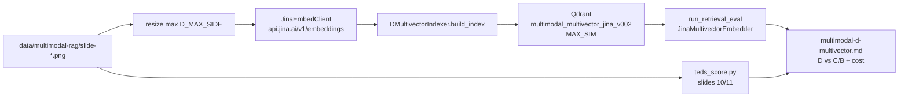

# Task 07: method-d-multivector

> **Sprint:** [../../README.md](../../README.md)
> **Тип:** feat (eval / ingestion)
> **Spec:** [analysis.md](../../analysis.md), [metric_map.md](../../metric_map.md)
> **Предшественник:** [Task 06 summary](../06-method-c-unified-embed/summary.md)

---

## Цель

Реализовать метод D под контракт индексатора: **PNG → Jina v4 multivector (`return_multivector=true`) → Qdrant `MultiVectorConfig(MAX_SIM)`**. Прогнать eval по 5 сегментам, зафиксировать `build_time_s` / `index_size_mb` / `est_cost_usd`, посчитать **TEDS** на S2-слайдах 10/11 и дать числовой вердикт: **оправдывает ли multivector цену** относительно C и лучшего B (гипотеза прироста на S2/S3).

---

## Архитектура



| Слой | Меняется? | Комментарий |
|------|-----------|-------------|
| `evals/indexers/jina_multivector/` | новый | Jina API client (image passage + text query, multivector) |
| `evals/indexers/d_multivector.py` | stub → full | Паттерн upsert как `c_unified.py`, но multivector vectors |
| `multimodal_retrieval.py` | минимально | `JinaMultivectorEmbedder` + ветка multivector в `search_slides` |
| `run_multimodal_eval.py` | нет | Отдельный orchestrator, как C |
| `mcp_server/` | нет | Prod не трогаем |

### Модель и API

| Параметр | Значение |
|----------|----------|
| model_id | `jina-embeddings-v4` (pinned, не `latest`) |
| API | `POST https://api.jina.ai/v1/embeddings` |
| Auth | `JINA_API_KEY` (fail-fast при отсутствии) |
| Index input | image base64, `task=retrieval.passage`, `return_multivector=true` |
| Query input | text, `task=retrieval.query`, `return_multivector=true` |
| token_dim | **128** (per-token multivector; smoke verify на slide-01) |
| resize | `D_MAX_SIDE` env / YAML (default 1024), без OCR-invert |

### Предусловие: JINA_API_KEY

Перед smoke/full прогоном — ключ Jina API в локальном `.env`:

1. Получить ключ: [jina.ai](https://jina.ai) → **API Keys** (бесплатный tier: ~10M tokens на старте).
2. Прописать в `.env` (не коммитить):

```env
JINA_API_KEY=jina_xxxxxxxxxxxxxxxxxxxxxxxxxxxxxxxx
```

3. Зеркало в `.env.example` — плейсхолдер + комментарий со ссылкой на jina.ai.
4. `require_jina_key()` в orchestrator — fail-fast с понятным сообщением, если переменная пуста.

> Новые пользователи: ключ создаётся в [API Key Manager](https://jina.ai/api-dashboard/key-manager).

### Qdrant multivector

```python
VectorParams(
    size=128,
    distance=Distance.COSINE,
    multivector_config=MultiVectorConfig(
        comparator=MultiVectorComparator.MAX_SIM
    ),
)
```

- Upsert: `PointStruct(vector=[[...128], [...128], ...])` — N токенов на слайд
- Search: `query_points(query=[[...128], ...])` — multivector query
- Payload: `slide_id`, `num_tokens`, `method`, `embed_model`

### Исправление конфига

В `evals/configs/multimodal-d-multivector.yaml` заменить `embedding_dim: 768` → **`128`** (per-token dim; 768 — ошибка stub Task 03).

---

## TEDS (ingestion-quality, слайды 10/11)

**Не смешивается** с retrieval-скором (metric_map.md §2).

| Компонент | Источник |
|-----------|----------|
| **Reference** | Ручная HTML/JSON-разметка структуры chart-слайдов → `evals/datasets/multimodal/teds-golden/v001_2026-07-11.json` |
| **Hypothesis** | VLM prompt → HTML (отдельный diagnostic-шаг) → `evals/artifacts/multivector/teds-hyp/slide-{10,11}.html` |
| **Скрипт** | `evals/scripts/teds_score.py` — TEDS = `1 - TED(tree_ref, tree_hyp) / max(|ref|, |hyp|)` |
| **Зависимость** | `apted` + парсер HTML→tree (или `table-recognition-metric` если apted недостаточен) |

VLM для hypothesis: тот же OpenRouter-контур, что в Task 05 (`google/gemini-2.5-flash-lite`), фиксированный structure-prompt. Артефакты сохраняются для ручной проверки.

---

## Состав работ

### 0. Подготовка окружения
- [ ] Получить `JINA_API_KEY` на [jina.ai](https://jina.ai) → API Keys
- [ ] Добавить `JINA_API_KEY=...` в локальный `.env` (файл в `.gitignore`, не коммитить)
- [ ] Обновить `.env.example` — плейсхолдер и ссылка на jina.ai

### 1. Jina multivector client
- [ ] `evals/indexers/jina_multivector/base.py` — `JinaMultivectorResult` (vectors: `list[list[float]]`, tokens, cost, latency)
- [ ] `evals/indexers/jina_multivector/client.py` — httpx POST, retry/backoff, pricing ($0.05/1M tokens)
- [ ] `evals/indexers/jina_multivector/preprocess.py` — PIL resize `D_MAX_SIDE`, PNG→base64
- [ ] `evals/indexers/jina_multivector/factory.py` — `smoke_embed`, `run_embed_batch`, `require_jina_key`

### 2. Indexer D
- [ ] `evals/indexers/d_multivector.py` — `DMultivectorIndexer.build_index`
- [ ] Удалить `DMultivectorIndexer` из `stubs.py`, обновить `registry.py`
- [ ] `index_size_mb` = `sum(num_tokens) * 128 * 4 / 1024²` (+ payload в point для аудита)
- [ ] `IndexCost.is_multivector=True`

### 3. Retrieval (downstream, минимальный diff)
- [ ] `JinaMultivectorEmbedder` в `multimodal_retrieval.py`
- [ ] `search_slides`: если `cfg.is_multivector` — передавать `list[list[float]]` в `query_points`
- [ ] `run_retrieval_eval` без изменений сигнатуры (embedder через Protocol)

### 4. TEDS harness
- [ ] Golden manifest slides 10/11 (ручная разметка по PNG)
- [ ] `evals/scripts/teds_structure_extract.py` — VLM → HTML для slides 10/11
- [ ] `evals/scripts/teds_score.py` — расчёт TEDS + отчётная секция

### 5. Orchestrator и отчёт
- [ ] `evals/scripts/run_multimodal_d_multivector.py` — preflight/smoke → index → eval → TEDS → report
- [ ] `evals/reports/multimodal-d-multivector.md`:
  - Retrieval D по 5 сегментам
  - **D vs C** и **D vs best B** по каждому сегменту (reference из Task 05/06)
  - Таблица цены: `index_size_mb`, `build_time_s`, `est_cost_usd` + **мультипликаторы vs C/B/A**
  - §TEDS slides 10/11 (formula, golden path, hyp artifacts)
  - §Гипотеза S2/S3: вердикт с числами (прирост / паритет / проигрыш)

### 6. Инфра и тесты
- [ ] Обновить `evals/configs/multimodal-d-multivector.yaml` (`embedding_dim: 128`)
- [ ] `.env.example` — `JINA_API_KEY`, комментарий `D_MAX_SIDE`
- [ ] `Makefile` — `eval-multimodal-d-multivector`
- [ ] Тесты: `test_jina_multivector_client.py`, `test_d_multivector_indexer.py`, обновить `test_indexer_registry.py`
- [ ] `cd evals && uv run pytest` — зелёный
- [ ] `git diff mcp_server/` = 0

### 7. Прогон
- [ ] Pre-flight: `JINA_API_KEY` задан в `.env`, smoke API отвечает 200
- [ ] Smoke: slide-01 → проверить N×128 matrix
- [ ] Full: `make eval-multimodal-d-multivector` (66 slides index + eval 38 items + TEDS)

---

## DoD

| # | Критерий | Способ проверки |
|---|----------|-----------------|
| 1 | Коллекция `multimodal_multivector_jina_v002`, 66 points, `MultiVectorConfig(MAX_SIM)` | Qdrant / run JSON |
| 2 | Поиск multivector без ошибок, результаты по 38 items | run JSON `items` |
| 3 | Eval по всем 5 сегментам | run JSON `aggregates` |
| 4 | `build_time_s`, `index_size_mb`, `est_cost_usd`, `api_calls` зафиксированы | отчёт + run JSON |
| 5 | TEDS на slides 10/11 с golden manifest + hyp artifacts | отчёт §TEDS + `teds-golden/` + `teds-hyp/` |
| 6 | Отчёт: D vs C/B по **каждому** сегменту + cost multipliers | `multimodal-d-multivector.md` |
| 7 | §Гипотеза S2/S3: вердикт с числами | отчёт §Гипотеза |
| 8 | `git diff mcp_server/` = 0 | `git diff --stat mcp_server/` |
| 9 | Тесты evals зелёные | `cd evals && uv run pytest` |

---

## Scope

**Трогаем:** `evals/indexers/jina_multivector/`, `d_multivector.py`, `multimodal_retrieval.py`, `run_multimodal_d_multivector.py`, `teds_*.py`, configs, tests, Makefile, `.env.example`, reports, `teds-golden/`, `artifacts/multivector/`.

**НЕ трогаем:** `mcp_server/**`, датасет v002, артефакты A/B/C, Task 08, `docs/roadmap.md`, `run_multimodal_eval.py`.

---

## Skills (перед реализацией)

- `modern-python` — uv, ruff, структура модулей
- `python-testing-patterns` — pytest, моки httpx/Jina API

---

## Риски и митигация

| Риск | Митигация |
|------|-----------|
| Jina API rate limit (100 RPM free tier) | Retry/backoff; пауза между slides; лог прогресса |
| `embedding_dim` mismatch (stub 768 vs факт 128) | Smoke embed slide-01 до full index; fail-fast |
| `index_size_mb` >> C (ожидаемо) | Явная формула + сравнительная таблица в отчёте |
| Multivector response format (flat vs nested) | Парсер с unit-тестом на fixture JSON |
| TEDS: VLM HTML ≠ идеальная структура | Golden вручную по PNG; hyp artifacts для ревью |
| Нет `JINA_API_KEY` | `require_jina_key()` fail-fast в orchestrator |

---

## Reference metrics (для отчёта)

Из Task 05/06 (не пересчитывать, только сравнение):

| Метод | S1 R@5 | S2 R@5 | S3 R@5 | S4 R@5 | build_time_s | index_size_mb | est_cost_usd |
|-------|--------|--------|--------|--------|-------------|---------------|--------------|
| C | 1.000 | 1.000 | 0.900 | 0.833 | 207 | 0.516 | 0 |
| B best | 0.857 | 1.000 | 0.800 | 1.000 | 399–606 | 0.193 | 0.006–0.021 |
| A tesseract | 0.857 | 0.889 | 0.900 | 0.833 | 73 | — | 0 |

**Ожидание по гипотезе (analysis.md):** D даёт прирост на S2/S3, но цена `index_size_mb` — максимальная в матрице.
